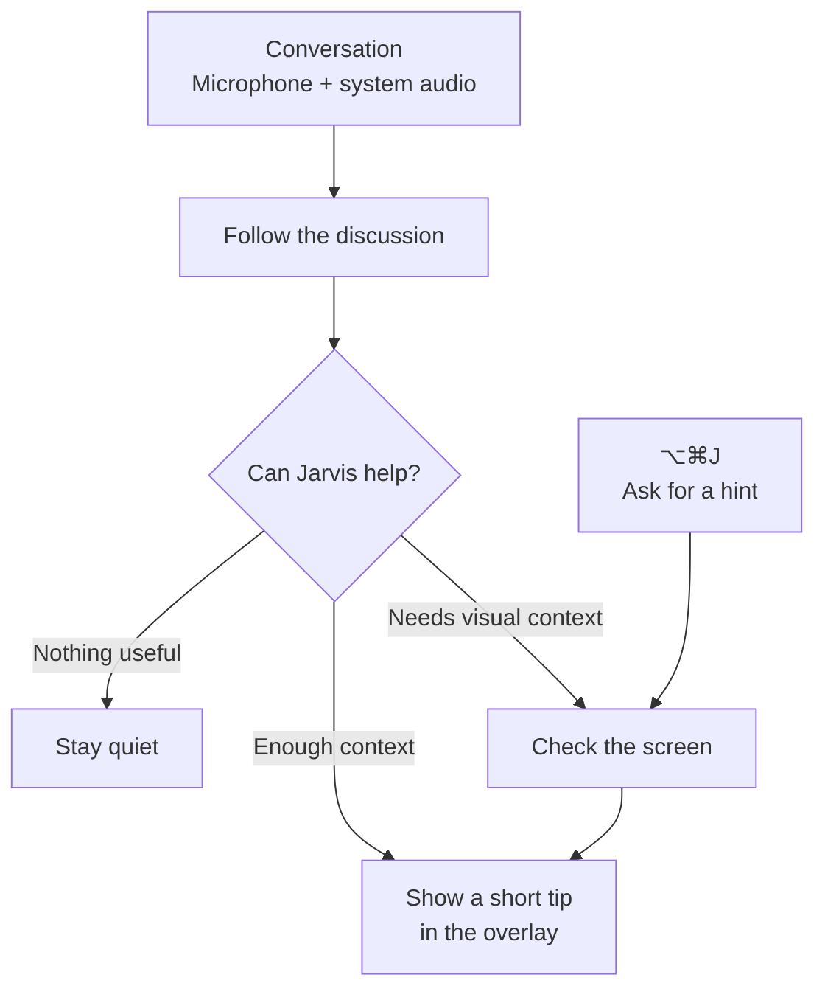

# Jarvis

Jarvis is an experimental, open-source macOS coach for technical meetings. It follows microphone
and system-audio conversations, checks the screen when visual context helps, and shows concise
guidance in overlays designed to stay out of screen capture.

Jarvis coaches proactively and stays quiet when it has nothing useful to add. Press **⌥⌘J** during a
session for an immediate, screen-aware hint.

> [!WARNING]
> Jarvis captures microphone and system audio. Depending on your settings, audio, transcript text,
> and requested screenshots may be sent to the providers you choose. The app is not App-Sandboxed
> or a production security boundary; it has the filesystem access of your macOS account. Use it only
> with all required consent and where law, workplace policy, and platform terms allow. Read the full
> [privacy and security model](./wiki/sandbox.md).

## Install Jarvis

**Requirements:** an Apple silicon Mac running macOS 14.2 or later. No developer tools are needed.

[**Download the latest signed and notarized release**](https://github.com/JINGBANZ/jarvis/releases/latest)

1. Under **Assets**, download `Jarvis-<version>.zip` and double-click it to extract the app.
2. Move `Jarvis.app` to **Applications**, then open it. Jarvis appears in the menu bar rather than
   the Dock.
3. Allow Microphone access and, for screen-aware hints, Screen Recording when macOS prompts.
4. From the menu-bar icon, open **Settings**, choose transcription and brain providers, add any
   credential those providers require, then select **Start Jarvis**. Allow System Audio Recording
   when Start requests it so Jarvis can hear the other side.

## How it works



The detailed loop and its design rationale live in the
[architecture guide](./wiki/architecture.md).

## Developer quick start

Building locally additionally requires Swift 6 and the macOS Command Line Tools.

```bash
git clone https://github.com/JINGBANZ/jarvis.git
cd jarvis
./scripts/build-app.sh --run
```

On the first local build, macOS asks whether `codesign` can use the `Jarvis Dev` key; choose
**Always Allow**. The downloaded release does not use this local development identity.

For signing details, permission recovery, and other commands, see
[Build and run](./wiki/build-and-run.md). Always launch the app through the build script or `open`,
not by running its bare executable.

## Privacy

- Raw audio and the rolling live transcript are not archived locally.
- Jarvis keeps bounded, owner-only session records of finalized speech, coaching actions,
  diagnostics, provider traffic, and screenshots it viewed.
- Selected remote providers receive the audio, text, or screenshots their configured role needs.
  OpenAI coaching requests currently enable server-side storage for debugging.

See [Privacy and security](./wiki/sandbox.md) for the complete egress and retention model.

## Learn more

Start at the [wiki index](./wiki/index.md), or jump directly to:

- [Architecture](./wiki/architecture.md) — design, components, and data flow
- [Build and run](./wiki/build-and-run.md) — setup, signing, permissions, and troubleshooting
- [Privacy and security](./wiki/sandbox.md) — local data, provider egress, retention, and isolation
- [Project status](./wiki/status.md) — what is built and what comes next

Contributions are welcome; read [CONTRIBUTING.md](./CONTRIBUTING.md) before opening a pull request.
Report security issues through the private process in [SECURITY.md](./SECURITY.md).

## License

Jarvis is licensed under the [Apache License 2.0](./LICENSE). Bundled third-party components are
listed in [THIRD_PARTY_NOTICES.md](./THIRD_PARTY_NOTICES.md).
