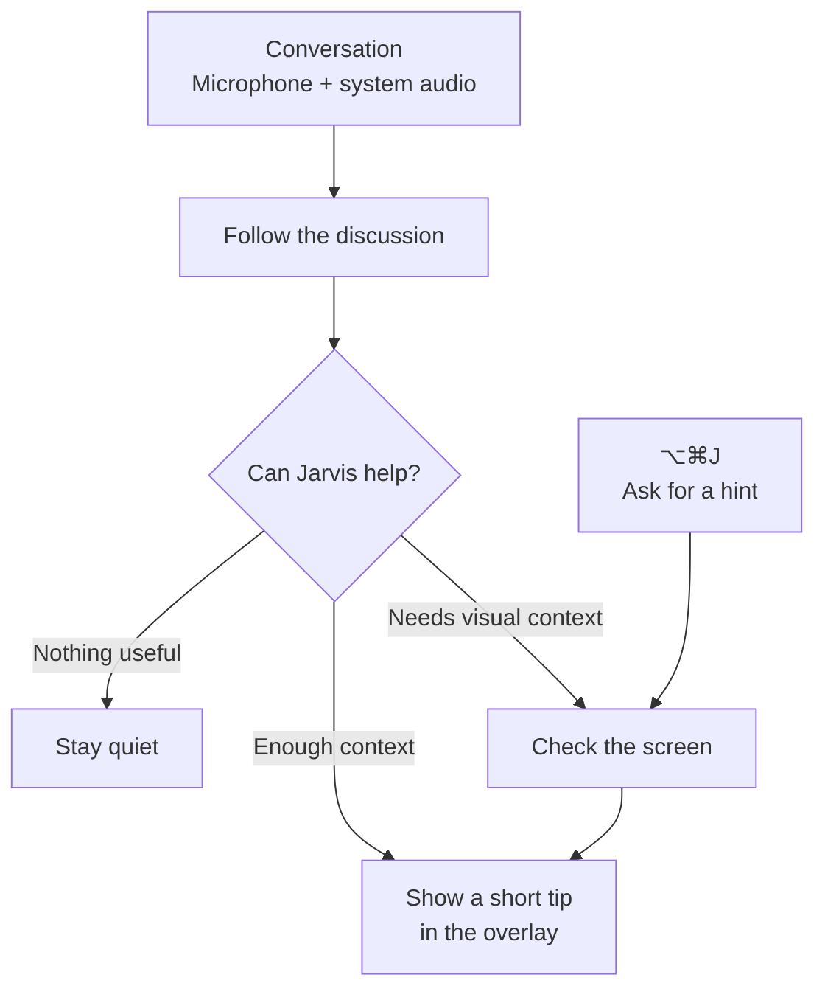

# Jarvis

Jarvis is an experimental, open-source, voice-driven macOS coaching agent for technical
conversations. It listens to both sides, checks the screen when useful, and gives brief prompts
while you think.

Jarvis coaches proactively and stays quiet when it has nothing useful to add. Press **⌥⌘J** during a
session for an immediate, screen-aware hint.

> [!WARNING]
> Jarvis captures microphone and system audio. Depending on your settings, audio, transcript text,
> and requested screenshots may be sent to the providers you choose. The app is not App-Sandboxed
> or a production security boundary; it has the filesystem access of your macOS account. Use it only
> with all required consent and where law, workplace policy, and platform terms allow. Read the full
> [privacy and security model](./wiki/sandbox.md).

## Install Jarvis

Requires an Apple silicon Mac running macOS 14.2 or later.

[**Download Jarvis**](https://github.com/JINGBANZ/jarvis/releases/latest/download/Jarvis.dmg)

Open Jarvis from **Applications**, configure its providers in **Settings**, then select **Start
Jarvis**. macOS will request the permissions Jarvis needs.

## How it works



## Developer quick start

Requires Swift 6 and the macOS Command Line Tools.

```bash
git clone https://github.com/JINGBANZ/jarvis.git
cd jarvis
./scripts/build-app.sh --run
```

See [Build and run](./wiki/build-and-run.md) for signing, permissions, and troubleshooting.

## Project links

[Wiki](./wiki/index.md) · [Contributing](./CONTRIBUTING.md) · [Security](./SECURITY.md) ·
[License](./LICENSE) · [Third-party notices](./THIRD_PARTY_NOTICES.md)

## Privacy

- Raw audio and the rolling live transcript are not archived locally.
- Jarvis keeps bounded, owner-only session records of finalized speech, coaching actions,
  diagnostics, provider traffic, and screenshots it viewed.
- Selected remote providers receive the audio, text, or screenshots their configured role needs.
  OpenAI coaching requests currently enable server-side storage for debugging.

See [Privacy and security](./wiki/sandbox.md) for the complete egress and retention model.
