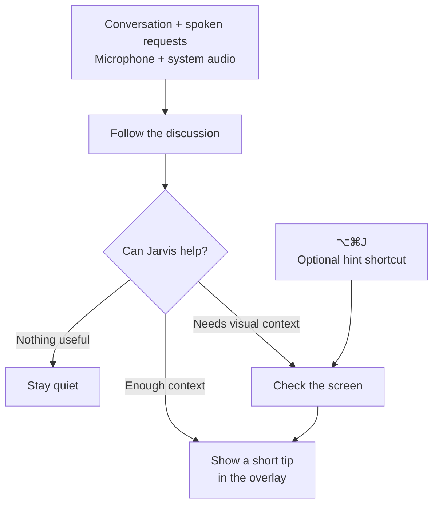

# Jarvis

**Your voice-only AI agent.**

[](https://github.com/JINGBANZ/jarvis/releases/latest/download/Jarvis.dmg)
[](https://t.me/+-FDYU99oXTBlZmQx)

Think out loud. Ask Jarvis a question. It listens to both sides of the conversation, checks your
screen when useful, and offers help at the right moment. **No text input. No prompt box.**

Jarvis is experimental and open source. Its current focus is coaching technical conversations:
behavioral, system-design, and coding questions. Replies appear in a private on-screen overlay.
Jarvis helps proactively and stays quiet when it has nothing useful to add. You can also press
**⌥⌘J** during a session for an immediate, screen-aware hint.

Every feature is built around spoken interaction: accurate listening, conversation context, and
timely help. See the [voice-only product direction](./wiki/architecture.md#1-vision).

## Install Jarvis

Currently available for macOS only. Requires an Apple silicon Mac running macOS 14.2 or later.

[**Download the macOS version**](https://github.com/JINGBANZ/jarvis/releases/latest/download/Jarvis.dmg)

Open Jarvis from **Applications**, configure its providers in **Settings**, then select **Start
Jarvis**. macOS will request the permissions Jarvis needs.

## How it works


```mermaid
flowchart TD
    A["Conversation + spoken requests<br/>Microphone + system audio"] --> B["Follow the discussion"]
    B --> C{"Can Jarvis help?"}
    C -->|"Nothing useful"| D["Stay quiet"]
    C -->|"Enough context"| E["Show a short tip<br/>in the overlay"]
    C -->|"Needs visual context"| F["Check the screen"]
    F --> E
    G["⌥⌘J<br/>Optional hint shortcut"] --> F
```

## Developer quick start

Requires Swift 6 and the macOS [Command Line Tools](./wiki/build-and-run.md#toolchain).

```bash
git clone https://github.com/JINGBANZ/jarvis.git
cd jarvis
./scripts/build-app.sh --run
```

See [Build and run](./wiki/build-and-run.md) for signing, permissions, and troubleshooting.

## Community

Join our [Telegram community](https://t.me/+-FDYU99oXTBlZmQx) to share your thoughts, ask questions,
and help shape Jarvis. Everyone is welcome!

## Project links

[Wiki](./wiki/index.md) · [Contributing](./CONTRIBUTING.md) · [Security](./SECURITY.md) ·
[License](./LICENSE) · [Third-party notices](./THIRD_PARTY_NOTICES.md)

## Privacy

- Raw audio and the rolling live transcript are not archived locally.
- Jarvis keeps bounded, owner-only session records of finalized speech, coaching actions,
  diagnostics, provider traffic, and screenshots it viewed.
- Selected remote providers receive the audio, text, or screenshots their configured role needs.
  OpenAI coaching requests currently enable server-side storage for debugging.

See [Privacy and security](./wiki/sandbox.md) for the complete egress and retention model.
