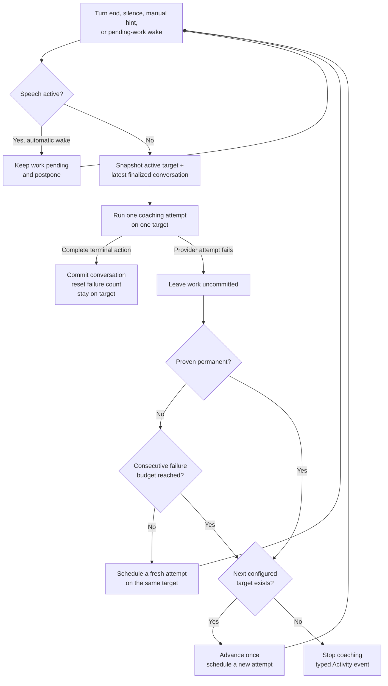

# Architecture

> A living document. Describes the vision, the harness loop, the components, and the principles
> that govern Jarvis. Exact schemas, prompts, and config are not duplicated here — they live in
> `Sources/JarvisCore/` (`ToolDefs.swift`, `Config.swift`, `CoachDriver.swift`).

> **Scope:** This page describes the **native Swift app** — the thing being built. The earlier
> two-phase plan (a Natively fork PoC first) was **dropped on 2026-06-14**; we build this directly,
> including the model-triggered `capture_screen` tool-loop. See [decisions.md](./decisions.md).
> Exact schemas, the coach prompt, and config are **not duplicated here** — they live in code
> (`Sources/JarvisCore/`, esp. `ToolDefs.swift`, `Config.swift`, `CoachDriver.swift`); this page is
> the *why*, the code is the *what*.

## 1. Vision

Jarvis is a personal, always-on macOS assistant that **coaches you through technical interviews**:
behavioral, system-design, and coding questions. It listens to you think aloud, and — when it needs
visible context — looks at your screen to see the current question, code, diagram, or notes. When it
has something genuinely useful to add, it speaks up **unprompted** with a short tip rendered in an
on-screen overlay.

The guiding belief: **build the harness, not the intelligence.** The intelligence already exists
(`gpt-5.5`, the `gpt-4o-transcribe` model on the OpenAI Realtime API). The macOS capabilities already exist (ScreenCaptureKit,
AVFoundation, Vision, the built-in `screencapture` tool, NSPanel). Jarvis is the thin layer of
glue that wires them into a proactive coach. We write the least code possible and reinvent nothing.

## 2. Core Loop

```
            ┌──────────────────────────────────────────────────────────────┐
            │                         JARVIS HARNESS                         │
            │                                                                │
  mic  ─────┤  AudioInput ──► Transcriber (gpt-4o-transcribe) ──► transcript    │
  sys-audio ┤                          │ turn-end / silence events           │
            │                          ▼                                      │
            │                    CoachDriver ──(gpt-5.5 + tools)──┐           │
            │                       ▲   │                         │           │
            │          capture_screen   │ speak(lines)            │           │
            │                       │   ▼                         │           │
  screen ◄──┤   ScreenTool ◄────────┘  Overlay (NSPanel) ◄────────┘           │
            │                                                                │
            └──────────────────────────────────────────────────────────────┘
```

Always-on and cheap: audio streams continuously to the Realtime API, producing a rolling,
speaker-labeled transcript. The transcript — not the screen — is the constant input signal.

On demand and expensive: the screen is **only** captured when the model asks for it via the
`capture_screen` tool, and a coaching response is **only** produced when the model calls `speak`.
This is what keeps Jarvis cheap and fast — the costly vision and generation steps fire only at
moments the model judges worthwhile.

### The turn

1. The Transcriber emits a **turn-end** event (`gpt-4o-transcribe` server VAD ends the turn after a
   tuned silence window) or a **silence check** fires (you've gone quiet, maybe stuck). The silence
   check carries *how long* you've been quiet and backs off across a long silence (the interval
   doubles each step up to a cap — see `Config`), resetting on speech; past an idle cutoff it stops
   probing entirely (you've stepped away — a nudge into an empty room still bills a request) until
   speech re-arms it.
2. The CoachDriver calls the brain on every trigger that carries **substance** — there is no
   cooldown, rate cap, or wake-word gate. Whether to speak (and whether the user just addressed
   Jarvis) is the model's call, governed by the system prompt; the only hard gates are the user's
   Start/Stop and the **substance gate** (`TurnSubstance`): a turn-end whose delta is pure
   back-channel filler ("Hmm", "嗯") or empty is skipped without a request. Classification is
   speaker-aware only where conversational meaning demands it: a short interviewer rejection such
   as "No" is substantive, even though the same user-side fragment is normally filler. Interviewer
   questions remain first-class and may draw a proactive tip. Skipped lines ride along on the next
   substantive turn; silence checks and the hint hotkey always go through.
3. It calls **`gpt-5.5`** with the coach system prompt, the session memory (`CoachHistory`), the
   new transcript delta, the timing context (seconds silent, session elapsed), and the tool set
   `[capture_screen, speak, stay_silent]`. The timing is what lets the model tell "thinking" from
   "stuck."
4. Before speaking, the model calls `capture_screen` when a specific, correct reply depends on
   visible context missing from the conversation — including unresolved references such as “this”
   or “here” — and no fresh capture is already available for that request. It may also capture when
   a silence trigger leaves progress unclear. The harness returns a silent screenshot plus OCR; that
   fresh result satisfies the screen gate, so the next model response must speak or stay silent
   rather than capture the same request again. Fully stated questions do not require a reflexive
   capture.
5. The model calls `speak(lines)` — a tip of up to ~3 short lines, returned **already split**
   into an array (Structured Outputs / `strict:true`), so the client never splits prose on
   punctuation — or `stay_silent`. A tool call is **required** on every model response: silence is an
   explicit tool, never plain text, so the session memory stays free of stray model prose
   (see [decisions.md](./decisions.md)).
6. `ActivityLog` records every brain action: successful or failed `capture_screen`, `speak`, and
   `stay_silent`. The deliberate-silence entry is human-facing but stays out of model memory.
7. `speak` renders to the **Overlay**, one line at a time (per-line display time set in `Config`).
   A newer tip never interrupts one still showing — tips queue and play in order, so no hint is lost.

**Why the overlay never interrupts and never drops (and why direct-reply latency is a non-issue).**
The queue is deliberately strict: a tip the user may still be reading is never cut off, and nothing
is discarded. The obvious objection — "a direct *'Jarvis, help'* reply could wait tens of seconds
behind a proactive tip" — does not apply in the real use case: **in a live interview the user never
addresses Jarvis out loud** (speaking to an AI would expose it), so overlay traffic is *entirely
proactive coaching* with no latency-critical direct reply to jump the queue. The accepted tradeoff is
that a queued proactive tip can surface some seconds after it was generated; that is bounded in
practice because `CoachDriver` runs a single turn in-flight (so tips are produced no faster than one
brain round-trip) and the prompt keeps the model restrained. So the policy is *not interrupt + not
drop*, not *show-freshest-only* — and adding direct-reply priority/preemption was considered and
rejected as solving a problem the interview workflow doesn't have. (The must-reply-on-direct-address
path still works for testing/practice; it is simply not latency-critical there.)

### On-demand hint (⌥⌘J)

Proactive coaching is the default, but the user can also **pull** a hint on demand. Pressing the
global hotkey **⌥⌘J** while a session is running fires a `manualHint` trigger that does in **one**
brain round-trip what the proactive screen path needs two for: the harness captures the screenshot
*itself* and injects it — plus a synthetic "give me a hint now" user message — into the *first*
request, and forces the `speak` tool, so a screen-aware hint always comes straight back. (The
proactive path, by contrast, must first let the model decide to call `capture_screen`, then reason
over the returned image on a second trip — the latency this hotkey exists to skip.) It reuses the
live session's brain, conversation, and transcript, so the hint has full context, and it routes
through the same single-in-flight turn box as audio triggers (a press coalesces, never stacks). It is
inert — a beep — when no session is running, since there is no live conversation to hint from. The
trigger and its pre-filled message are recorded to the [activity viewer](./build-and-run.md), so you
can see exactly what the shortcut sent to the brain.

The hotkey is registered with **Carbon `RegisterEventHotKey`**, the one global-shortcut API Apple
never modernized, which needs no Accessibility/TCC permission. We deliberately did **not** take the
`KeyboardShortcuts` package: every modern release uses SwiftUI macros (`@Entry`/`#Preview`) whose
plugins ship only with full Xcode, and Jarvis builds **CLT-only** (see
[build-and-run.md](./build-and-run.md)). The binding is fixed for now; a rebinding UI is a later nicety.

## 3. Components

| Component | Responsibility | Built on (borrowed) |
|---|---|---|
| **AggregateEchoCapture** | The whole capture path: one **private Core Audio aggregate device** = the built-in mic (`me`, clock master) + a system-output **process tap** (`them`, drift-compensated onto the mic's clock). A single IOProc delivers both sample-synced at the device's **native rate** — the one-clock case AEC3 needs; the capture **reads that rate and resamples mic+tap up to 48 kHz** for AEC3 (a no-op when the device is already 48 kHz). So **any input device works** — built-in, USB, 44.1 kHz gear, or AirPods (Bluetooth HFP at 16/24 kHz) — instead of the old hard 48 kHz pin that silently failed to start on Bluetooth mics. Inside the callback it runs AEC3 (tap = far reference, mic = near), removing the other side's speaker bleed from the mic *before* transcription — no headphones, and double-talk works (measured 30–50 dB cancellation). The untouched resampled tap remains the `them` source while a separate padded/truncated copy aligns AEC; wire delivery is serialized off the realtime IOProc. Then both sides downsample to 24 kHz. Replaces the old separate `AVAudioEngine` mic + `SCStream`. | Core Audio (`AudioHardwareCreateProcessTap`, private aggregate device, drift compensation) + `AVAudioConverter` resampling + WebRTC **AEC3**. |
| **WebRTCEchoCanceller** | AEC3 echo canceller driven at 48 kHz on 10 ms frames inside the capture IOProc; far reference first, then the mic cleaned in place. | WebRTC **AEC3** (`webrtc-audio-processing`), vendored static + zero-dylib via `scripts/build-aec.sh`. |
| **ErrorReporter** | The single funnel for user-facing failures. Severity on a Foundation-only `UserFacingError` decides the lifecycle consequence; an explicit startup/runtime context decides presentation. Startup failures may alert, but runtime failures never activate Jarvis or present UI even when they stop the session. `BrainFailure` feeds attempt outcomes into the finite provider route; only route exhaustion enters terminal reporting. Fixed, typed Activity outcomes carry stable on-disk identities while raw detail stays in `JarvisLog`. | AppKit (`NSAlert`) for startup only. |
| **Transcriber** | Maintain a rolling, speaker-labeled, **spoken-time timestamped** transcript; emit speech-activity, turn-end, and backing-off silence events (with quiet duration). Two instances run in parallel — one per side — tagging lines `me`/`them` into one shared transcript. A per-`item_id` ledger reconciles out-of-order delta/completed/failed/VAD events and salvages streamed text. An utterance-local failure with no usable words stays diagnostic and cannot trigger the brain; a permanent account or configuration rejection stops the unusable session with a fixed Activity reason. A privacy-preserving continuity witness records content-free capture/delivery/socket/server checkpoints and locally derived activity intervals, so the session log can locate a future gap without retaining PCM or adding pseudo-speech to model context. A socket is ready only after the server acknowledges its configuration; active ping/pong probes, send/receive errors, and startup timeouts all drive the same reconnect path. | `gpt-4o-transcribe` (Realtime API; tuned `server_vad`). |
| **CoachDriver** | Coordinate one single-flighted coaching attempt from a natural trigger or pending-work wake-up: snapshot one route target plus the latest conversation, route its tool calls, commit only a complete terminal action, and report one outcome to the scheduler. No speaking cooldown/rate cap — restraint is the model's; the only client-side content skip is the filler-only turn-end gate (`TurnSubstance`). | `gpt-5.5` (vision + tool-use) with `gpt-5.4-mini` for memory summaries — or a local Claude Code / Codex CLI on the user's subscription (see [§4 Local CLI brain providers](#local-cli-brain-providers)). |
| **ScreenTool** | Fulfill `capture_screen`: silently shoot the **active window** (default scope) — the window-server frontmost, on whichever display, clean even when partially covered — and attach an **on-device OCR** of the shot to the tool result so the model reads exact text instead of pixels. Falls back to a full-display capture (no OCR) — the Settings-chosen display in Entire-display scope, the main display when no window is eligible; the overlay window is excluded either way. See [settings-window.md](./settings-window.md#capture-scope). | macOS `screencapture` CLI + Apple Vision (`VNRecognizeTextRequest`). |
| **Overlay Caption** | Render `speak` output: up to ~3 short lines (model-split), shown one at a time and queued so a newer tip never cuts off the current one; non-activating, always-on-top, excluded from capture. Switchable from Settings — **off by default**; when off, tips are suppressed. | AppKit NSPanel; `OverlayCaptionPanel`. |
| **Overlay Box** | A persistent window logging every `speak` tip in full, timestamped — the scrollable history of what the caption flashed one line at a time. Movable, resizable, opaque, also excluded from capture; switched on/off from Settings (**on by default**), cleared on each Start. Fed by the same `speak` call as the caption via **`BroadcastOverlay`**, which fans one `OverlayRendering.render` out to both sinks (so `CoachDriver` is unchanged). | AppKit NSPanel; `OverlayBoxPanel`. |
| **MenuBar** | Manual **Start/Stop** of the pipeline (no auto-start), an explicit connection state (starting, listening, reconnecting, system-audio connecting, microphone-only, or stopped), and one-time API-key entry. It turns green only when the microphone transcription socket is configured and ready. The two overlay surfaces are switched from Settings, not the menu. | AppKit menu-bar item; owner-only file for the key. |
| **HotkeyController** | Register the global **⌥⌘J** hint hotkey and route a press to a one-trip `manualHint` turn while a session runs (beep otherwise). See [§2 On-demand hint](#on-demand-hint-j). | Carbon HIToolbox (`RegisterEventHotKey`, no TCC). |

Each component has one job and a narrow interface. The CoachDriver is the only place the
"intelligence" lives, and even there the intelligence is the model — the driver just wires events
to tool calls and enforces safety.

### Capture: device-rate adaptation

`AggregateEchoCapture` reads the input device's native sample rate and resamples up to AEC3's
48 kHz, rather than forcing the aggregate to 48 kHz. The earlier hard **pin** existed for two
reasons — AEC3 is created at a fixed 48 kHz, and the 48→24 kHz wire downsampler assumes a true
48 kHz input — so an aggregate that inherited a 44.1 kHz mic would corrupt the echo model and
mislabel the wire rate. But the pin **silently failed to start** on any device that can't do
48 kHz, notably AirPods (Bluetooth HFP runs them at 16/24 kHz). Reading-and-resampling serves both
original concerns *better* (AEC3 always gets true 48 kHz; the wire label stays correct) and works on
every device. The **one-clock aggregate is untouched** — the pin was about *rate*, not the clock;
mic and tap still come off one drift-compensated IOProc, so they stay sample-synced and the far/near
lockstep (now applied post-resample) holds. If the rate can't be read we fail rather than assume.

Alternatives rejected: running AEC at the device's *native* rate doesn't generalize (24/44.1 kHz
aren't AEC3-legal, so you resample anyway, with a variable frame size in the most delicate
component); and **bypassing AEC on "headphone" routes** is unsafe because a Bluetooth *speaker* is
indistinguishable from a headset, so a wrong bypass re-admits the echo. AEC3 therefore stays on for
all routes — it's a near-passthrough on earbuds (no acoustic echo to cancel). Caveat: AirPods *as a
mic* are HFP narrowband and low-fidelity regardless of resampling; for input quality, use the
built-in mic.

### Failure surfacing — startup loud, runtime ghost

Every user-facing failure flows through one `ErrorReporter`: severity on a Foundation-only
`UserFacingError` decides the lifecycle consequence while an explicit context captured at the
failure site decides presentation. Startup failures caused by an explicit Start may alert; every
runtime context suppresses alerts unconditionally, including after teardown, so a queued main-actor
report cannot reveal Jarvis during screen sharing. Permanent brain, microphone-transcription, and
audio-capture failures stop without presenting UI; the system-audio failure degrades to
microphone-only. Every brain provider crosses one typed `BrainFailure` boundary, but provider
classification never replays a failed request inside its coaching attempt. A failed attempt leaves
capture, transcription, pending triggers, unsent transcript, and committed history intact; the
provider-route state machine decides whether to try the active target again, advance to the next
user-authorized target, or stop after the finite route is exhausted. Audio-route rebuilds separately
retry under a bounded schedule before capture is declared unavailable, and stale callbacks are
identity-guarded across Stop → Start. Each Activity row persists a stable event kind. The agentic
session evaluator reads the complete Activity file, using those kinds and the full user-visible
sequence rather than a preselected excerpt; dynamic provider and transport detail remains only in
`JarvisLog`. Route changes and final exhaustion use fixed, provider-level Activity events; individual
failed attempts that have not yet advanced the route use fixed provider-only Activity copy because
the missed coaching turn is user-visible. Raw request errors, attempt scheduling, and failure counts
remain diagnostic detail.

Ghost mode applies from a live pipeline through terminal teardown: no autonomous activation, alert,
window, browser, notification, attention request, or sound is allowed outside the nonactivating,
capture-excluded caption and box overlays. The persistent menu-bar item and user-invoked
Settings/Activity surfaces are explicit exceptions, as is unavoidable macOS privacy UI. The Core
presentation matrix is unit-tested, and `scripts/check-ghost-mode.sh` rejects unreviewed presentation
API calls from the normal test gate. Realtime health remains visible only through the existing
menu-bar status; `ErrorReporter` owns failure lifecycle and permitted startup surfacing.

### Ordered provider route

Settings persists one primary target followed by an ordered list of explicitly authorized fallback
targets. A target is a provider/model pair; the shared reasoning-effort preference is snapshotted with
the route when an attempt begins. Exact duplicate targets are invalid, while two different models from
the same provider are allowed when the user deliberately places both in the list. The live route cursor
starts at the primary, only moves forward, and is session-local: automatic failover never rewrites
preferences. A successful fallback remains active for the rest of the session unless it later exhausts
its own failure budget. Stop → Start begins again at the persisted primary. Only a Settings edit that
changes route topology—the ordered provider/model target identities—installs a fresh route and resets
the live cursor between attempts. A reasoning-effort edit rebuilds clients at the existing cursor and
failure counts; the already-running attempt remains valid, so its success or failure updates route
health normally.

Saving the transcription API key refreshes only OpenAI clients and never probes or replaces CLI
clients. It preserves the route cursor and counts. An in-flight OpenAI failure belongs to the
superseded credential and is ignored, while an in-flight attempt on an unaffected CLI retains normal
success/failure accounting.

A **coaching attempt** snapshots one target and the latest provider-neutral conversation, then keeps
that target for the complete tool loop. Every provider request in that loop is made once. A complete,
non-truncated terminal `speak` or `stay_silent` commits the attempt and clears that target's consecutive
failure count. A provider error, malformed/incomplete terminal response, or failure after an
intermediate `capture_screen` fails the attempt once; cancellation, filler suppression, and local
screen-capture failure do not count as provider failures. The most recent completed screen observation
remains provider-neutral input for the next attempt, but older captures, raw reasoning, tool-call
identifiers, and call/result pairing never cross an attempt or provider boundary.

Failed conversation work remains pending and schedules another coaching attempt under bounded
backoff. This internal wake-up does not depend on a new natural trigger. If a turn-end, silence, or
manual-hint trigger arrives first, it coalesces with the pending wake-up; the next attempt contains the
failed conversation plus every newer finalized transcript item. If nothing new arrives, the new
attempt uses the same pending conversation. Automatic wake-ups wait while speech is active so they do
not race an utterance that is about to finalize. An explicit manual hint interrupts that postponement
even after the wait begins and upgrades the same pending-work attempt to a forced hint; ordinary
natural triggers remain parked until transcription settles. `TriggerReason` remains the model-facing
reason that made coaching useful (`turnEnd`, `silence`, or `manualHint`); pending work is scheduler
state, not a fourth instruction to the model. An automatic attempt with no newer trigger reuses the
pending work's reason; when another natural trigger arrives, its newer reason describes the fresh
snapshot.

Temporary and unknown failures increment the active target's consecutive count; reaching the
code-owned threshold exhausts that target (see
[`BrainRouteSession.failuresPerTarget`](../Sources/JarvisCore/Coach/BrainRouteSession.swift)).
A failure classified as permanent at the provider boundary (for example, proven authentication,
billing, access, or model configuration failure) exhausts the target immediately. Either transition
only changes the route cursor after the failed attempt ends: the next target starts in a separate
fresh attempt with rebuilt conversation context. A terminal success resets the active target's count
but never moves the cursor backward. A fallback that is already proven impossible to construct at
activation time—for example, a missing executable, confirmed signed-out CLI, or invalid
configuration—is skipped as unavailable rather than consuming synthetic attempts merely to reach
that threshold. If no target remains, coaching stops, Activity records one fixed typed
route-exhausted event, and raw errors stay in `jarvis-debug.log`.



The implementation keeps orchestration, route policy, and OS edges separate:

| Component | Responsibility | Must not do |
|---|---|---|
| Route value (`JarvisCore/Brain`) | Immutable ordered targets and validation. | Schedule work or create UI. |
| Route state machine (`JarvisCore/Coach`) | Count attempt outcomes, move forward, and emit pure transition commands. | Call providers, read preferences, or own timers. |
| Attempt scheduler (`JarvisCore/Coach`) | Own pending work, bounded backoff, trigger coalescing, single-flight, and speech-aware postponement. | Classify provider payloads or mutate the route directly. |
| Attempt runner (`CoachDriver`) | Snapshot one target, run its tool loop, normalize completed provider-neutral effects, and report one outcome. | Retry a failed request or choose another target mid-attempt. |
| Client factory (`JarvisCore/Brain`) | Build a `BrainClient` for an explicit target and surface preflight availability. | Select or reorder targets. |
| Preferences (`JarvisCore/Config`) | Persist primary, ordered fallbacks, per-provider models, and shared effort. | Store the live route cursor or failure counts. |
| App adapters (`JarvisApp`) | Render the list editor and feed speech-activity/timer events into Core. | Contain retry or failover policy. |

## 4. Data Flow & Cost Model

- **Continuous (cheap):** audio → Realtime → transcript. This runs the whole session.
- **Per-turn (cheap):** a `gpt-5.5` call on each substantive turn-end and each silence event, with a
  bounded, mostly-cached working set. Filler-only turn-ends (from either speaker) are skipped
  client-side — free. No image unless the model asks.
- **On-demand (expensive):** a screenshot + vision tokens, only when the model calls
  `capture_screen`. A coaching response, only when the model calls `speak`.

The model is the cost governor: it spends vision tokens and screen real estate only when it
judges them worthwhile. That is the whole point of making screen capture a model-invoked tool
rather than a per-turn screenshot.

### Models and APIs

- **Brain — `gpt-5.5` via the OpenAI Responses API** (`POST /v1/responses`), not Chat Completions:
  for the gpt-5 family, function/tool calling is the recommended (and least restricted) path on
  Responses. The tool loop is threaded with `function_call` / `function_call_output` items, with the
  model's `reasoning` items replayed verbatim ahead of the call — OpenAI's requirement for the model
  to continue its chain of thought over a tool result instead of re-reasoning from scratch.
- **Per-session memory — client-managed (`CoachHistory`).** The coach needs to remember its *own*
  prior replies (the transcript only holds user speech), so `CoachDriver` keeps the session memory
  itself and rebuilds every request as `[system] + memory + new delta`. Owning the memory is what
  keeps it small and cheap: it grows **append-only** (a byte-identical prefix, so OpenAI's prompt
  cache keeps hitting at ~90% discount); `stay_silent` turns leave no trace; screenshots and reasoning
  items live only inside the turn that produced them — at commit, the pixels become a one-line stub
  and the capture's OCR text (in the tool result) is what persists, and reasoning items are dropped;
  and past a token threshold (see
  `Config.historyCompactionTokenThreshold`) the oldest span is **compacted** into a short structured
  summary written by a cheaper model (`gpt-5.4-mini`), so the problem statement never falls out of
  context. Requests are sent `store:true` so they stay inspectable in the OpenAI dashboard for
  debugging — the retention tradeoff is documented in [sandbox.md](./sandbox.md).
- **Transcription — `gpt-4o-transcribe` over the GA Realtime API** with **tuned `server_vad`** (not
  `semantic_vad`, which is reported flaky in transcription-only mode — it can stop emitting
  `…transcription.completed` entirely). Turn-end fires on `…transcription.completed`, plus a
  client-side debounce so a brief mid-thought pause doesn't fragment one sentence into several turns.

### Local CLI brain providers

The brain can alternatively run through a locally installed **Claude Code** or **Codex** CLI
(`BrainProvider`, selected in [Settings → Brain](./settings-window.md#brain)), so coaching turns are
billed to the user's existing Claude / ChatGPT **subscription** instead of the metered API key.
`CLIBrainClient` implements the same `BrainClient` protocol, so `CoachDriver`, the client-managed
memory, provider-route policy, and traffic recording are all unchanged — only the transport differs:

- **One stateless subprocess per turn** (`claude -p` / `codex exec`, spawned by
  `AgentCLIProcessRunner`) — no CLI session is created, resumed, or left behind: every call is
  self-contained (client-managed memory, same as the API path), the CLIs run with session
  persistence off (`--no-session-persistence` / `--ephemeral`, so no transcript copy lands in
  `~/.claude` / `~/.codex`), and the process dies with the turn — at reply, at the SIGTERM→SIGKILL
  timeout watchdog, or **immediately when Stop cancels the turn** (task cancellation kills the pid,
  so a cancelled turn never keeps burning quota). Since the CLI has no native function calling, the
  `ToolDef`s are rendered as a **JSON tool protocol** — the model ends its reply with
  `{"tool":…,"arguments":{…}}`, parsed back into the same `ToolInvocation`s (with prose/code-fence
  tolerance, and a forced `speak` degrading to speaking the raw reply so a hotkey press never
  silently vanishes).
- **Every turn is one model call.** Claude takes its input as a stream-json message, so screenshots
  ride **inline as base64 image blocks** — same call, no disk copy, no Read-tool round trip — and
  with `--tools ""` (every built-in disabled) a turn can't go agentic at all. Codex has no inline
  image input, so for it screenshots become 0600 files in the per-session log directory (which
  already persists every screenshot the model sees — same data posture), attached via `-i` and
  deleted when the run finishes. A bounded local capability probe reads the installed Codex CLI's
  advertised feature names; its supported shell, code-mode, delegation, browser/app, plugin, and
  other agentic surfaces are disabled without guessing flags that an older or renamed CLI rejects.
  Project-root/document discovery is suppressed, and the leading instruction explicitly treats the
  three Jarvis tool names as an output protocol, not Codex tools. `--sandbox read-only` remains the
  enforcement backstop for built-ins Codex does not expose a disable switch for. Claude runs with
  its persona replaced (`--system-prompt`) and no settings sources, and the one reasoning-effort
  setting maps onto each CLI's own scale.
- **Installed CLIs are auto-detected.** `AgentCLIDetector` discovers binaries through file probes
  over stable $PATH entries + known install dirs. Inherited $PATH entries under the system temporary
  directory are ignored for both selection and the child environment: terminal launchers may put
  short-lived wrappers there, but a long-running app must resolve the durable user/system install
  instead. Claude's actual sign-in state comes from its non-billing `auth status --json` command under
  a short timeout, because stale account metadata can survive an expired OAuth session; Codex uses
  its auth-file marker and a bounded, non-model `features list` capability probe. Settings
  distinguishes signed in, signed out, and an unavailable auth probe, and Start refuses a confirmed
  logout. Settings availability discovery probes every supported CLI; Start probes only the CLI
  providers present in the configured route. Saving the transcription API key probes no CLI.
- **The OpenAI key stays required**: transcription always runs on the Realtime API. A CLI provider
  moves the brain/summarizer off the key, not the ears; the session evaluator independently runs
  through a local agentic CLI over the completed session directory. **Latency is the tradeoff**,
  though a modest one now that every turn is one model call: measured coach turns run ~2.6s (text)
  / ~3.3s (with screenshot) on claude sonnet at low effort, ~5–8s on codex — versus the direct
  API's sub-2s target. The invocation is kept deliberately slim (persona replaced, no settings
  sources or personal codex config — `--ignore-user-config` — **zero MCP servers** via
  `--strict-mcp-config` / `-c mcp_servers={}`, and no feature-gated Codex agent tools),
  so what remains is irreducible from outside: claude's floor is ~0.7s of process overhead + model
  time; codex's is ~4.7s even for a trivial prompt because its fixed coding-agent scaffold (a
  built-in multi-thousand-token system prompt that `exec` offers no flag to replace) rides every
  call. The pipeline absorbs it (single-in-flight turns coalesce; the overlay paces display). If
  more is ever needed, the escalation is a long-lived interactive CLI process (stream-json in/out
  with `/clear` between turns — verified to work) — worth its lifecycle complexity only for
  claude's last ~0.7s, so it's deliberately not built; per-turn session *resume* is pointless (it
  still pays startup per call).

### Latency

Target: **turn-end → first overlay line < 2s.** It holds because transcription is continuous
(no STT latency at trigger time) and most turns are text-only (no `capture_screen`), so the brain
call is a single short round-trip. The overlay then reveals the already-returned lines one at a
time (paced by `Config`), so the first tip appears immediately — note the brain response itself is **not**
streamed (one buffered request; the overlay just paces the display).

### Resilience

The capture edge keeps two system-audio representations for different contracts: transcription
preserves every real tap sample and pads only a short/empty callback's missing silence so Realtime
VAD keeps advancing; AEC receives a separate exact mic-length padded/truncated reference. Neither
path disables AEC or changes the configured Realtime noise-reduction profile. A route switch may
briefly expose no usable input/output device, so a failed aggregate rebuild follows a bounded
exponential retry schedule before reporting terminal capture loss. Repeated notifications from the
same device transition may supersede the pending work, but share one `RetryIncident` budget; only a
successful rebuild resets it for a later incident.

The always-on legs are built to survive transient failure rather than die on it:

- **The realtime transcription socket *will* drop** (network blips, server resets, the ~60-min
  session cap) and a Realtime session **cannot be resumed** — a dropped connection means a new
  session. A socket is not declared ready at the WebSocket handshake: the transcriber waits for the
  server's session-configuration acknowledgement under a startup deadline. Once ready, ping/pong
  probes expose an idle half-open connection before the user's next utterance; send, receive, close,
  startup-timeout, and liveness failures all enter one idempotent reconnect path. Each replacement
  socket has a generation so stale callbacks cannot damage the new one, and diagnostics label the
  `me`/`them` side, socket generation, server session, and current macOS network-path summary. While
  reconnecting, audio remains in one **transactional FIFO plus recovery tail** (`PCMBuffer`, capped at
  `maxBufferedAudioSeconds`). Exactly one oldest chunk is claimed at a time. A successful URLSession
  callback moves it into the in-memory tail rather than deleting it, because Realtime intentionally
  sends no confirmation for `input_audio_buffer.append`; only server VAD/transcription audio-clock
  progress retires a safe prefix. On failure, the unconfirmed tail is requeued ahead of audio captured
  during reconnect backoff. This closes the ready-transition, asynchronous-send, and idle half-open
  loss edges; deliberate cap eviction is logged as diagnostic metadata. Within a healthy socket,
  streamed transcript deltas survive a failed or missing terminal event. An utterance-local failure
  remains visible in diagnostics but cannot become pseudo-speech or trigger the brain; a permanent
  quota, authentication, access, or configuration rejection ends the session and records its fixed
  cause in Activity.
  Sequence, sample, timestamp, and socket-generation checkpoints cover the capture, delivery,
  WebSocket attempt/completion, and server-event boundaries. Periodic content-free summaries and
  typed anomalies show which boundary stopped advancing. Bounded local activity intervals match
  overlapping server VAD intervals on the session audio clock, including delayed reconnect replay,
  so a quiet dip inside one server utterance is not reported as a gap. This evidence stays in the
  owner-only session log: it diagnoses loss but cannot reconstruct words that never reached
  transcription, and none of it enters model context. VAD-only start/stop events do not
  restart silence checks without contributing context. Pending items are finalized by bounded
  stopped/active deadlines. On a recoverable socket failure, their old server IDs are cleared and
  their retained PCM is transcribed by the replacement session instead of first emitting a partial
  or gap that the replay would duplicate. Stale speech state therefore cannot suppress silence
  coaching after reconnect. Reconnect uses capped exponential backoff.
- **The brain call** is single-flighted (a turn can't double-speak) and runs under a provider-aware
  request timeout. The API and Claude ceilings stay well above the reasoning-turn tail; Codex has a
  shorter bound because a healthy decision turn takes seconds and a silent agent-runtime stall would
  otherwise batch every later transcript turn behind it. A failed provider request is never replayed
  inside its coaching attempt. The attempt ends, sent-state and provider-neutral work remain
  uncommitted, and the scheduler makes a new attempt after bounded backoff or an earlier coalesced
  natural trigger. That new attempt rebuilds its input from the latest committed history, the failed
  conversation, and every newer finalized transcript item; with no new speech, it simply re-attempts
  the pending work. Reaching the [ordered route's](#ordered-provider-route) code-owned consecutive
  failure budget exhausts the active target; a provider-boundary failure proven permanent exhausts
  it after one attempt. In both cases, only the next fresh attempt runs the next target on the
  forward-only route. A terminal success resets the active target's count and keeps that target
  installed. No provider is probed concurrently, and no automatic recovery returns to the primary.
  Cancellation remains quiet. Memory **compaction** fails soft outside this route: a failed summary
  simply leaves the full history for the next attempt.
- **The audit edge** drains Activity's asynchronous writer as Stop completes. An explicit
  Activity → **Evaluate** click then runs the read-only agentic evaluator over the source checkout
  plus the completed session directory; it reads `jarvis-activity.jsonl` itself in full, so no
  application-owned filter decides which Activity events are relevant before the audit. The
  standalone script invokes this same Core evaluator.

## 5. Safety Model

Enforcement-first, not convention. See [sandbox.md](./sandbox.md) for the full model. In short:

- **App Sandbox** with only the entitlements it needs (screen recording, audio input), giving
  **no general filesystem access** — the hardened posture for a shippable build. *For the current
  personal build this is relaxed:* the app is unsandboxed and signed with a stable self-signed
  identity (`Jarvis Dev`, so grants persist), relying on macOS **TCC prompts** for Screen Recording
  + Microphone. It can therefore technically read the user's files;
  that tradeoff is accepted for the personal tool. See [sandbox.md](./sandbox.md).
- **API key in an owner-only file** (`0600`), not the Keychain — see [sandbox.md §3](./sandbox.md) for why.
- **Built and run in the main `forrest` account inside a git worktree** (recoverability). The
  separate-restricted-account requirement is waived for the personal build; see [sandbox.md](./sandbox.md).
- **Egress is narrow and explicit:** audio to `gpt-4o-transcribe`; a screenshot + transcript window
  to `gpt-5.5` *only when the model triggers a capture/response*. The audio witness persists only
  counters, sequence/sample metadata, timestamps, socket generations, server audio-clock values, and
  a local activity bit in the owner-only session log — never PCM or recovered words. The only screen-/audio-derived data
  written to **local** disk is the owner-only, bounded per-session **activity log** (spoken tips,
  deliberate-silence outcomes, fixed failed-action and stop/degrade notices, transcribed lines, and
  the screenshots the model saw); raw mic audio and the live transcript are never archived. Requests
  are sent `store:true`, so what the model saw does remain inspectable (and retained) server-side at
  OpenAI for debugging (see [sandbox.md](./sandbox.md)).
- **Behavioral restraint (model-governed):** there is **no cooldown or rate cap** in code. Every
  substantive utterance — from either speaker; only back-channel filler is skipped as pure cost —
  reaches the brain, and the brain decides whether it has anything worth
  saying — that restraint lives in the system prompt (see [`coachSystemPrompt`](../Sources/JarvisCore/Coach/ToolDefs.swift)).
  This keeps
  conversation natural: a follow-up question is never stranded behind a timer. The hard control is
  the menu-bar **Start/Stop** — coaching never runs until explicitly started, and stopping tears the
  pipeline down entirely. Cost is accepted as tracking usage for now (a future improvement, not a
  v1 guardrail).

## 6. Non-Goals (v1)

- Multiple coaching modes / a tiered sensitivity dial. (One technical-interview mode spans
  behavioral, system-design, and coding questions.)
- Continuous OCR or recording the screen/audio to disk ("recall").
- A dedicated wake-word engine. Direct address is just the word "Jarvis" (or a question) appearing
  in the transcript, which the brain reads and answers — there is no wake-word detector. (A global
  **⌥⌘J** hotkey for an on-demand screen hint *does* exist — see [§2](#on-demand-hint-j) — but it
  complements the proactive default; it is not a trigger-to-listen wake key.)
- Productization: hosted auth, billing, onboarding, or arbitrary provider chains.
- Windows / cross-platform.

## 7. Design Principles

1. **Build the harness, not the intelligence.** If a model or an OS framework can do it, we don't write it.
2. **Least code wins.** Prefer a borrowed tool (`screencapture`, an Apple framework, an OpenAI API) over custom code, every time.
3. **The model is the cost governor.** Expensive actions (vision, speaking) happen only when the model opts in.
4. **Proactive, but disciplined.** Speaking up unprompted is the whole point; the model's own restraint (a tuned system prompt) keeps it from being annoying.
5. **Sees the screen, not the disk.** Security is enforced by the sandbox, not by good intentions.
6. **Self-verifying.** Every build ships with tests and a smoke checklist the agent can run to prove it works.
7. **One domain, done well.** Ship the technical-interview coach; expand later.

How Jarvis is built, signed, tested, and run — and the activity viewer — is its own
operational page: [build-and-run.md](./build-and-run.md).
