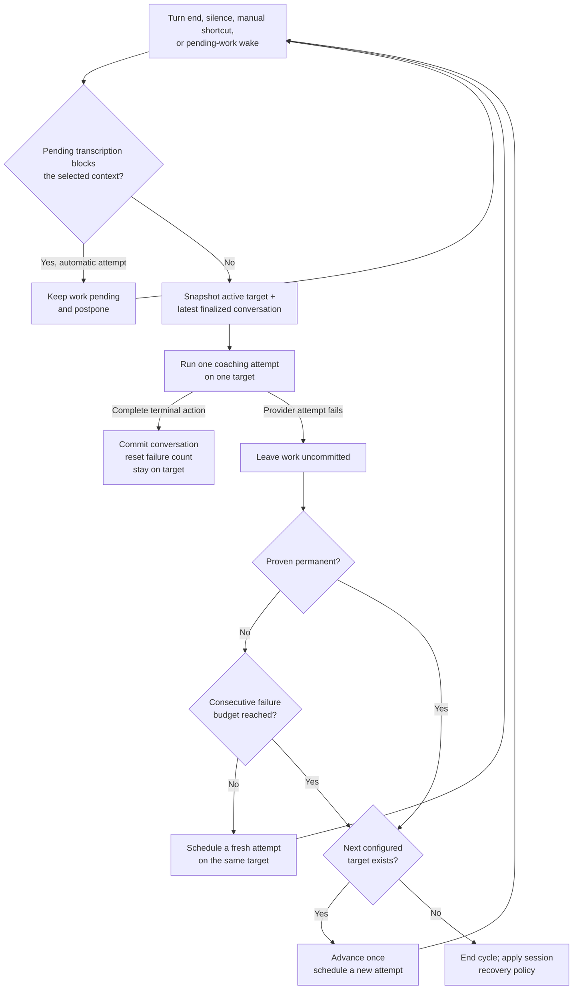

# Architecture

> A living document. Describes the vision, the harness loop, the components, and the principles
> that govern Jarvis. Exact schemas, prompts, and config are not duplicated here — they live in
> `Sources/JarvisCore/` (`Prompts/`, `Coach/Tools/`, `Config/Config.swift`).

> **Scope:** This page describes the **native Swift app**, built directly rather than on a fork of
> an existing tool; why no existing product or open-source base fit is the record in
> [landscape-survey.md](./landscape-survey.md) and [fork-evaluation.md](./fork-evaluation.md).
> Exact schemas, the coach prompt, and config are **not duplicated here** — they live in code
> (`Sources/JarvisCore/`, especially `Prompts/`, `Coach/Tools/`, and
> `Config/Config.swift`); this page is
> the *why*, the code is the *what*.

> The cross-cutting contract for isolating optional runtime work is
> [lean-coaching-core.md](./lean-coaching-core.md); every phase of its roadmap is built, and this
> page describes the resulting runtime.

## 1. Vision

Jarvis is a personal, always-on macOS assistant that **coaches you through technical interviews**:
behavioral, system-design, and coding questions. It listens to you think aloud, and — when it needs
visible context — looks at your screen to see the current question, code, diagram, or notes. When it
has something genuinely useful to add, it speaks up **unprompted** with a short tip rendered in an
on-screen overlay.

The guiding belief: **build the harness, not the intelligence.** The intelligence already exists
(the selected brain model and transcription provider). The macOS capabilities already exist
(SpeechAnalyzer, ScreenCaptureKit, AVFoundation, Vision, the built-in `screencapture` tool, NSPanel).
Jarvis is the thin layer of glue that wires them into a proactive coach. We write the least code
possible and reinvent nothing.

## 2. Core Loop

```
            ┌──────────────────────────────────────────────────────────────┐
            │                         JARVIS HARNESS                         │
            │                                                                │
  mic  ─────┤  AudioInput ──► selected Transcriber ──► transcript              │
  sys-audio ┤                       │ turn-end / silence events                │
            │                       ▼                                          │
            │                 CoachDriver ──(brain model + tools)─┐           │
            │                       ▲   │                         │           │
            │          capture_screen   │ speak(lines)            │           │
            │                       │   ▼                         │           │
  screen ◄──┤   ScreenTool ◄────────┘  Overlay (NSPanel) ◄────────┘           │
            │                                                                │
            └──────────────────────────────────────────────────────────────┘
```

Always-on and cheap: audio streams continuously to the selected transcription adapter, producing a
rolling, speaker-labeled transcript. OpenAI Realtime is the default; Apple Speech is an opt-in,
on-device adapter on macOS 26+. OpenAI defaults to automatic language recognition and lets the user
hint English, Mandarin, or both; Apple uses one user-selected locale per session. The transcript —
not the screen — is the constant input signal.

On demand and expensive: the screen is **only** captured when the model asks for it via the
`capture_screen` tool, and a coaching response is **only** produced when the model calls `speak`.
This is what keeps Jarvis cheap and fast — the costly vision and generation steps fire only at
moments the model judges worthwhile.

### The turn

1. The Transcriber emits a **turn-end** event after it finalizes an utterance (GPT-4o uses tuned
   server VAD, GPT Transcribe and GPT Live use a local Silero VAD plus an explicit acknowledged
   commit, and Apple Speech uses final `SpeechTranscriber` segments; all paths share the same client
   transcript-batching window, which groups rapid final fragments but does not establish
   cross-speaker chronology),
   or a **silence check** fires (you've gone quiet, maybe stuck). The silence check carries *how
   long* you've been quiet and backs off across a long silence (each interval is four times the
   last, up to a cap — see `Config` and `SilenceBackoff`), resetting on speech; past an idle cutoff
   it stops probing entirely (you've stepped away — a nudge into an empty room still bills a
   request) until speech re-arms it. The first check comes after well under a minute of quiet, not
   two minutes: a stuck candidate is rarely silent that long, because a muttered "okay", a request
   for a moment, or a half sentence each restart the wait, and a two-minute wait lets a whole stuck
   stretch pass unchecked. The fourfold growth, rather than doubling, keeps the second check a few
   minutes after the first, so quiet thinking that the first check saw is not checked again soon,
   and a long quiet stretch costs a few requests. Speech from either side defers a check.
2. Before an automatic attempt, `TranscriptionSettlementGate` checks both provider streams against
   the newest spoken timestamp in the finalized transcript snapshot. Pending speech does not block
   that context when its known start clears that timestamp by `TranscriptionWorkState`'s start-time
   margin; a start inside the margin, an earlier start, and an unknown start all block. The margin
   bounds the residual skew left in those starts: the per-socket audio-time mapping, server-VAD and
   local detector onset reporting, and the fixed device offset between the mic path and the
   post-mix tap. The scheduler refreshes and rechecks the snapshot after every wake, then pins the
   admitted delta for the attempt so newer arrivals cannot cross an unresolved earlier utterance.
   Silence probes and attempts without new finalized speech still require full settlement.
   `TranscriptionWorkState` carries the earliest unresolved start on the shared session clock.
   OpenAI's item ledger supplies it when every pending item has timing. On GPT Transcribe and GPT
   Live, speech still in progress adds its Silero onset, the same start its committed item carries.
   Reconnect recovery and an ended local turn the server has not yet bound to an item remain
   unknown. Apple PCM silence requests `SpeechAnalyzer.finalize` and
   remains unsettled until matching final-result progress is consumed from the module stream; its
   start is the local activity tracker's onset, held until that pass settles. Apple finalizes
   phrases mid-sentence, and moving the start forward with each final would let Jarvis coach on half
   a question while the speaker is still talking, so a mid-sentence phrase waits for the pause that
   ends the sentence, as on the OpenAI path. Gemini times no utterance at all, so
   `PendingSpeechWindow` derives its start from the capture time of the audio still queued and the
   local onset of the utterance the server is recognizing, capped by the moment that recognition
   was first reported. Speech the local detector missed stays unknown, and one long run of speech
   that the server splits into several utterances keeps its first onset until the run ends. The
   same window gives a Gemini final its spoken time, but only the first final of a window that saw
   one stretch of local speech gets the onset. Every other final keeps its arrival time. A later
   final in a long run started after the onset, and after a second stretch the first may have been
   noise Gemini began recognizing but never finalized. The recognition cap is left out for the same
   reason. Arrival time is never earlier than the speech, so falling back can only delay coaching,
   while a stale early stamp could let coaching pass speech that really came first.
   The model still decides whether a finalized thought warrants a hint; admission does not classify
   intent or infer sentence completeness from punctuation.
   Natural triggers coalesce while waiting. Each finalized turn carries its transcript boundary, so
   a delayed transcript-batch callback arriving after another attempt committed that same line is
   consumed instead of buying a duplicate request. Any explicit coaching shortcut bypasses this wait.
   The CoachDriver then calls the brain on every trigger that carries **substance** — there is no
   cooldown, rate cap, or wake-word gate. Whether to speak (and whether the user just addressed
   Jarvis) is the model's call, governed by the system prompt; the only hard gates are the user's
   Start/Stop and the **substance gate** (`TurnSubstance`): a turn-end whose delta is pure
   clear hesitation sounds ("Hmm", "嗯", or a sequence such as "Uh. Hmm. Oh.") or empty is skipped
   without a request. Those sounds are also removed from a mixed brain-facing delta, while Activity
   keeps the complete finalized transcription. Context-dependent short replies such as "Yes", "No",
   "Okay", "对", and "可以" fail open for either speaker, as do unknown short fragments. Interviewer
   questions remain first-class and may draw a proactive tip. Consumed noise never rides into a
   later request; silence checks and both coaching shortcuts always go through. The gate is a small explicit
   class on purpose: a classifier model would add latency and cost for it, and asking the
   transcription model to drop filler is not a deterministic boundary and would silently alter the
   audit record.
3. It calls the **selected brain model** with the coach system prompt, the session memory
   (`CoachHistory`), the
   new transcript delta, the timing context (seconds silent, session elapsed), and the session's
   switched-on tool set. `capture_screen`, `speak`, and `stay_silent` are always there; `load_tool`
   and a one-line catalog entry for `search_prep_notes` join them when prep sources are configured
   and the user has not switched that capability off (see [Capabilities](#capabilities)). The timing
   is what lets the model tell "thinking" from "stuck."
4. Before speaking, the model calls `capture_screen` when a specific, correct reply depends on
   visible context missing from the conversation — including unresolved references such as “this”
   or “here” — and no fresh capture is already available for that request. It may also capture when
   a silence trigger leaves progress unclear. The harness returns a silent screenshot plus typed
   text evidence. Active-window captures always run on-device OCR over the viewport. With the optional
   Chrome text setting and Accessibility permission, bounded text from the active tab's accessibility
   tree is added as a complementary source. That
   fresh result satisfies the screen gate, so the next model response must speak or stay silent
   rather than capture the same request again. Fully stated questions do not require a reflexive
   capture.
5. The model calls `speak(lines)` — a tip of up to ~3 short lines, returned **already split**
   into an array (Structured Outputs / `strict:true`), so the client never splits prose on
   punctuation — or `stay_silent`. A tool call is **required** on every model response: silence is an
   explicit tool, never plain text. Under a "stay silent by calling no tool" contract the model still
   has to emit *something*, and at low reasoning effort that came out as leaked deliberation text
   ("final empty. no. final.") that polluted the conversation and was imitated on later turns;
   requiring a tool call prevents the emission rather than filtering it afterwards.
6. Activity records every brain action, through the session's one evidence handle: successful or
   failed `capture_screen`, `speak`, `stay_silent`, each prep-notes search, each capability load, and
   the fixed notice that a tip went out without the user's prepared notes. Heard rows and
   model-facing transcript deltas share `ConversationChronology`:
   occurrence time is authoritative, and insertion order breaks timestamp ties. A late-finalizing
   earlier utterance is therefore inserted before a faster later reply. When Activity reaches its
   memory backstop, Core sends the discarded insertion identities so the live DOM trims in lockstep
   and keeps using those same indices. Reopened sessions retain the same newest insertion identities
   before sorting that retained set by occurrence time. The deliberate-silence entry is human-facing
   but stays out of model memory.
7. The scheduler reports the audit facts around the decision through the narrow
   `CoachingAttemptAuditing` port: the natural trigger or pending-work wake, the indexed finalized
   lines considered by the substance gate, whether a provider call is the initial request or a screen
   continuation, and the terminal outcome. Brain clients report matching traffic through
   `BrainTrafficAuditing`; a typed task-local request attribution carries the attempt identity.
   Runtime classification and actual request inclusion are recorded separately so the evaluator can
   observe a gate miss instead of recomputing the fact under audit. `FileSessionAudit` admits these
   typed events best-effort to the bounded process worker; callers outside a persisted live session
   omit the optional observer. This stays diagnostics-only; Activity remains the human-facing record
   and provider scheduling detail remains out of it. See [session-audit.md](./session-audit.md) for
   the component boundary and lifecycle.
8. `speak` appends the tip to the **Overlay Box**, the session's scrolling history, so a newer tip
   never replaces one the user may still be reading.

### Capabilities

What a session can do is one value, `CoachCapabilities`, composed at Start from the user's switches,
the bundled skills, and whether prep-material sources are configured, then read by the coach loop,
which builds every request's prompt and tool list from it. One value fixed at Start is the whole
point: a set that grew or changed shape mid-session would change what a brain was told it could call
between two requests of the same conversation, and a route can move between brains over one shared
history.

A tool carries its own usage guidance (`ToolDef.guidance`) and a deferred flag. A **hot** tool is
declared with its schema and its guidance from the first request: the tip style is `speak`'s
guidance, because `speak` is the tip. A **deferred** tool appears only as one catalog line, its name
and its one-sentence description, and the model calls `load_tool` to receive its schema and
guidance as a tool result, after which it is declared and callable for the rest of the session. So
the prompt describes exactly the tools the request carries, and the guidance for a tool the model
cannot call is not in the prompt at all. Jarvis defers on every brain in the same way rather than
using a provider's own tool-search feature: the route can move between brains mid-session over one
shared history, and a plain tool result replays on any of them.

A **skill** is coaching guidance for a kind of question, bundled as
`Sources/JarvisCore/Resources/Skills/<name>/SKILL.md` in the agentskills.io format: frontmatter
naming the skill and describing it in one line, then the body. `coding-with-ai` is a separate,
optional companion to `coding`: each refers to the other by name and loads it too when it applies
and is not already loaded, rather than one nesting inside the other. `SkillCatalog` reads and validates
them at Start (a small hand-written frontmatter reader — two keys do not warrant a YAML dependency
in a package that builds under Command Line Tools alone), and a file it rejects costs its own
guidance, never the session. The switched-on skills are the second catalog; `load_skill` returns one
body, framed as an extension of the action policy and tip style so the directives inside it read as
instructions rather than as data. A skill never becomes a callable tool, and its body is never in
the prompt.

Nothing preselects a skill at Start. The model reads the one-line description and loads what the
question in front of it needs, which is what lets one session coach a behavioral question and then a
design question. The alternative of a runtime classifier adds a model call and a wrong answer to
recover from; concatenating every skill into the prompt pays for all of them on every request and
was what a single "general technical" skill existed to work around. The description is written for
the model, with an example, because that line is all it sees before deciding.

A load belongs to the attempt that made it and becomes session state only when that attempt commits
a turn. An attempt that fails simply loads again, at the cost of one round trip, and in exchange
"already loaded" is true exactly when the loaded content is in history the model can still read. Compaction
keeps those pairs verbatim under the summary for the same reason ([`CoachHistory`](../Sources/JarvisCore/Coach/CoachHistory.swift)).

`search_prep_notes` is the first deferred tool. It is in the catalog when prep-material *sources* are
configured and the user has not switched it off. "Configured" is deliberately not "an index exists":
building the index reads files and shells out to `textutil`, so it runs off the Start path and the
search port arrives after the first
attempts. A search that finds no index says so and coaching continues without the notes. That is the
honest answer, and it costs nothing, where changing the offered set mid-session would cost the whole
session. The same answer covers indexing that finished with nothing usable, because the builder
installs no port in either case; which one it was stays in `jlog`, and Activity carries only the
fixed notice that a tip went out without the user's own material. Switching the capability off also
skips the index build, so the file reading and `textutil` work stop with it.

Prep material is shared across interview types: `.md`, `.txt`, `.pdf`, and `.docx` sources can all
supply behavioral, coding, or system-design preparation, including mixed-topic documents. No skill
or topic filters sources by file format. Extraction depends on the file format; coaching depends
on the question and retrieved evidence. The deferred tool description names behavioral stories,
coding approaches, and system designs so technical preparation is discoverable before loading.
Retrieval stays selective: questions unlike plausible preparation can skip it, and relevant excerpts
already in context are reused. Once loaded, tool guidance treats excerpts as reference data, preserves
assumptions and caveats, and supplements uncovered technical topics without fabricated attribution
or personal history. A required reply alone does not bypass loading; only a tool choice permitting
solely `speak` does.

Prep search uses local keyword ranking over paragraph chunks. Only `.md` sources receive Markdown
handling; plain text and extracted PDF/Word text retain paragraph-based chunking without interpreting
literal hash or pipe characters. Markdown section boundaries keep short stories with their accuracy
notes. Consecutive headings stay with their first content block, including the first group of an
oversized table; trailing headings without content are omitted from the search index because they
supply no evidence. The source file is unchanged. Fenced code blocks stay intact, including blank
lines; indented code is not interpreted as headings or tables. Recognized leading/trailing-pipe
tables with an explicit delimiter row split between rows and repeat their column headers, including
when a table immediately follows a heading without a blank line. Comparison rows remain
interpretable and a question map does not become one oversized search result. Unsupported Markdown
constructs retain paragraph behavior. Long prose paragraphs, fenced code, individual rows with their
headers, and a heading plus its first content block can exceed the target; long sections can still span chunks
(see [`PrepMaterialChunker`](../Sources/JarvisCore/PrepMaterial/PrepMaterialChunker.swift)).

Search guidance normally calls for one query per topic. When the results only point to a named
story or section and lack usable facts, the model may make one focused follow-up using that title
and identifying details, then stops searching. Empty or unavailable results do not authorize a
retry. Resolving an explicit reference lets the coach supply the answer content instead of asking
the candidate to consult a document index during the interview. This bounded exception is shared
by all prep formats and interview topics; it changes guidance, not the search index or runtime
scheduling (see [`SearchPrepNotes`](../Sources/JarvisCore/Coach/Tools/SearchPrepNotes.swift)).

The behavioral skill evaluates all returned excerpts against the exact question and distinguishes
personal events from drafts, hypothetical approaches, and criteria. For a new question, the opening
hint pairs the specific behavior or reasoning a strong answer would demonstrate with supported
answer content or a focused recall question. This assessment focus is inferred from the question,
without claiming private interviewer intent or inventing company criteria, so the candidate can
choose and emphasize relevant evidence. Follow-up hints address the current gap without repeating
that framing, and sufficient answers still call for silence. Hints do not rely on story IDs, section labels,
or unexplained project shorthand. Compact wording preserves each action's owner and status and each
metric's qualifier. When no supported story fits, the coach asks for a real example or identifies
the missing fact. A retrieval miss cannot establish that the candidate has never had that experience
or authorize invention.

A call to a tool the session does not offer, or a load naming something it does not have, is answered
with a plain "no tool named X is available" rather than failing the attempt. The per-attempt response
cap is 7, leaving room for loading a skill and tool, an initial search and its permitted reference
follow-up, a capture, and a terminal coaching action.

`capture_screen`, `speak`, and `stay_silent` have no switch: Jarvis cannot start without screen
capture, and a turn cannot end without one of the other two. Neither loader has one either, because
each is composed only while its catalog has something left in it. See
[settings-window.md](./settings-window.md) for the user-facing card.

A [coaching shortcut](#on-demand-coaching-shortcuts) press runs this same loop, so even the first press
of a session can load the skill or tool its question needs and search prep notes, and its loads commit
when it speaks, like any attempt's. What a press may call is narrowed on each response instead: every
callable tool except `stay_silent` and `capture_screen`, since its screen is already in the first
request, and the response at the cap is forced to `speak`. A press therefore always ends in a tip and
never runs out of responses. When `speak` is the only tool left, the request is the plain forced
`speak`, one round trip. On the OpenAI API, Codex, and the Gemini API the narrowing is an
`allowed_tools` choice over the unchanged declared array, which keeps the cached prefix of automatic
attempts (`ResponsesWireFormat`, `InteractionsWireFormat`). Claude Code can neither force nor narrow a call, so
its request declares only the permitted tools under `tool_choice: auto`
([Subscription targets through the bundled proxy](#subscription-targets-through-the-bundled-proxy)).
The accepted cost is a round trip for each first load and each search, and the client resends the
whole input, screenshot included, on each one. One load followed by a
forced `speak` was rejected as too narrow: the shortcut is the fallback for a need the automatic path
missed, so it should not be the less capable of the two.

The runner checks every reply against the tool choice its own request sent instead of trusting the
transport to enforce it, because Claude Code's set is only the tools it declares and the
Codex's path forces parallel calls, so a reply can call outside the set or carry more
than one call. A call outside the permitted set is answered with a tool result saying it is not
available on a press, and a call whose arguments the typed parser (`ToolInvocation.parse`) cannot use
is answered with its tool's schema; either way the model is asked again in the same attempt. The
parser is deliberately more lenient than the schema, so a call the schema would reject but the parser
can use still runs. The response's first call is the one judged, whether or not it parsed. A press
answered in plain text is refused the same way, once per attempt, with a message telling the model to
call `speak`. The refusal re-sends the whole request, screenshot included, so it is worth one round
trip and no more, and `CoachHistory.commit` drops the prose and the refusal so neither replays on a
later request or reaches the summarizer. Prose becomes the reply itself only once that refusal is
spent, or on the response at the cap whatever it called: its first line is the hint and the rest,
Markdown intact, is the detail when the session has one, recorded in history as a `speak` call.
When a response carries several calls, the first runs and each other one is answered as not
executed, so a replayed call never lacks a result. The forced response at the cap has no later
response to answer into, so an unusable reply there with no prose fails the attempt and the
[ordered route](#ordered-provider-route) retries. An automatic turn whose reply is prose alone fails
the same way, since it must choose between `speak` and `stay_silent`. Answering instead of failing is
deliberate: a failed attempt costs the route's retry delay, and on a press it leaves the user waiting
for a hint they asked for ([`CoachAttemptRunner`](../Sources/JarvisCore/Coach/CoachAttemptRunner.swift)).

### The detail box

A reply is short lines plus one optional Markdown `detail`. The lines are the coaching; `detail` is
for supporting content requested by a loaded skill or the paragraphs an explanation needs.
Every session declares `detail`, because every session has the Overlay Box to show it. A detail that
arrives while the box is collapsed is not shown, and the replay records none, so the model never reads
back a detail the user did not see. `detail` is nullable rather than absent, which is what makes a
field optional under strict Structured Outputs.

Nothing in the runtime decides what belongs in a detail. The speak guidance says when to write one at
all, and the skill that owns a domain says what its blocks are: the `coding` skill carries the code
block rules and the `diff` correction shape, the `system-design` skill the mermaid block. That is why
the core prompt names neither. A rule only the model can apply belongs where the model reads it, and
a session that never loads the skill never pays for it in its cached prefix.

The general detail default defers to the loaded skill so brevity does not make the user press
Show code for every implementation step. The pairing rules, placement headers, and exceptions live in the
[`coding` skill](../Sources/JarvisCore/Resources/Skills/coding/SKILL.md); the core keeps no second
copy of that domain policy.

[`ReplyDetail`](../Sources/JarvisCore/Overlay/ReplyDetail.swift) splits one detail into an ordered
list of segments: the first fenced block the code bounds accept, the first `mermaid` fence the
renderer accepts, and the prose before, between, and after them. The segments keep the order the
model wrote them, so a sentence written after a block reads after it and a line that introduces a
block sits directly above it. A candidate the box rejects on the way to the accepted one is removed
from the prose, from the replayed arguments, and from Activity, and the tool result names it, so the
model reads back what the user actually saw rather than assuming its block landed; the search then
goes on, so a valid block written after a broken one still reaches the box. Everything else stays in
the prose and renders inline where it was written, including a fence written after the shown one of
its kind.
[`CodeBlock`](../Sources/JarvisCore/Overlay/CodeBlock.swift) rejects oversized code rather than
cutting it into an invalid fragment. [`DiagramHint`](../Sources/JarvisCore/Overlay/DiagramHint.swift)
accepts a bounded Mermaid subset of rectangular labeled boxes and directed connections; the parser
owns the grammar and limits, and the system-design skill owns the model-facing usage guidance. Native
[`DiagramHintImage`](../Sources/JarvisOverlay/DiagramHintImage.swift) draws that inert graph into a
memory-only image, needing no JavaScript, browser, remote assets, or extra window. Nothing is drawn on
the interviewer's shared canvas.

[`OverlayBoxPanel`](../Sources/JarvisOverlay/OverlayBoxPanel.swift) is two stacked sections of the one
capture-excluded panel: the hint box on top, the detail box below. The hint box holds hints only; a
hint whose reply carried a detail ends with a dim marker in the same text, not a control
([#336](https://github.com/JINGBANZ/jarvis/issues/336) makes it clickable later). The detail box
renders the whole document in [`DetailView`](../Sources/JarvisOverlay/DetailView.swift): paragraphs,
lists, and inline code as attributed text, a code block in monospace with `diff` lines tinted and
struck, and a mermaid block drawn in place.
[`DetailDocumentView`](../Sources/JarvisOverlay/DetailDocumentView.swift) stacks one view per
segment, top to bottom in document order, rather than one text view with the diagram attached
inline. Apple's Markdown parser gives no syntax coloring or diff tinting and cannot draw a diagram, so
the code block and the diagram keep their own formatters, and a diagram in its own view scales into
the height the text segments leave, wherever it sits, down to a legible floor.

There is one detail box, so a later reply replaces what is in it. Its title strip names the hint the
detail came from and carries the recovery: back and forward arrows step through the session's details
and hold the box wherever they stop, stepping forward onto the newest resumes following, Pin holds the
newest, and Dismiss rolls the box down to the strip so the arrows and Pin stay reachable.
[`DetailSlot`](../Sources/JarvisCore/Overlay/DetailSlot.swift) owns that rule, which is why it is
Foundation-only and unit-tested without a window. Clear empties both boxes unless the box is held,
since the user asked for that reference to stay, and Stop resets both. Eviction is the cost of one
box; [#336](https://github.com/JINGBANZ/jarvis/issues/336) is the follow-up if a live run shows the
arrows are not enough.

The detail box's title strip is the panel's second piece of chrome, built from the same
`OverlayBoxChrome` as the header: one geometry gives both strips their height, icon size, button
square, edge inset, and title size, so they read as one surface and both follow the box the user
dragged. Fixed sizes in one of them is how they drift apart.

The horizontal divider adjusts the detail box's height by dragging or through VoiceOver
increment/decrement actions, without activating Jarvis or taking keyboard focus. The chosen proportion
survives new replies, clear, collapse/expand, and panel resizing for the current session; a new
session restores automatic content sizing. Its dark background defaults to opaque and has its own
opacity, independent of the history fill (see
[Overlay appearance](./settings-window.md#overlay-appearance)). Long lines wrap without changing the
source text; the content uses its configured compact size and shrinks only as needed to fit, down to a
readable minimum. Very small panels scroll rather than clipping or shrinking indefinitely. Collapsing
the box hides both sections and expanding restores them.

A shown diagram gives the detail area most of the existing panel, leaving a compact hint-history
strip visible. It never changes the outer panel's size or position. A manually chosen divider
proportion still takes precedence. Diagrams adapt their flow to the available width: a horizontal
chain can become vertical, and wide ranks wrap into rows. Node and edge labels retain their native
readable size, with only vertical scrolling when the graph cannot fit the remaining height. Prose
beside a diagram keeps its configured compact size rather than shrinking to compensate for the graph.
See `OverlayBoxPanel`, `DetailDocumentView`, `DiagramHintLayout`, and `DiagramHintImage` for sizing.

Delivery is one main-actor operation: the runner asks the overlay to show the reply and the overlay
reports back what reached the screen. A detail the box could not accept, because it is hidden or
collapsed or has nothing left to draw, is dropped whole from Activity and from committed history, so the
model's memory and the user's screen agree. Invalid or unsupported block syntax degrades to the rest
of the reply, with diagnostic detail only in `jlog`. Rendered images are never archived; the detail's
Markdown, diagram source included, is persisted with the tip in the owner-only session directory.

### On-demand coaching shortcuts

Hints, explanations, code, and diagrams are all proactive. The shared coach prompt distinguishes
needing a next step from not understanding the question, earlier guidance, or the overall approach
using the available session history, newest speech, and current screen. Clear confusion warrants an
explanation; silence or unchanged code alone does not. Repeated confusion calls for simpler framing or
a smaller example, while productive progress calls for silence. This policy applies to every kind of
question without a separate classifier, timer, or model request.

Three configurable global shortcuts are fallbacks for a missed need: **Give me a hint** (default
**⌥⌘J**) requests the next useful hint; **Explain more** (default **⌥⌘E**) explicitly requests
clarification of the relevant gap, which may span several earlier hints; **Show code** (default
**⌥⌘K**) requests the next small code block. Each trigger says what the user wants in one line and
nothing about how to answer it: how is the speak guidance's job and the loaded skill's, so a trigger
is not a third copy to keep in step. All three capture a fresh screen, then snapshot the latest
finalized transcript for the first request, so speech finalized during capture reaches that request.
The attempt audit and committed transcript boundary use that same snapshot; a deferred turn already
covered by it does not produce another hint. All three always end in a tip: a press may load a skill or tool and search prep
notes first, but never stays silent or captures again (see [Capabilities](#capabilities)). If capture
fails, the request identifies the missing screen and uses available context without inventing visible
details. They share the ordinary single-flight coach loop and provider route. Natural wakes preserve
pending manual intent; the latest explicit shortcut chooses its kind. A fresh manual press may bypass
unsettled transcription, while an automatic retry waits for settlement. Stop cancels any request;
while stopped, an explicit keyboard shortcut only beeps and mouse clicks pass through. Activity records
which coaching shortcut was pressed.

Explain more and Show code answer into the detail box, which every session has, so neither has a
switch; the model follows the [detail guidance](#the-detail-box) and the loaded skill to supply
the content alongside the hint.

A Show code press preloads the `coding` skill. Moving the code rules into that skill would otherwise
cost the press two round trips: one for the model to call `load_skill`, one to answer. Instead the
runner writes the same call and result a model load produces, ahead of the press's own user messages
so the request still ends in plain user text, and the model answers with the rules already in hand.
The pair commits, replays, and survives compaction like any load; a failed attempt discards it and the
retry preloads again. It is skipped when `coding` is switched off or already loaded, and on every
other trigger. An automatic turn loads `coding` only when the model chooses to, so proactive code
depends on that choice, while a Show code press never does.

The two detail-navigation shortcuts route directly to `OverlayBoxPanel`'s arrow actions. They
carry no `TriggerReason`, so browsing history never enters the coach loop, captures the screen,
or writes a manual-hint Activity entry. They use the same session detail availability as the
other detail shortcuts; unavailable navigation is silent. Their bindings and boundary behavior
are defined in [Settings → Shortcuts](./settings-window.md#shortcuts).

Keyboard shortcuts use **Carbon `RegisterEventHotKey`**, which needs no Accessibility/TCC permission.
[`CoachingShortcut`](../Sources/JarvisCore/Config/CoachingShortcut.swift) provides stable event identities;
`HotkeyController` dispatches only matching Jarvis events. Each binding persists independently through
`HotkeyPreferences`. Registering a replacement happens before releasing the old binding, so a
collision—including another Jarvis shortcut—keeps the prior working binding. Each action also supports
an optional, separately persisted mouse binding. `MouseHotkeyController` uses a suppressing event tap
with an existing Accessibility grant; `MouseShortcutRouter` matches only actions allowed in the live
session and consumes the matched click through release. See
[Settings → Shortcuts](./settings-window.md#shortcuts) for binding behavior and
[Sandbox → Data Egress](./sandbox.md#data-egress) for privacy scope.

## 3. Components

| Component | Responsibility | Built on (borrowed) |
|---|---|---|
| **SessionComposition** | Own one session from an accepted Start to coaching ready, capture-heartbeat handling, and Stop, over an `AudioSource` (`Sources/JarvisApp/Capture/AudioSource.swift`) the caller supplies. Production passes `AggregateEchoCapture` and keeps the default screen capture, `WindowScopedScreenCapture`; the [live e2e mode](./live-e2e-tests.md) passes `FixtureAudioSource` and `FixtureScreenCapture`. One composition is what lets the live e2e run exercise the production Start path with only the audio and the screen substituted, instead of a second copy of the wiring that could drift from it. `AppDelegate` keeps Start validation and preflight, readiness rendering, the global shortcuts, the menu, Settings, and Activity; `JarvisReadiness.activeSession` is the one readiness token both check callbacks against. | Composition over the components below. |
| **AggregateEchoCapture** | The whole capture path: one **private Core Audio aggregate device** = the built-in mic (`me`, clock master) + a system-output **process tap** (`them`, drift-compensated onto the mic's clock). A single IOProc delivers both sample-synced at the device's **native rate** — the one-clock case AEC3 needs; the capture **reads that rate and resamples mic+tap up to 48 kHz** for AEC3 (a no-op when the device is already 48 kHz). So **any input device works** — built-in, USB, 44.1 kHz gear, or AirPods (Bluetooth HFP at 16/24 kHz) — instead of the old hard 48 kHz pin that silently failed to start on Bluetooth mics. Inside the callback it runs AEC3 (tap = far reference, mic = near), removing the other side's speaker bleed from the mic *before* transcription — no headphones, and double-talk works (measured 30–50 dB cancellation). The untouched resampled tap remains the `them` source while a separate padded/truncated copy aligns AEC; wire delivery is serialized off the realtime IOProc. When a client-commit model is selected, separate Silero VAD instances score these post-AEC streams (resampled to 16 kHz) on the delivery queue rather than the IOProc, and emit content-free turn edges. Both sides then downsample to 24 kHz. Replaces the old separate `AVAudioEngine` mic + `SCStream`. | Core Audio (`AudioHardwareCreateProcessTap`, private aggregate device, drift compensation) + `AVAudioConverter` resampling + WebRTC **AEC3** + **Silero VAD** via Core ML. |
| **WebRTCEchoCanceller** | AEC3 echo canceller driven at 48 kHz on 10 ms frames inside the capture IOProc; far reference first, then the mic cleaned in place. | WebRTC **AEC3** (`webrtc-audio-processing`), vendored static + zero-dylib via `scripts/build-aec.sh`. |
| **ErrorReporter** | The single funnel for user-facing failures. Severity on a Foundation-only `UserFacingError` decides the lifecycle consequence; an explicit startup/runtime context decides presentation. Startup failures may alert, but runtime failures never activate Jarvis or present UI even when they stop the session. `ProviderFailure` feeds attempt outcomes into the finite provider route; cycle exhaustion uses the session recovery policy. Fixed, typed Activity outcomes carry stable on-disk identities while raw detail stays in `JarvisLog`. | AppKit (`NSAlert`) for startup only. |
| **JarvisReadiness** | Compose the selected session's permission, credential, brain preparation, transcription preparation, endpoint, and capture-health snapshots into one typed status: checking, blocked, recovering, fully ready, microphone-only ready, cycle failed, or stopped. An opaque Start generation rejects stale callbacks. Focused subsystems keep owning their own mechanics; this Foundation-only component emits effects that the app renders in both the menu and Activity. | Foundation-only state reduction over `CaptureReadinessMonitor` and typed app observations. |
| **Transcriber** | Maintain a rolling, speaker-labeled, **spoken-time timestamped** transcript; emit transcription-work state, transcript-bound turn-end, and backing-off silence events (with quiet duration). Two instances run in parallel — one per side — tagging lines `me`/`them` into one shared transcript through the provider-neutral `TranscriptionSession` port. The default OpenAI adapter keeps its per-`item_id` reconciliation, delta salvage, acknowledged readiness, ping/pong health, and transactional reconnect path; PCM captured while its socket is unavailable is itself pending recovery until replacement replay reaches a terminal boundary. GPT-4o Transcribe remains its default model and uses tuned server VAD. GPT Transcribe and GPT Live Transcribe remain opt-in with a local Silero VAD: a bounded pre-roll opens at confirmed speech onset, active speech and trailing silence enter the ordered audio FIFO, and indefinite idle silence stays off the wire. Endpoints commit only after that FIFO reaches their boundary, and the server's commit acknowledgement binds each boundary to its `item_id`. GPT Transcribe also reports detected completion languages to debug diagnostics. Both new models receive fixed context for the captured speaker role, and GPT Live additionally requests low transcription delay. The opt-in macOS 26+ Apple adapter prepares one selected-locale asset before capture, converts the existing 24 kHz PCM to `SpeechAnalyzer`'s preferred format, and commits final results only. Its content-free local activity tracker requests analyzer finalization after speech; `TranscriptionFinalizationState` keeps work unsettled until the analyzer completes and matching module-result progress is consumed, including speech or setup races, without gating transcription or retaining PCM, and carries the pending start described in [The turn](#the-turn). The opt-in Gemini Live adapter times its pending start and its finals with `PendingSpeechWindow`, also described there. Every path keeps unusable words diagnostic-only and records content-free boundary evidence. | OpenAI Realtime transcription (model-compatible server or local turn detection), Apple `SpeechAnalyzer` / `SpeechTranscriber` (on-device), or the Gemini Live WebSocket. |
| **ConversationChronology** | Own the ordering rule for conversation-derived data in Foundation-only Core: both speaker streams use one session time origin, event occurrence time comes first, and stable insertion order breaks ties. It preserves append-index provenance while producing chronological views for the model, live Activity, and reopened sessions. | `TranscriptLine.at` and Activity event timestamps. |
| **CoachDriver** | Coordinate one single-flighted coaching attempt from a natural trigger or pending-work wake-up: admit automatic attempts only when both transcription streams are settled through the selected context, consume a deferred turn whose transcript boundary is already committed, snapshot one route target plus the latest chronological conversation, route its tool calls, commit only a complete terminal action, and report one outcome to the scheduler. No speaking cooldown/rate cap — restraint is the model's; `TurnSubstance` removes only clear hesitation sounds from mixed deltas and skips a turn-end when no substantive text or saved observation remains. | The selected route target: the OpenAI API or Codex on the OpenAI Responses wire shape, Claude Code on Anthropic's Messages API, both subscriptions through the bundled helper, or the Gemini API on Google's Interactions API; one transport serves them all, with one wire format per API family. See [§4 Subscription targets through the bundled proxy](#subscription-targets-through-the-bundled-proxy) and [§4 Gemini API target](#gemini-api-target). Provider-specific summary tiers are defined in `BrainModelCatalog`. |
| **[Session evidence](./session-audit.md)** | Carry every optional record a live session produces — the human Activity story, attempt provenance, provider traffic, and agent-facing diagnostics — through one bounded worker, per-session handle, and close lifecycle, without coupling any of it to coaching behavior or latency. One uniform best-effort loss contract, and a versioned health marker that keeps incomplete evidence honest to both the evaluator and the reader. | Foundation-only owner-only session artifacts. |
| **LocalProxySupervisor** | Keep the bundled CLIProxyAPI helper serving the subscription targets for the app's whole run: start it on demand, prove each sign-in from its model list, restart a crashed helper on the same endpoint, and run a browser sign-in only on the user's click. It never routes: a subscription it cannot serve becomes an unavailable route target. See [§4 Subscription targets through the bundled proxy](#subscription-targets-through-the-bundled-proxy). | CLIProxyAPI child process on loopback HTTP; `Process`. |
| **ScreenTool** | Fulfill `capture_screen`: silently shoot the **active window** (default scope) — the window-server frontmost, on whichever display, clean even when partially covered — and attach current-viewport OCR. If the user enabled Chrome text and granted Accessibility, a read-only adapter also extracts bounded semantic text from that exact window's active tab. The screenshot remains the authority for diagrams, layout, and visible exact-token claims. Falls back to a full-display capture (no text evidence) — the Settings-chosen display in Entire-display scope, the main display when no window is eligible; the overlay window is excluded either way. See [settings-window.md](./settings-window.md#capture-scope). | macOS `screencapture` CLI + Accessibility + Apple Vision (`VNRecognizeTextRequest`). |
| **Overlay Box** | A persistent window logging every `speak` tip in full, timestamped, as the session's scrollable history. Movable, resizable, translucent, excluded from capture, and with no off switch. Its own header carries the box's controls: **collapse** on the left, which rolls the panel down to the header strip and back without losing the size the user dragged to, the name in the middle, and **clear** on the right, which appears only when there is something to erase. The header's proportions are derived from the box's height (`OverlayBoxChrome`) rather than fixed, so the strip stays aimable at the floor of `Defaults.Overlay.Box.heightRange` and stays chrome on a box dragged to fill a display. A borderless window advertises no resize affordance, and macOS refuses to let an inactive app set the cursor, so the box draws its own (`OverlayBoxResizeAffordanceView`): the edge or corner under the pointer lights up, on an `.activeAlways` tracking area, which is what reaches a background app. That view also owns the drag, so the region that lights is the region that resizes. Its thin edge grips are the only thing that refuses a window drag, because AppKit applies `mouseDownCanMoveWindow == false` to a view's whole frame: a full-size view refusing it freezes the box in place. It follows the session: shown on Start (cleared and rolled open, for the new conversation) and hidden on Stop. Its size persists across launches; its position does not, so it opens centered. It is the `OverlayRendering` sink `CoachDriver` speaks to. A reply's `detail`, its code block or diagram or paragraphs, is drawn in a second section below the scrolling history in this same box. See [The detail box](#the-detail-box). | AppKit NSPanel; `OverlayBoxPanel`. |
| **MenuBar** | Manual **Start/Stop** of the pipeline (no auto-start), the same authoritative readiness status shown by Activity, and one-time API-key entry when OpenAI is in use. Stopped and active use a boxless monochrome eye: closed on the Listening Lens's diagonal axis while stopped and open while active, with the active icon following the system menu-bar foreground instead of a brand color. The attention states retain the lit Listening Lens tile — amber while checking or recovering and red when a Start is blocked before any session begins — and the menu and tooltip name the requirement behind those attention states; stopped is simply labeled `Jarvis is stopped`. A failed system stream may degrade to microphone-only, while a failed microphone stream stops the session. The Overlay Box is cleared from its own header, not from the menu. A centered, disabled caption at the bottom of the menu names the running build, so a user can report it without opening Settings: a release shows a muted `v<version>` from `CFBundleShortVersionString`, and a local build shows a red `Dev`, keyed off the development marker `scripts/build-app.sh` stamps into the assembled bundle (see `MenuBarController.buildCaptionItem()`). | AppKit menu-bar item; owner-only file for the key. |
| **HotkeyController / MouseHotkeyController** | Handle the coaching and detail-navigation bindings; AppDelegate routes coaching to the session and navigation to the overlay. See [Settings → Shortcuts](./settings-window.md#shortcuts). | Carbon HIToolbox (`RegisterEventHotKey`, no TCC) for keyboard; Core Graphics event tap with Accessibility permission for mouse. |
| **OnboardingGate** | Run first-run onboarding once per install, before the rest of the app is built: one OpenAI or Gemini API key, then the three TCC grants, each step shown only when what it collects is missing. Closing the window before the end quits; completing it sets the one onboarding flag, so later launches go straight to the menu bar. `SystemAudioPermissionProbe` proves the silently enforced system-audio grant by playing a muted tone into a tap of Jarvis's own process and listening for it. See [§3 Onboarding](#onboarding) and [§3 Permissions](#permissions). | AppKit window, `CredentialVerifier`, AVFoundation, `CGRequestScreenCaptureAccess`, Core Audio process taps. |

Each component has one job and a narrow interface. The CoachDriver is the only place the
"intelligence" lives, and even there the intelligence is the model — the driver just wires events
to tool calls and enforces safety.

### Capture: device-rate adaptation

`AggregateEchoCapture` reads the input device's native sample rate and resamples up to AEC3's
48 kHz, rather than forcing the aggregate to 48 kHz. The earlier hard **pin** existed for two
reasons — AEC3 is created at a fixed 48 kHz, and the downsampler to the selected transcription
provider's wire rate (see [Models and APIs](#models-and-apis)) assumes a true
48 kHz input — so an aggregate that inherited a 44.1 kHz mic would corrupt the echo model and
mislabel the wire rate. But the pin **silently failed to start** on any device that can't do
48 kHz, notably AirPods (Bluetooth HFP runs them at 16/24 kHz). Reading-and-resampling serves both
original concerns *better* (AEC3 always gets true 48 kHz; the wire label stays correct) and works on
every device. The **one-clock aggregate is untouched** — the pin was about *rate*, not the clock;
mic and tap still come off one drift-compensated IOProc, so they stay sample-synced and the far/near
lockstep (now applied post-resample) holds. If the rate can't be read we fail rather than assume.

Alternatives rejected: running AEC at the device's *native* rate doesn't generalize (24/44.1 kHz
aren't AEC3-legal, so you resample anyway, with a variable frame size in the most delicate
component); and **bypassing AEC on "headphone" routes** is unsafe because a Bluetooth *speaker* is
indistinguishable from a headset, so a wrong bypass re-admits the echo. AEC3 therefore stays on for
all routes — it's a near-passthrough on earbuds (no acoustic echo to cancel). Caveat: AirPods *as a
mic* are HFP narrowband and low-fidelity regardless of resampling; for input quality, use the
built-in mic.

### Onboarding

A new install can't coach without an API key and the three macOS grants, so `OnboardingGate`
collects both before `AppDelegate` builds the rest of the app. It runs once: completing it sets
`OnboardingPreferences.isCompleted`, and every later launch goes straight to the menu bar without
probing anything. The flag records completion, never a key or a grant; those are always read live.
After onboarding, a missing key, Microphone, or Screen Recording grant shows as needing the user on
the Settings hub ([settings-window.md → Status](./settings-window.md#status)), and Start refuses
with the reason. System Audio can't show there, because only the test tone proves it, so the probe
every Start runs is what catches it.

Each step shows only when what it collects is missing
(`Onboarding.steps(needsAPIKey:holdsEveryGrant:)`). The key step shows when the saved setup calls a
provider whose key isn't saved, which is exactly when Start would refuse: a new install, which calls
OpenAI by default, always sees it, and a setup of a subscription brain with Apple Speech never does.
A key in the owner-only key file or in `OPENAI_API_KEY` / `GEMINI_API_KEY` counts, and an install
that already has what it needs completes onboarding without a window. Closing the window before the
end quits, so an unfinished onboarding runs again on the next launch and skips the steps already
done.

**The key step** offers OpenAI and Gemini, because either key covers both the brain and
transcription. Each tile names the brain model and the transcription model that key would use.
Continue checks the key with the provider before saving it (`OnboardingAPIKeyStep`): a refused key
is never written, so a bad key can't make a later launch skip the step. A check the provider
couldn't answer turns the button into **Continue Anyway**, which saves the key, because a rate limit
or an outage is no evidence against it. Connections saves first and checks after, because there a
slow check must never block an edit. Saving also calls `Onboarding.adopt`, which makes the key's
vendor the brain's primary target, with its default model, and the transcription provider, and
drops fallback targets that need the other key. The defaults are OpenAI, so without this a
Gemini-only install would have Start refuse. **Create one** opens the vendor's key page: an explicit
click, before any session exists.

**The permissions step** is the walk in [Permissions](#permissions).

**Look.** Both steps share one layout (`OnboardingStepView`): Jarvis's head with the parts the step
feeds lit, a greeting title, the step's body, a note, and Quit, step dots, and the primary button.
The dots show only when both steps run. The window has no title strip; its buttons sit on the
backdrop. `OnboardingTheme` holds the colors, chosen so every text color clears 4.5:1 on its surface
in light and dark, while the head keeps `RobotHeadView`'s Settings colors.

### Permissions

Jarvis needs three macOS grants (Microphone, System Audio Recording, Screen Recording) and cannot
coach without any of them, so onboarding's permissions step asks for all three before the app is
built. One button walks the dialogs, strictly one at a time because macOS queues them. The window's
close button quits: grant or quit is the whole choice. Once onboarding has completed, a grant that
goes missing is not asked for at launch: Start refuses and names it, and the Settings hub names the
System Settings pane for Microphone and Screen Recording. There is no Permissions page in Settings:
macOS's own panes are where a grant comes back. A grant macOS forgets after onboarding (a
`tccutil reset` or a changed signature) returns to undetermined, which System Settings can't switch
on until Jarvis asks again; onboarding runs once, so the way back is clearing `onboarding.completed`
([build-and-run.md](./build-and-run.md#packaging--signing--why-permission-grants-persist)).

Chrome semantic text has a fourth, optional Accessibility grant. **Read Chrome page text** is off by
default and can request this grant only from Settings while Jarvis is stopped. The setting remains
off unless the grant is live. Turning it off during a session takes effect at the next attempt. It is
deliberately outside onboarding: denial or revocation leaves current-viewport OCR available and
never blocks coaching. Capture itself never prompts, and the setting is frozen into each attempt's
session-plan revision so live teardown cannot produce privacy UI.

Optional mouse shortcuts use the same Accessibility grant, independently of Chrome text. They require
an existing grant and never request it; without permission, keyboard shortcuts and coaching remain
available. See [Settings → Shortcuts](./settings-window.md#shortcuts).

The reason it happens at launch rather than at Start is the coaching context. A TCC dialog is system
UI that no capture-exclusion trick can hide, so one arriving mid-interview is visible to whoever the
user is sharing a screen with. After onboarding, the only dialog Start can still raise is System
Audio's, and only after a `tccutil reset` returns that grant to undetermined.

**Screen Recording is invisible to the process that asks.** `CGRequestScreenCaptureAccess` returns
false whether the user allowed or refused, and preflight keeps returning what the process started
with. A *later* launch sees the truth, so `PermissionPreferences.screenRecordingAsked` records that
Jarvis asked, and a launch that has asked before and still lacks the grant treats it as a proven
refusal. Without that, a refusal is indistinguishable from a grant awaiting relaunch and the walk
loops the user through Quit & Reopen forever.

**System Audio Recording is enforced silently.** There is no API to request it and none to read it,
and a refusal changes no observable except the audio itself: with the grant denied, tap creation, the
tap's 48 kHz format, the aggregate's channel count, `AudioDeviceStart`, and the IOProc callbacks all
behave exactly as when granted, and only the samples differ. Measured on macOS 26: 117 callbacks
peaking at 0.25 when allowed, 116 callbacks peaking at 0.0 when denied.

So `SystemAudioPermissionProbe` proves the grant by making a sound and listening for it. It taps
**only Jarvis's own process** rather than the system mix and mutes it, then plays half a second of a
quiet tone: hearing it back is proof, digital silence is proof of refusal. Scoping the tap to Jarvis
is what keeps the check invisible, since nothing the user is playing is tapped and nothing they are
listening to is muted. The private `TCCAccessPreflight` would read this grant exactly and silently,
but it can break on any macOS update, so the tone stays the check. **Grants are proved, never remembered.** Nothing records whether a grant was
held, because a stored answer reads exactly like a current one and the caller deciding whether a
session may run cannot tell which it holds. Being wrong there is the worst outcome in the design: a
denied tap still delivers frames, and `CaptureReadinessMonitor` reads frame arrival as healthy
without inspecting amplitude, so a session would report full readiness while hearing nothing from
the other side.

So proof is gathered twice, and lives only in the process that gathered it. While onboarding hasn't
completed, launch checks the two readable grants first, because they cost nothing and cannot prompt;
system audio is probed only when they are held, and anything missing opens the permissions step,
which raises its dialogs with a window on screen to explain them. Then every Start proves system audio again, ahead of the
preparation it already runs, since a menu-bar app can sit for days between launches and a grant
withdrawn in that time would otherwise reach a session. Every Start takes that path: there is no
longer a configuration with nothing to await, and nothing before the probe gates on its previous
answer, so a Start that failed on system audio is retried by pressing Start again. A probe that
cannot run proves nothing: it blocks the attempt at hand without counting as a refusal, so the
permissions step keeps offering to ask rather than sending the user to a toggle that may already be on.

The one thing that persists is `screenRecordingAsked`, and it is not a grant: it records that Jarvis
asked, which no later grant or refusal makes untrue. It is cleared once the grant is observed held,
which onboarding does at launch and again when it completes, because holding it proves the asking was
answered. That is what lets a later reset be treated as undetermined and asked for again, rather than
read as a refusal. Mid-session revocation is out of scope: every way to catch it is either amplitude
policing, which contradicts the rule above, or a timer. The next Start refuses with the reason.

### Failure surfacing — startup loud, runtime ghost

Every user-facing failure flows through one `ErrorReporter`: severity on a Foundation-only
`UserFacingError` decides the lifecycle consequence while an explicit context captured at the
failure site decides presentation. Startup failures caused by an explicit Start may alert; every
runtime context suppresses alerts unconditionally, including after teardown, so a queued main-actor
report cannot reveal Jarvis during screen sharing. Permanent brain, microphone-transcription, and
audio-capture failures stop without presenting UI; the system-audio failure degrades to
microphone-only. Every brain provider crosses one typed `ProviderFailure` boundary, but provider
classification never replays a failed request inside its coaching attempt. A failed attempt leaves
capture, transcription, pending triggers, unsent transcript, and committed history intact; the
provider-route state machine decides whether to try the active target again, advance to the next
user-authorized target, or finish the finite cycle under the session recovery policy. Audio-route rebuilds separately
retry under a bounded schedule before capture is declared unavailable, and stale callbacks are
identity-guarded across Stop → Start. Each Activity row persists a stable event kind. The agentic
session evaluator reads the complete Activity file, using those kinds and the full user-visible
sequence rather than a preselected excerpt; dynamic provider and transport detail remains only in
`JarvisLog`. Route changes and final exhaustion use fixed, provider-level Activity events.
Cycle failures use typed Activity notices with the redacted provider cause; repeated attempts within
a cycle do not add duplicate notices. Raw request errors, scheduling, and failure counts remain
diagnostic detail.

Overall readiness is current UI state rather than an Activity event: `JarvisReadiness` drives the
menu and the live Activity badge from the same effect, while an opened past session shows **Ended**.
A temporary brain failure shows retrying while its finite budget remains. An exhausted cycle shows
a failed status until coaching succeeds; capture and transcription continue, and their failures keep
precedence. See the [ordered route policy](#ordered-provider-route) for quiet recovery and terminal limits.
Readiness transitions never append rows to `jarvis-activity.jsonl`; the persisted record continues
to contain only user-facing coaching, fixed failures, and lifecycle outcomes.

Ghost mode applies from a live pipeline through terminal teardown: no autonomous activation, alert,
window, browser, notification, attention request, or sound is allowed outside the nonactivating,
capture-excluded Overlay Box. The persistent menu-bar item and user-invoked
Settings/Activity surfaces are explicit exceptions, as is unavoidable macOS privacy UI. The Core
presentation matrix is unit-tested, and `scripts/check-ghost-mode.sh` rejects unreviewed presentation
API calls from the normal test gate. Realtime health remains visible through the menu and current
Activity badge; `ErrorReporter` owns failure lifecycle and permitted startup surfacing.

Brain transport diagnostics (`BrainRequestDelegate`) use per-task URLSession metrics while
preserving the shared connection pool. DNS/connect/TLS/upload/response durations and connection
reuse/proxy counts enter the existing `BrainTrafficAuditEvent.phases` on the same provider-call record
the evaluator reads. Missing endpoints are omitted, not reported as zero. No parallel correlation
stream is emitted; diagnostic fields exclude URLs, headers, payloads, and arbitrary error text.

### Ordered provider route

Settings persists one primary target followed by an ordered list of explicitly authorized fallback
targets. A target is a provider/model pair; the shared reasoning-effort preference is snapshotted with
the route when an attempt begins. Exact duplicate targets are invalid, while two different models from
the same provider are allowed when the user deliberately places both in the list. The live route cursor
starts at the primary, only moves forward, and is session-local: automatic failover never rewrites
preferences. A successful fallback remains active for the rest of the session unless it later exhausts
its own failure budget. Stop → Start begins again at the persisted primary. Only a Settings edit that
changes route topology—the ordered provider/model target identities—installs a fresh route and resets
the live cursor between attempts. A reasoning-effort edit rebuilds clients at the existing cursor and
failure counts; the already-running attempt remains valid, so its success or failure updates route
health normally.

Saving an API key refreshes only the clients of route targets that call their provider with that
key, and the future reconnect credential of a live transcription socket that authenticates with it;
it never replaces subscription clients. It preserves the route cursor and counts. An in-flight
failure on a refreshed target belongs to the superseded credential and is ignored, while an
in-flight attempt on an unaffected target keeps normal success and failure accounting.

A **coaching attempt** snapshots one target and the latest provider-neutral conversation, then keeps
that target for the complete tool loop. Every provider request in that loop is made once. A complete,
non-truncated terminal `speak` or `stay_silent` commits the attempt and clears that target's consecutive
failure count. A provider error, an incomplete response, a reply the runner cannot answer within the
response cap ([Capabilities](#capabilities)), or failure after an intermediate `capture_screen` fails
the attempt once; cancellation, filler suppression, and local
screen-capture failure do not count as provider failures. The most recent completed screen observation
remains provider-neutral input for the next attempt. When a newer capture is committed, older image
and text evidence collapses to neutral stubs; raw reasoning, tool-call identifiers, and call/result
pairing from failed attempts never cross that boundary.

Failed conversation work remains pending within the cycle's retry budget and schedules another
coaching attempt after a short fixed delay. This internal wake-up does not depend on a new natural trigger. If a turn-end, silence, or
manual coaching trigger arrives first, it coalesces with the pending wake-up; the next attempt contains the
failed conversation plus every newer finalized transcript item. If nothing new arrives, the new
attempt uses the same pending conversation. Every automatic attempt applies the
[transcript admission rule](#the-turn) to a fresh snapshot, so later pending speech cannot starve
completed context and earlier or unknown work still preserves chronology. Natural triggers wake the
wait to reconsider its reason and context. An explicit coaching shortcut bypasses that wait and
upgrades the same pending-work attempt to a shortcut attempt, which always ends in a hint. `TriggerReason` remains the model-facing
reason that made coaching useful (`turnEnd`, `silence`, `manualHint`, `manualExplanation`, or `manualCode`); pending work is scheduler
state, not a fourth instruction to the model. An automatic attempt with no newer trigger reuses the
pending work's reason; when another natural trigger arrives, its newer reason describes the fresh
snapshot.

Temporary and unknown failures exhaust a target at the code-owned threshold (see
[`BrainRouteSession.failuresPerTarget`](../Sources/JarvisCore/Coach/BrainRouteSession.swift)). A proven
permanent provider-boundary failure exhausts it immediately. The next fresh attempt advances to the
next configured target; unavailable targets are skipped without synthetic provider attempts. Retries
use a fixed short delay that an incoming natural trigger may wake early, with no exponential backoff.
A successful response clears the target's failure count and preserves successful fallback selection.

A **coaching cycle** is one finite traversal of the remaining route, possibly containing multiple
attempts and HTTP requests. Exhausting a cycle keeps capture and transcription active. The icon,
menu and Activity status remain failed until a successful coaching attempt. Failures never add rows
to the Box, which holds only coaching; Activity records the failed cycle with the provider's redacted
cause.

A later explicit coaching shortcut or new finalized speech starts a fresh cycle at the primary;
silence without new transcript does not. Consecutive failed cycles delay that admission by 0, 5, 15,
45, then at most 120 seconds. New input coalesces during the cooldown, and the admitted attempt
snapshots the latest conversation. Any successful terminal coaching action resets the cooldown and
ends the failure streak.
Proven permanent target failures remain excluded for the session, including across fresh cycles and
Settings edits; when all configured targets are permanently unavailable, `brainRouteExhausted` ends
the session and Activity names the cause. A failure streak that reaches the recovery ceiling
([`BrainCycleRecovery.ceiling`](../Sources/JarvisCore/Coach/BrainCycleRecovery.swift), ten minutes)
without a success ends the session through its own `brainRecoveryExpired` reason, even without new
speech, and Activity quotes the most recent failed cycle's cause. The ceiling clock starts at the
streak's first failed cycle, not at the last success. Silence probes stop after a long quiet stretch,
so a clock measured from the last success would end an idle session on its first failure. These
terminal paths add no live presentation.

Provider clients remain owned until replacement or session teardown. Stop cancels pending/in-flight
work and the recovery deadline. This policy is implemented by `BrainRouteSession`,
`BrainCycleRecovery`, and `CoachDriver`; provider preferences remain unchanged. Stop leaves the
bundled helper running, because it serves Settings and the next Start.



The implementation keeps orchestration, route policy, and OS edges separate:

| Component | Responsibility | Must not do |
|---|---|---|
| Route value (`JarvisCore/Brain`) | Immutable ordered targets and validation. | Schedule work or create UI. |
| Route state machine (`JarvisCore/Coach`) | Count attempt outcomes, move forward, and emit pure transition commands. | Call providers, read preferences, or own timers. |
| Attempt scheduler (`JarvisCore/Coach`) | Own finite cycle retries, trigger coalescing, single-flight, and transcription-settlement admission. | Classify provider payloads or mutate the route directly. |
| Attempt runner (`CoachAttemptRunner`) | Run one snapshotted target's tool loop, normalize completed provider-neutral effects, commit history, and report one outcome. | Retry a failed request, choose another target mid-attempt, or schedule anything. |
| Client factory (`BrainClientFactory`, JarvisBrainProviders) | Build a `BrainClient` for an explicit target and surface preflight availability. | Select or reorder targets. |
| Preferences (`JarvisCore/Config`) | Persist primary, ordered fallbacks, per-provider models, and shared effort. | Store the live route cursor or failure counts. |
| App adapters (`JarvisApp`) | Render the list editor and feed provider transcription-work/timer events into Core. | Contain retry or failover policy. |

## 4. Data Flow & Cost Model

- **Continuous (cheap):** audio → the selected transcription adapter → transcript. This runs the
  whole session; Apple Speech removes continuous audio egress and OpenAI transcription billing.
- **Per-turn (cheap):** a selected-brain call on each substantive turn-end and each silence event,
  with a bounded, mostly-cached working set. Clear non-semantic hesitation sounds are removed before
  brain input, and turn-ends containing only those sounds (from either speaker) are skipped
  client-side — free. No image unless the model asks.
- **On-demand (expensive):** a screenshot + vision tokens and available bounded screen text, only
  when the model calls `capture_screen`. A coaching response, only when the model calls `speak`.

The model is the cost governor: it spends vision tokens and screen real estate only when it
judges them worthwhile. That is the whole point of making screen capture a model-invoked tool
rather than a per-turn screenshot.

### Models and APIs

- **OpenAI brain — the selected catalog model via the Responses API** (`POST /v1/responses`), not Chat Completions:
  for the gpt-5 family, function/tool calling is the recommended (and least restricted) path on
  Responses. The tool loop is threaded with `function_call` / `function_call_output` items, with the
  model's `reasoning` items replayed verbatim ahead of the call — OpenAI's requirement for the model
  to continue its chain of thought over a tool result instead of re-reasoning from scratch.
  [`BrainAccessor`](../Sources/JarvisBrainProviders/Accessor/BrainAccessor.swift) is the transport
  every target shares, and one `BrainWireFormat` per API family holds the JSON. Every format replays
  an assistant message by one rule: its raw items when present, otherwise its parsed calls,
  otherwise its text.
- **Claude brain: the selected Claude model via Anthropic's Messages API**, through the bundled
  helper's `/v1/messages`. The tool loop is threaded with `tool_use` / `tool_result` blocks, and
  within an attempt each reply's content goes back unchanged, thinking blocks ahead of the call,
  Anthropic's requirement for the model to continue over a tool result. See
  [Subscription targets through the bundled proxy](#subscription-targets-through-the-bundled-proxy).
- **Gemini brain: the selected Gemini Flash model via Google's Interactions API.** See
  [Gemini API target](#gemini-api-target).
- **Per-session memory — client-managed (`CoachHistory`).** The coach needs to remember its *own*
  prior replies (the transcript only holds user speech), so `CoachDriver` keeps the session memory
  itself and rebuilds every request as `[system] + memory + new delta`. Owning the memory is what
  keeps it small and cheap: it grows **append-only** (a byte-identical prefix, so OpenAI's prompt
  cache can reuse stable prefixes); a `stay_silent` call leaves no trace, even one a turn was refused
  or went past, so its refusal never tells a later turn that silence is off-limits, while useful
  speech and the newest screen observation survive. At conversation commit, pixels become neutral
  stubs; a newer capture supersedes older screen text, and a turn's raw provider items are dropped
  while the calls parsed beside them stay (`ChatMessage.rawItems(_:calls:)`), so memory never parses
  a vendor's items. Screen text
  carries the `[mm:ss]` session time it was captured, the transcript's own clock, and says the screen
  may have changed since, so a later turn reads it as evidence from then: text that still called
  itself the current viewport let a "how do I solve this" minutes later skip the fresh look the
  screen gate asks for. Past a token
  threshold (see `Config.historyCompactionTokenThreshold`) the oldest span is **compacted** into a
  short briefing using the provider-specific summary tier in `BrainModelCatalog`. Its size estimate
  treats non-ASCII scripts conservatively. The summarizer receives role-labeled history, tool-call
  identifiers and arguments (including delivered coaching), and linked tool results. Historical
  requests are evidence to summarize, never instructions to answer. Stored screenshots are already
  replaced by the earlier-image text stub; that stub does not establish a capture failure. The retention and topic-retirement policy lives in
  [`JarvisPrompts.HistorySummary`](../Sources/JarvisCore/Prompts/JarvisPrompts+HistorySummary.swift).
  The model returns a JSON briefing covering context, decisions, prior coaching, open questions, and
  verification evidence. The validator also accepts a single whole-response Markdown fence because
  Haiku can wrap valid briefing JSON despite the prompt requesting bare JSON. An untagged fence or
  case-insensitive `json` tag is accepted, with LF or CRLF line endings. It strips only that envelope
  before validating the same briefing structure; surrounding prose, other language tags, incomplete
  fences, and truncated JSON are rejected. The briefing must be under 250 whitespace-delimited words
  and its normalized JSON under 750 estimated tokens, using the history estimator to bound non-ASCII
  scripts and JSON overhead. The runner replaces history only with a structurally valid, bounded briefing;
  malformed output or missing fields leaves the full history intact through the existing fail-soft path. This
  check establishes structure and size, not factual truth or semantic usefulness: a refusal in the
  expected JSON shape can still pass. Preserving evidence and distinguishing proposals from observed
  results remain summarizer responsibilities. Compaction uses one Core-owned workload
  deadline across providers; a slow or failed summary also leaves full history for a later attempt. Server-side memory (a Conversations
  API conversation, or `previous_response_id` threading) is deliberately not used: it can only grow,
  so every screenshot and reply is re-billed as input on every later turn of a long session, and its
  single-writer lock turns one slow turn into minutes of `conversation_locked` silence. OpenAI API requests are sent `store:true`
  so they stay inspectable in the OpenAI dashboard for debugging — the retention tradeoff is
  documented in [sandbox.md](./sandbox.md).
- **Coaching guidance is loaded on demand, not chosen at Start** (see
  [Capabilities](#capabilities) for the mechanism). The prompt holds Jarvis's identity, its action
  policy, and the guidance of its always-on tools; everything else is a one-line catalog entry the
  model loads when the question calls for it. Four skills ship: behavioral shapes candidate-owned
  experience answers with STAR, handles personal and hypothetical questions directly, preserves
  prep-material caveats, and reserves labeled fictional examples for an explicit practice request.
  It avoids refining an answer that is already concrete and complete; coding covers representation and invariant guidance,
  local implementation and defect diagnosis, workload-grounded performance reasoning, and
  discriminating tests with explicit expected results. Understanding questions precede implementation
  detail, and ambiguous requirements are resolved before labeling a design a bug. Boundary tests
  remain available for a post-completion hint the base policy already warrants; coding-with-ai adds
  guidance for directing another AI, reviewing its proposals, challenging an approach against constraints, distinguishing adopted code and execution
  evidence, verifying counterexamples, and checking minimal fixes against reproducing and regression
  cases. Verification reminders follow changed evidence or impending unsupported completion rather
  than repeating during learning; delegated prompts leave routine algorithm steps to the other AI.
  Instruction-level regression inputs and their semantic criteria live in
  [`coaching-quality.json`](../Tests/JarvisLiveTests/Scenarios/coaching-quality.json), with evaluation
  limits in the [review guide](../Tests/JarvisLiveTests/Scenarios/coaching-quality-review.md).
  It composes with coding when offered and applies only once AI collaboration is established:
  the candidate is using a coding assistant, or the interviewer or candidate has said it is allowed.
  A visible assistant panel alone is a hint, not that establishment. Its separate catalog entry keeps
  that workflow conditional without a round or seniority setting
  (see [`coding-with-ai`](../Sources/JarvisCore/Resources/Skills/coding-with-ai/SKILL.md)).
  System-design supplies the stage vocabulary from requirements through trade-offs and checks
  state ownership, durable background-work creation, replenishment, and recovery against the current
  requirements. It targets the highest-impact missing mechanism at the current stage and asks for
  a diagram in the one stage that benefits. An explicitly requested stage takes precedence over
  screen notes; generic hints continue the stage established in conversation. Architecture hints
  describe component responsibilities and a request or data flow. Canvas navigation controls are
  interface state and become the answer when navigation is what the candidate asks for; an unseen
  drawing calls for a conversation-grounded hint with its visual limitation stated. Unresolved
  requirements call for a specific question the candidate can put to the interviewer, without needing
  to answer Jarvis during the interview. The base prompt keeps what is
  true of every session: when to speak or stay silent, hint length, and comprehension before
  strategy. Finishing code alone still does not trigger a hint, and there is no runtime classifier
  or persisted question classification.

  A skill body describes a *kind of question*, never "this session", because a load can arrive
  mid-interview into a discussion that has already been about something else. New skills need only a
  new folder; user-supplied skill files are not supported. `SkillCatalog` probes the installed-app,
  SwiftPM, and test layouts, since packaging copies `Jarvis_JarvisCore.bundle` into
  `Contents/Resources` and `swift test` has neither.

  The composed set is frozen at Start (`SessionComposition`) and handed to the coach loop, whose
  attempt runner builds every request's instructions with `JarvisPrompts.Coach.system(capabilities:)`,
  which keeps file I/O off coaching turns. A skill's body reaches the model inside the turn, as a
  tool result, never by rewriting the system prompt, so every request in a session opens with the
  same instructions and a route switch changes none of them.
- **Transcription has its own provider, model, and language settings.** OpenAI remains the provider
  default and `gpt-4o-transcribe` remains its model default; `gpt-transcribe` and
  `gpt-live-transcribe` are opt-in comparison choices. GPT-4o stays the default because, in a
  same-input macOS 26 system-audio comparison with GPT Live Transcribe and Apple Speech, it alone
  preserved English, Mandarin, and within-sentence language switching; the evidence is directional,
  since GPT Transcribe was not compared. All use the GA Realtime API, but keep their
  model-compatible turn contracts: GPT-4o uses tuned `server_vad`, while GPT Transcribe and GPT Live
  disable automatic turn detection, keep only bounded local pre-roll while idle, and explicitly
  commit endpoints from a local Silero VAD scoring each post-AEC stream at 16 kHz. Silero, not the
  classic WebRTC VAD already inside the vendored AEC archive: that detector is biased toward recall
  and fires on impulsive broadband noise, so laptop typing near the mic held one turn open for
  86 seconds in production, and its one-bit output cannot express the hysteresis
  `SpeechEndpointDetector` runs on Silero's per-frame probabilities. The heavier alternatives were
  rejected on weight or terms: FluidAudio (ASR, TTS, diarization and a Rust XCFramework for 1 MB of
  VAD, with runtime model downloads), ONNX Runtime (tens of MB to run a 2 MB model), TEN VAD (an
  Agora non-compete that propagates to derivatives), Picovoice Cobra (closed, server-validated key),
  and Apple `SoundAnalysis` (windows of 0.5 s or more against 32 ms frames). GPT
  Transcribe and GPT Live receive fixed role-aware recording context; GPT Live also requests low
  transcription delay. Both also receive the user's free-text vocabulary glossary (Settings →
  Transcription) as literal `keywords`, biasing recognition toward jargon and names; GPT-4o
  Transcribe has no such field and ignores the setting. Automatic is the default language
  selection and sends no language hint. A single expected language guides recognition without
  translating. Multiple selections are supplied to GPT Transcribe and GPT Live and leave GPT-4o
  automatic because the older model accepts at most one language hint. GPT Transcribe's completion-language
  metadata is logged for diagnosis without entering Activity or model context. This is one
  session-level expectation shared by both speakers, not a language decision per turn; either
  speaker may switch within a sentence. The macOS 26+ opt-in is Apple `SpeechAnalyzer` with one
  `SpeechTranscriber` locale chosen
  from the framework's runtime-supported list; `SFSpeechRecognizer` is not offered on older macOS,
  because it would be a second Apple adapter with its own authorization, availability, and result
  lifecycle. `AssetInventory` installs that model before the new
  pipeline replaces a running one, and final results alone enter Activity/model context. Apple
  documents `SpeechDetector` as an optional power-saving gate that may trade away transcription
  accuracy, while its result stream does not expose usable VAD boundaries; Jarvis therefore sends
  all audio to the transcriber and uses its existing content-free PCM activity detector only to
  request finalization and postpone coaching until the matching final-result boundary is consumed.
  Both adapters apply the client-side transcript-batching window to group rapid final fragments;
  automatic model admission is controlled separately by provider work state, never by extending
  that fixed delay.
- **Gemini transcription is the third opt-in provider, over the Gemini Live WebSocket
  (`GeminiLiveSession`, `GeminiLiveTranscriber`).** The socket authenticates with the API key as a
  URL query parameter rather than a header — the only one of the three providers that does — so
  `GeminiLiveTranscriber` never logs, interpolates, or stringifies the connect URL or a `URLRequest`
  built from it (a `URLError` can embed the failing URL, key included, in its `description`); every
  diagnostic instead names the fixed, credential-free `GeminiLiveSession.redactedEndpoint`. A caught
  transport error is safe to carry because it reaches a message only through
  `TransportFailureClassifier`'s fixed table, keyed on the error code and never on the error's own
  description, and a server close reason reaches Activity only through `ProviderMessageRedaction`
  (see [One failure record](#one-failure-record-one-table-per-vendor)). Turn detection is **entirely
  server-owned**: Gemini finalizes each utterance itself and returns it as `inputTranscription`, so
  unlike the OpenAI models there is no client-side commit, no Silero endpoint scoring, and no
  ledger reconciling provisional against final items — one server final is one accepted line, mirrored
  in `RealtimeContinuityReporter`'s `expectsServerSpeechEvents: false` for this boundary. The opening
  `setup` frame carries the model, expected-language hints (`languageCodes`, `[]` selects automatic
  detection rather than an omission the server would have to guess at), the optional vocabulary
  glossary (`customVocabulary`), and the verbatim/smart mode; the socket is not usable until the
  server acknowledges it with `setupComplete` — an open socket alone does not prove the format was
  accepted. Reconnect, ping/pong liveness, and bounded offline audio buffering mirror
  `RealtimeTranscriber`'s lifecycle so the two providers fail and recover the same way from the rest
  of the pipeline's perspective, with one deliberate divergence — Gemini's `goAway`-driven
  drain-then-rotate — covered in [Resilience](#resilience). `GeminiLiveTranscriber` is a new,
  independent adapter rather than a generalization of `RealtimeTranscriber` into a shared base: Gemini
  needs neither `RealtimeTranscriber`'s per-item ledger nor its client-commit path (turn detection is
  entirely server-owned), so restructuring the OpenAI adapter — whose live socket cannot be
  unit-tested — to serve a provider that needs neither would risk the primary transcription path for
  speculative reuse. What the two genuinely share is the socket lifecycle (ready-timeout, ping/pong,
  timer invalidation, generation guards), and that part is one driver, because a lifecycle rule
  maintained twice by hand is a rule the two adapters can disagree about without either looking
  wrong: see [Resilience](#resilience). The per-item ledger, the commit path, and turn detection are
  what the adapters keep to themselves, which is what separates them.
- **The wire sample rate is a per-provider requirement, not a quality knob
  (`TranscriptionProvider.audioFormat`, `TranscriptionAudioFormat`).** OpenAI Realtime and Apple
  Speech take 24 kHz PCM16 mono; Gemini Live requires 16 kHz PCM16 mono
  (`audio/pcm;rate=16000`, sent in the chunk's `mimeType`, which must match the PCM actually sent).
  Speech carries nothing above 8 kHz that a recognizer uses, so 16 kHz is already sufficient for
  recognition — Gemini's lower rate is what its API accepts, not a deliberate quality tradeoff Jarvis
  is making. Capture resamples the shared 48 kHz AEC output down to whichever rate the selected
  provider declares, so the AEC3/downsample pipeline and `WebRTCEchoCanceller` stay provider-agnostic
  and only the final resample step varies — an exact 3:1 decimation for Gemini's 16 kHz, cheaper and
  cleaner than a Gemini-private resampler chained after a shared 24 kHz stage (a 24 → 16 kHz second
  hop at a 2:3 ratio), which was rejected for exactly that reason: it resamples twice for no benefit
  and keeps a "shared" constant that actually encodes one provider's requirement. Capturing at 16 kHz
  for every provider — the simplest option — is not available, since OpenAI Realtime requires 24 kHz.

### Subscription targets through the bundled proxy

The **Codex** and **Claude Code** targets (`BrainProvider.codexSubscription`,
`.claudeSubscription`, selected in [Settings → Brain](./settings-window.md#brain)) let the user's
ChatGPT or Claude plan pay for coaching instead of a metered API key. Both are served by
[CLIProxyAPI](https://github.com/router-for-me/CLIProxyAPI) (MIT, Go), shipped inside the app at
`Contents/MacOS/cliproxyapi` from the pinned, checksum-verified release in
[`scripts/lib/cliproxyapi.sh`](../scripts/lib/cliproxyapi.sh). The helper holds the OAuth sign-ins
and serves them on 127.0.0.1: Codex on its OpenAI Responses route (`/v1/responses`) and Claude Code
on Anthropic's own Messages route (`/v1/messages`), so both subscriptions go through the one
[`BrainAccessor`](../Sources/JarvisBrainProviders/Accessor/BrainAccessor.swift) with the wire format
of their API family (`ResponsesWireFormat`, `MessagesWireFormat`), and the attempt runner reads one
provider-neutral reply. Only the route, the key, the wire format, the failure table, and the target's
tool policy differ, and each provider's
[`BrainProviderDescriptor`](../Sources/JarvisCore/Brain/BrainProviderDescriptor.swift) names them,
together with its display name and effort floor, and for a subscription the helper's model owner,
login flag, and account-file prefix.

A proxy rather than the vendors' own CLIs: driving `claude` and `codex` as coaching processes meant
imitating native function calls with a text protocol the model had to follow and Jarvis had to parse
back, several thousand lines of process ownership, and a prompted tool choice a shortcut press could
not rely on. Bundled rather than installed: users install nothing, and when a vendor changes its wire
format the fix is a Jarvis release with a bumped pin, not an upgrade the user has to find. The cost
is about 60 MB on disk and 20 MB per update.

- **One helper per app launch** ([`LocalProxySupervisor`](../Sources/JarvisBrainProviders/Proxy/LocalProxySupervisor.swift)).
  It starts when the saved route names a subscription at launch, when Connections appears, when the
  Settings hub or Brain page needs sign-in state and a sign-in is saved, and when a Start, or a route
  edit applied to a running session, routes to a subscription. It stays up between sessions, because it is idle then and a sign-in
  made in Settings must reach it, and stops at Quit. Each launch writes an owner-only configuration named by Jarvis's
  process id, holding a free loopback port and a key that exists only for that launch; a development
  build and a release running side by side therefore never rewrite each other's file, which the helper
  would hot-reload. The helper starts with `-local-model`, so it never fetches a model catalog, and
  the configuration switches off its management panel and its injected image tool. It also sets
  `commercial-mode`, which keeps the helper's request-logging middleware from being installed at all:
  otherwise a failed call writes its body, a coaching request carrying the transcript and the captured
  screen text, into the helper's own log directory, which no session owns and Clear history never
  reaches. Each start also narrows that directory to owner-only and deletes dumps an older build
  left. The helper and its logins inherit only `HOME`, `PATH`, `TMPDIR`, and `LANG`: the binary reads
  database, object-store, and proxy variables that would move a credential off this Mac or reroute
  traffic the configuration pins to the vendors. It is ready when its model list answers, within ten
  seconds.
- **Crashes keep the endpoint.** A helper that exits after it answered restarts on the same port
  with the same key after 1, 5, then 15 seconds, so a session composed against it keeps working; a
  fourth exit within ten minutes gives up until the next explicit start. A helper that is still up but
  has stopped answering its model list is ended by the probe that found it silent, so a process that
  survives its own service cannot hold the endpoint; the crash timer does not cover that case, so the
  replacement waits for the next explicit start, which reuses the port and key. A probe whose caller
  was cancelled, by Stop, a newer Start, or a closing Settings window, proves nothing about the helper
  and leaves it alone. A helper that exits before
  Jarvis has seen it answer, including while that probe is in flight, is a failed start and is not
  retried until asked. A Jarvis that ended without Quit leaves
  its helper and configuration behind; the next launch stops that helper, once its process is proven
  to be this executable, and removes the files.
- **Readiness is the model list.** One probe per Start or reapply: the helper lists a vendor's models
  only while it holds a credential for that vendor, so an `owned_by` of `openai` or `anthropic` proves
  the Codex or Claude sign-in. A subscription the probe cannot serve becomes an unavailable route
  target carrying a permanent failure, authentication when signed out and unavailable with the
  helper's own reason when it would not start, and the route skips it when the cursor reaches it, so
  a fallback still coaches. A Start or route edit is refused only when no target in the route can
  coach (`UserFacingError.brainRouteUnavailable`). A reapply that is not a topology edit never retires
  a target on the probe's word: if the helper does not answer, the running route keeps the clients it
  has and the edit is recorded as not applied, and if it answers without naming a vendor the
  subscription stays available, because the helper lists a vendor's models only once it has loaded that
  credential and a restart or a token refresh can answer for a moment without it.
- **Tool policy per target** ([`ToolChoicePolicy`](../Sources/JarvisCore/Brain/ToolChoicePolicy.swift)).
  The OpenAI API and Codex are `providerEnforced`: `required`, `allowed_tools`, a
  forced function, strict tools, and verbatim reasoning replay all pass through the Codex path intact.
  Claude Code is `filteredAuto`: Anthropic has no subset choice and Claude Fable 5.1 rejects a forced
  tool (`any` and `tool` are 400s), and without narrowing Opus called `capture_screen` on a press six
  times in six. Every Claude request therefore sends `tool_choice: {type: auto,
  disable_parallel_tool_use: true}` with only the permitted tools declared, which costs a press the
  prompt cache from the tools block onward. Its reasoning floors at `low`, because `none` disables
  thinking and Fable 5.1 rejects that. Neither policy is trusted on its own: the runner checks every
  reply against the choice it asked for ([Capabilities](#capabilities)).
- **What the helper changes on the wire.** On the Codex path it deletes `max_output_tokens`, so the
  workload timeout is the output bound; forces `store: false`, which Jarvis also sends for every
  subscription target, so the dashboard retention described in
  [sandbox.md](./sandbox.md#data-egress) never covers plan traffic; forces `parallel_tool_calls: true`,
  which the runner answers by running the first call; and reuses `prompt_cache_key` as the upstream
  session id, which is why Jarvis keeps that key stable. On the Claude route the request is already
  Anthropic's own shape
  ([`MessagesWireFormat`](../Sources/JarvisBrainProviders/Accessor/MessagesWireFormat.swift)): the
  helper forwards it with only its Claude Code disguise applied and its prompt-cache breakpoints
  injected, so the tool definitions reach Anthropic untouched. Jarvis sends the system prompt at the
  top level, screenshots as base64 `image` blocks, a round's tool results in one user message,
  adaptive thinking with `output_config.effort` at the floor, `max_tokens` as the cap, and no
  `strict`: Anthropic compiles a strict tool set it has not seen for several seconds before the first
  byte, and Jarvis declares several sets per session, so a malformed reply, about one Opus 5 `speak`
  in ten with `lines` double-encoded as a string, is answered with the schema in the same attempt
  instead. Within an attempt each reply's content blocks go back unchanged, so a thinking block
  precedes the `tool_use` it belongs to; committed history keeps the rebuilt calls and drops the
  thinking, which Anthropic allows outside a tool round. The tool-less history summarizer on Haiku 4.5
  sends neither thinking nor effort, which that model rejects. The helper's default cloak stays on:
  it presents Claude traffic as Anthropic's own Claude Code client so usage stays on plan limits,
  which moves Jarvis's system prompt behind that client's identity block.
- **Models.** The Codex shares the OpenAI list; an id the Codex backend does not serve
  fails at request time with the helper's `model_not_found`. The Claude list names releases the helper
  routes, which is why Haiku is the dated `claude-haiku-4-5-20251001`: the helper reads the undated
  alias as an unknown model. The Claude summarizer is Haiku; the Codex summarizer is the target model,
  since the Codex backend serves neither mini model.
- **Failures read as the vendor wrote them.** The helper answers each route in its API family's
  error shape, its own errors included: OpenAI's on the Codex route
  ([`OpenAIFailureClassifier`](../Sources/JarvisCore/Providers/OpenAI/OpenAIFailureClassifier.swift))
  and Anthropic's on the Claude route
  ([`AnthropicFailureClassifier`](../Sources/JarvisCore/Providers/Anthropic/AnthropicFailureClassifier.swift)),
  where `authentication_error` and `permission_error` are permanent, `not_found_error` and the
  helper's own `unknown provider for model` answer are configuration, and `rate_limit_error`,
  `overloaded_error`, `api_error`, and any other `invalid_request_error` (Anthropic's catch-all 400,
  which a fresh attempt's different conversation may pass) stay temporary. With every credential for
  a vendor gone the Codex route answers 503
  `upstream_authentication_required`, a permanent authentication failure. A model the helper cannot
  route answers 400 `unknown provider for model` (`model_not_found` on the Codex route,
  `invalid_request_error` on the Claude route), which stays a configuration failure: the helper sends
  the same reply for a signed-out vendor and for a model it does not serve, so the Start probe is what
  names a signed-out subscription. When every credential is cooling down it answers 429 with its own
  `Retry-After`, a temporary rejection. A helper that stopped mid-session refuses the connection, an
  unreachable failure that is temporary, so the cycle fails, listening continues, and the restart on
  the same endpoint serves the next attempt. Activity gives each its own next step: sign in from
  Connections, press Try again there when the sign-in service is down, or wait for the plan's limit
  ([`ProviderFailure+Activity`](../Sources/JarvisCore/Providers/ProviderFailure+Activity.swift)).
- **Sign-in happens only on the user's click** ([`LocalProxySignIn`](../Sources/JarvisBrainProviders/Proxy/LocalProxySignIn.swift)).
  Connections runs the helper's own `-codex-login` or `-claude-login` with `-no-browser` against this
  launch's configuration, opens the OAuth page it prints (the one browser open in this design, behind
  the Sign in click) once the line names one of the vendors' authorize hosts, and waits up to ten
  minutes for the provider to redirect to the helper's fixed
  callback port, 1455 for Codex and 54545 for Claude. A busy port ends the login with the helper's
  message. The credential lands in the auth directory the running helper watches, so no restart is
  needed, and Jarvis narrows it to owner-only. Cancel ends the login and closing Settings does not,
  because the browser still has to redirect; Sign out deletes that subscription's credential files.
- **Latency sits in the vendors' own band.** Through the helper a Codex turn beats the Codex CLI on the
  same machine and a Claude press trails the Claude CLI, both inside the same fifteen-second workload
  deadline, and the [live e2e run](./live-e2e-tests.md) shows that shape end to end. Coaching through
  the proxy therefore costs no round trip the CLIs would have saved, which is what made it worth
  adopting over driving those CLIs.
- **Terms risk is accepted, not hidden.** Anthropic's terms prohibit intermediating Claude session
  tokens. The owner accepts that on his own account; a Claude target that stops working fails
  permanently and the route falls forward.

The session evaluator is the one place a vendor CLI still runs, as a one-shot read-only agent, not a
coaching target. `AgentCLIDetector` finds `claude` and `codex` with file probes over stable `$PATH`
entries and known install directories (nvm's versioned installs newest first, and for Codex the Codex
and ChatGPT app bundles), ignoring inherited `$PATH` entries under the system temporary directory,
where terminal launchers leave short-lived wrappers. Claude's sign-in comes from its non-billing
`auth status --json` under a short timeout, because account metadata can outlive an expired OAuth
session; Codex's comes from its auth file. See
[build-and-run.md → The live activity viewer](./build-and-run.md#the-live-activity-viewer).

### Gemini API target

The **Gemini API** target (`BrainProvider.gemini`, chosen in [Settings → Brain](./settings-window.md#brain))
sends coaching to the stable version of Google's Interactions API
(`BrainProviderDescriptor.geminiInteractionsEndpoint`) with the Gemini key saved in Connections. The
key rides only in a request header, which the descriptor's auth scheme names and
[`BrainAccessor`](../Sources/JarvisBrainProviders/Accessor/BrainAccessor.swift) sets. Brain requests
never follow a redirect, so the key never leaves in a URL or goes to a 3xx target. Requests are
stateless, so Google keeps no interaction for later reads, and carry the whole conversation, as every
target's do.

Jarvis calls Google directly rather than through a gateway. The bundled helper would need the key
copied into its configuration file, drops Gemini's narrowed tool choice, and marks every
non-streaming reply complete. Bifrost would add a second helper of about 122 MB that fetches pricing
data from its vendor by default. Google's OpenAI-compatible layer offers only Chat Completions.

- **One wire format per API family.**
  [`InteractionsWireFormat`](../Sources/JarvisBrainProviders/Accessor/InteractionsWireFormat.swift)
  uses the same transport, replay rule, and session memory as every other target. The provider
  descriptor names its endpoint, header, and failure table.
- **Rules the live API enforces beyond its reference.**
  - A function call must follow a thought step that carries a signature. So any call Gemini did not
    just return (committed memory, a runner-written preload, another provider's call before a
    switch) goes behind the placeholder signature Google documents for injected calls on
    `generateContent`. That keeps memory provider-neutral, so a switch works in either direction.
  - A call must follow a user step or a function result. Input that would open with the Show code
    preload therefore opens with a short user step.
  - A function result must name its call.
  - Returned call ids (`call_` plus up to six digits) get a per-reply suffix, so a long session
    never repeats one.

  The placeholder is the one undocumented dependency. A 400 on any request that carries history
  would signal that Google stopped accepting it, and the [live e2e run](./live-e2e-tests.md) replays
  a Claude Code preload to Gemini on every run.
- **Tool policy `providerEnforced`.** `required` becomes `any`. A narrowed or forced choice becomes
  `allowed_tools` in mode `any`, inside `generation_config`. Tools keep their schemas and drop
  `strict`, which Gemini doesn't support; the runner's own check covers the difference. Gemini has
  no parallel-call switch, so the runner runs the first call, as it does for Codex.
- **Effort.** Low, medium, and high keep their names, and `none` becomes `minimal`. Gemini 3.8 and
  3.7 Flash reject `minimal`, so their catalog entries floor at low. `max_output_tokens` counts
  thought tokens, as the Responses cap does, so the effort budgets carry over.
- **Replies.** `requires_action` (calls) and `completed` (text) finish a reply. Any other status is
  truncation, including `incomplete` at the output cap; a `failed` reply's `errors` are quoted into
  the Activity row. Usage reports thought tokens separately from output, and the evaluator adds them
  so every provider's output column includes reasoning. Implicit caching is documented only above
  4,096 tokens and showed no hit in testing even above that, so no cache discount is assumed;
  `total_cached_tokens` is logged, so a real session shows whether it ever applies.
- **Models.** Gemini 3.8 Flash is the default. 3.7, 3.6, and 3.5 Flash are also offered, and 3.5
  Flash-Lite, which also writes compaction summaries. Preview models and the 2.5 family, whose
  thinking control differs, are left out.
- **Failures** read through
  [`GeminiFailureClassifier`](../Sources/JarvisCore/Providers/Gemini/GeminiFailureClassifier.swift),
  which transcription shares.
  - A rejected key arrives as HTTP 400 with Google's older error body inside a list
    (`API_KEY_INVALID`), and is a permanent authentication failure.
  - Interactions errors carry a snake_case `code`, which Activity quotes.
  - A safety block (`content_blocked`) stays temporary, because a later turn may pass. Google warns
    it can fire on safe coding and security questions.
  - 429 and 5xx stay temporary.

### Latency

Target for the direct API path: **turn-end → tip in the Overlay Box < 2s.** Transcription is continuous
(no STT latency at trigger time) and most turns are text-only. Subscription latency depends on the
vendor, model, and network behind one loopback hop through the helper; how that compares with the
vendors' own CLIs is in
[Subscription targets through the bundled proxy](#subscription-targets-through-the-bundled-proxy),
and neither subscription promises the direct API target. The box shows the already-returned tip
whole; the brain response itself is not streamed to the overlay.
Session auditing adds only best-effort typed-event admission to the live path. Parsing, redaction,
serialization, file I/O, bounded retention, and close behavior belong to the
[session-audit component](./session-audit.md); ordinary Stop never makes a replacement Start wait for
an older session's disk access, and Quit never waits for audit persistence.

### Resilience

The capture edge keeps two system-audio representations for different contracts: transcription
preserves every real tap sample and pads only a short/empty callback's missing silence so Realtime
VAD keeps advancing; AEC receives a separate exact mic-length padded/truncated reference. Neither
path disables AEC or changes the configured Realtime noise-reduction profile. A route switch may
briefly expose no usable input/output device, so a failed aggregate rebuild follows a bounded
exponential retry schedule before reporting terminal capture loss. Repeated notifications from the
same device transition may supersede the pending work, but share one `RetryIncident` budget; only a
successful rebuild resets it for a later incident.

The always-on legs are built to survive transient failure rather than die on it:

- **Transcription selection is explicit and session-scoped.** Start snapshots one complete
  provider-specific configuration for both speaker endpoints: provider plus OpenAI model and
  expected-language list, or provider plus Apple locale. Changing Settings affects the next Start, reconnects keep
  the same snapshot, and neither adapter silently sends audio to the other provider after failure. A
  microphone-side terminal failure ends the unusable session. A system-audio-side failure degrades to
  microphone-only and says why, unless the failure is one both sockets share (a permanent rejection,
  or a connection that never reached ready), in which case it ends the session instead
  (`ProviderFailure.endsEverySession`). Both sockets use one key and one network, so degrading on
  whichever side reports first would hide the real cause behind a system-audio notice seconds before
  the microphone side failed identically. A socket lost after it was ready is a blip local to that
  one stream and still degrades. Apple Speech and the capture device are `.local`: they share no
  account or network surface, so they never escalate.
- **An OpenAI Realtime transcription socket *will* drop** (network blips, server resets, the ~60-min
  session cap) and a Realtime session **cannot be resumed** — a dropped connection means a new
  session. A socket is not declared ready at the WebSocket handshake: the transcriber waits for the
  server's session-configuration acknowledgement under a startup deadline. Once ready, ping/pong
  probes expose an idle half-open connection before the user's next utterance; send, receive, close,
  startup-timeout, and liveness failures all classify at the edge and enter one idempotent reconnect
  path. A refused WebSocket upgrade whose status proves the request cannot succeed as sent
  (`HandshakeRefusal`, shared by both vendor tables), or a close the vendor table proves permanent,
  skips the reconnect path entirely and ends the session with its cause, because no retry fixes a
  rejected key, a denied region, or a wrong URL. A status that describes a moment rather than a
  contract, such as a proxy's upgrade timeout, keeps its retries like any other temporary failure.
  A socket that has never reached ready gets **three attempts** rather than seven (the two budgets
  `SocketLifecyclePolicy` is built with): it has nothing buffered to preserve, and every further
  attempt is silence the user cannot explain. When that budget runs out, the reported failure keeps the last observed identity and
  message and reads as unreachable rather than lost, which is what ends the session instead of
  degrading. A socket lost after it was ready keeps the longer budget, because there is a working
  session's audio to replay into a replacement. Each replacement
  socket has a generation so stale callbacks cannot damage the new one, and diagnostics label the
  `me`/`them` side, socket generation, server session, and current macOS network-path summary. While
  reconnecting, speech-eligible audio remains in one **transactional FIFO plus recovery tail**
  (`PCMBuffer`, capped at `maxBufferedAudioSeconds`); idle client-commit audio stays in the separate
  bounded `SpeechGatedAudioBuffer` pre-roll until onset. Exactly one oldest chunk is claimed at a time. A
  successful URLSession callback moves it into the in-memory tail rather than deleting it, because Realtime intentionally
  sends no confirmation for `input_audio_buffer.append`; only acknowledged item lifecycle progress
  retires a safe prefix. For GPT Transcribe and GPT Live, an explicit commit never crosses its
  sequence boundary, the returned `input_audio_buffer.committed` event binds that boundary to an
  `item_id`, and committed PCM remains replayable until the item is terminal. On failure, unresolved local boundaries are
  requeued with the unconfirmed tail ahead of audio captured
  during reconnect backoff. This closes the ready-transition, asynchronous-send, and idle half-open
  loss edges; deliberate cap eviction is logged as diagnostic metadata. Within a healthy socket,
  streamed transcript deltas survive a failed or missing terminal event. An utterance-local failure
  remains visible in diagnostics but cannot become pseudo-speech or trigger the brain; a permanent
  quota, authentication, access, or configuration rejection ends the session and records its cause in
  Activity, quoted from the provider.
  Sequence, sample, timestamp, and socket-generation checkpoints cover the capture, delivery,
  WebSocket attempt/completion, and server-event boundaries. Periodic content-free summaries and
  typed anomalies show which boundary stopped advancing. Bounded local activity intervals match
  overlapping provider turn intervals on the session audio clock, including delayed reconnect
  replay, so a quiet dip inside one provider utterance is not reported as a gap. This evidence stays in the
  owner-only session log: it diagnoses loss but cannot reconstruct words that never reached
  transcription, and none of it enters model context. VAD-only start/stop events do not
  restart silence checks without contributing context. Pending items are finalized by bounded
  stopped/active deadlines. On a recoverable socket failure, their old server IDs are cleared and
  their retained PCM is transcribed by the replacement session instead of first emitting a partial
  or gap that the replay would duplicate. Stale speech state therefore cannot suppress silence
  coaching after reconnect. Reconnect uses capped exponential backoff.
- **Both socket providers run that lifecycle from one driver
  (`SocketLifecyclePolicy`, `WebSocketConnection`).** The decisions are Foundation-only and
  unit-tested in Core: when to open, what counts as ready, which failures terminate now, and how much
  retry budget is left. The App-side driver owns the `URLSession`, the task, the generation counter,
  the three timers, and the receive and close paths, and asks the policy for each of those decisions.
  Each transcriber is that driver's adapter and supplies only what its vendor does differently: the
  request, the configuration frame, the frame reader, the two failure classifiers, and the stream
  bookkeeping a socket handoff needs.

  The split costs two locks, and the rule between them is load-bearing. The driver's lock guards
  socket state and is a leaf: the driver never calls an adapter while holding it. Each adapter guards
  its own audio and replay state, mirrors the driver's readiness under that lock, and has its
  producers read only the mirror. Every driver state change is immediately followed by an adapter
  callback that flips the mirror, so a producer sees either the whole pre-change picture or the whole
  post-change one, never a half-applied handoff. Having producers ask the driver directly would
  reopen the race the replay barrier exists to close: a producer that saw "not ready" before the
  handoff had begun would publish a barrier into the lifecycle ahead of the snapshot it belongs to.

  A rotation the server announced (OpenAI's `session_expired` or a 1001 close, Gemini's `goAway`)
  spends no retry budget and waits out no backoff delay, because it is expected churn rather than a
  fault. That freedom belongs only to a socket that reached ready. A warning on a socket that never
  worked describes a connection that is failing, and reading it as a rotation would reopen forever
  against a server that refuses every handshake, so those take the ordinary budgeted path.
- **A Gemini Live socket is capped at roughly 10 minutes, but Google gives advance warning:** a
  `goAway` frame (with a `timeLeft` countdown) arrives before the close, instead of the close simply
  happening as OpenAI's does. `GeminiLiveTranscriber` uses that warning to drain rather than just
  reconnect: `pumpIfPossible` stops sending NEW audio to the expiring socket (it keeps accumulating in
  the same bounded FIFO used for offline buffering — no second buffer), while the utterance already in
  flight gets a bounded grace period to produce its final transcript on the still-open socket. The
  bound is the smaller of a fixed cap and the server's own `timeLeft`, enforced by the same
  main-queue-confined timer discipline as `readyTimeout`/`pongTimeout`, so a lost final can never hang
  the rotation — it proceeds on the deadline regardless. Only then does it open the replacement, which
  sends its own `setup` like any new socket, and the buffered audio drains into it. Both sockets (mic
  and system audio) are opened together, so without this a session loses the transcript line in flight
  and replays audio from the middle roughly every 10 minutes — four times in a 45-minute interview.
  Because Google already warned it was coming, the rotation is not treated as a failure: it skips the
  reconnect backoff schedule entirely (no retry-budget consumption, no `.failed`), whether the
  replacement opens on the grace-period deadline, on the utterance's final arriving early, or on any
  transport failure that lands on the socket while it is draining. A very long utterance that is still
  being spoken exactly when the deadline is reached can still be split across the rotation — the
  residual limitation the drain narrows but does not close; the complete fix is Google's own session
  resumption (`sessionResumptionUpdate`), deliberately left as a follow-up (see
  [status.md → Not yet built](./status.md#not-yet-built)).
- **Apple Speech has no network reconnect loop.** Start validates macOS/device support, resolves the
  selected conversation locale to a supported equivalent, and downloads any missing asset before
  capture replaces an existing pipeline. Each endpoint then owns one analyzer and an ordered
  memory-only input stream. Apple uses one locale for the whole session; OpenAI is the intended path
  for English/Mandarin code-switching rather than parallel Apple analyzers.
  Setup uses the same bounded pre-ready audio budget as OpenAI; overflow is diagnostic. Final
  provider ranges supply spoken timestamps and continuity boundaries. The local activity tracker
  retains only adaptive level state, not PCM, and requests analyzer finalization rather than gating
  transcription input; model admission remains parked until finalization and matching consumed result
  progress agree. An analyzer, result-stream, conversion, or input-stream failure stays inside the Apple
  boundary and follows the terminal/degraded lifecycle above—never an implicit OpenAI fallback.
- **The brain call** is single-flighted (a turn can't double-speak) and runs under a Core-owned
  workload deadline shared by every target, since each is one HTTP request to the same client.
  A failed request is never replayed inside its coaching attempt. The attempt ends, sent-state and provider-neutral work remain uncommitted, and the
  scheduler makes a new attempt within its retry budget after a short delay or earlier coalesced trigger. That
  new attempt rebuilds its input from the latest committed history, the failed conversation, and
  every newer finalized transcript item; with no new speech, it simply re-attempts the pending work.
  The [ordered route](#ordered-provider-route) defines finite retries, fallback transitions, and
  bounded cycle failure. No provider is probed concurrently. Cancellation remains
  quiet. Memory **compaction** fails soft outside
  this route: a failed summary simply leaves the full history for the next attempt.
- **The audit edge** is isolated, bounded, and completeness-aware. Regular Stop drains and closes its
  old audit in a background task while a replacement Start proceeds independently. Quit seals the
  audit and returns without waiting. Capacity or persistence failure loses only affected evidence,
  leaves a sticky partial signal, and does not disable later admission. The health state moves from
  `in_progress` to one immutable terminal `complete` or `partial` state; post-seal callbacks are
  rejected instead of reopening it. The complete observer, lifecycle, privacy, and evaluator contract
  lives in [session-audit.md](./session-audit.md).

## 5. Safety Model

Enforcement-first, not convention. See [sandbox.md](./sandbox.md) for the full model. In short:

- **The current app is unsandboxed.** It is signed with a stable identity and relies on macOS TCC
  prompts for microphone, system-audio, and screen capture. It therefore has the filesystem authority
  of the signed-in user. App Sandbox with a narrow set of capabilities remains a future distribution
  target, not a property of the current build. See [sandbox.md](./sandbox.md).
- **API key in an owner-only file** (`0600`), not the Keychain — see [sandbox.md §3](./sandbox.md) for why.
- **Development happens inside a git worktree** for recoverability. A worktree does not isolate the
  process from the developer's account; a separate Standard account is optional hardening for long
  unattended agent runs. See [sandbox.md](./sandbox.md).
- **Egress is narrow and explicit:** the selected transcription provider's model receives audio —
  OpenAI Realtime when OpenAI is selected, Gemini Live when Gemini is selected — while opt-in Apple
  Speech keeps raw audio on-device; a screenshot + transcript window goes to the selected brain
  provider/model *only when the model triggers a capture/response*. Gemini authenticates its socket
  with the API key as a URL query parameter rather than a header, so it needs its own logging
  discipline — see [Models and APIs](#models-and-apis).
  The audio witness persists only counters, sequence/sample metadata, timestamps, provider
  generations, provider audio-clock values, and a local activity bit in the owner-only session
  log — never PCM or recovered words. The only screen-/audio-derived data written to **local** disk
  is the owner-only, bounded per-session record: Activity (spoken tips, deliberate-silence outcomes,
  failed-action and stop/degrade notices carrying the provider's redacted message, transcribed
  lines, and the screenshots the model saw), the coaching-attempt provenance needed to attribute those finalized lines, and redacted wire
  traffic. Raw mic audio and a separate live-transcript archive are never persisted. OpenAI API
  requests are sent `store:true`, so what the model saw does remain inspectable (and retained) server-side at
  OpenAI for debugging (see [sandbox.md](./sandbox.md)).
- **Behavioral restraint (model-governed):** there is **no cooldown or rate cap during healthy operation**. Every
  substantive utterance — from either speaker; only clear non-semantic hesitation sounds are removed
  as pure cost — reaches the brain, and the brain decides whether it has anything worth
  saying — that restraint lives in the system prompt (see
  [`JarvisPrompts.Coach.system`](../Sources/JarvisCore/Prompts/JarvisPrompts+Coach.swift)).
  This keeps
  conversation natural during healthy operation. During provider failures, new speech coalesces
  within the finite cycle budget; subsequent cycles follow the [recovery cooldown](#ordered-provider-route). The hard control is
  the menu-bar **Start/Stop** — coaching never runs until explicitly started, and stopping tears the
  pipeline down entirely. Cost is accepted as tracking usage for now (a future improvement, not a
  v1 guardrail).

## 6. Non-Goals (v1)

- A tiered sensitivity dial, or code-level coaching modes with separate trigger gates or
  runtime state. One harness spans behavioral, system-design, and coding questions; the model loads
  the matching skill inside that shared loop — see [§ Capabilities](#capabilities) — and the
  scheduling stays the same whichever it loads.
- Continuous OCR or recording the screen/audio to disk ("recall").
- A dedicated wake-word engine. Direct address is just the word "Jarvis" (or a question) appearing
  in the transcript, which the brain reads and answers — there is no wake-word detector. (A global
  **⌥⌘J** hotkey for an on-demand screen hint *does* exist — see [§2](#on-demand-coaching-shortcuts) — but it
  complements the proactive default; it is not a trigger-to-listen wake key.)
- Productization: hosted auth, billing, or arbitrary provider chains.
- Windows / cross-platform.

## 7. Design Principles

1. **Build the harness, not the intelligence.** If a model or an OS framework can do it, we don't write it.
2. **Least code wins.** Prefer a borrowed tool (`screencapture`, an Apple framework, an OpenAI API) over custom code, every time.
3. **The model is the cost governor.** Expensive actions (vision, speaking) happen only when the model opts in.
4. **Proactive, but disciplined.** Speaking up unprompted is the whole point; the model's own restraint (a tuned system prompt) keeps it from being annoying.
5. **Make sensitive capabilities explicit.** TCC, owner-only files, provider selection, and narrow
   egress are enforced today; do not claim filesystem isolation until App Sandbox is implemented.
6. **Self-verifying.** Every build ships with tests and the [live e2e tests](./live-e2e-tests.md) the agent can run to prove it works.
7. **One domain, done well.** Ship the technical-interview coach; expand later.

The same principle applies to runtime structure: the
[lean coaching core contract](./lean-coaching-core.md) keeps only outcome-affecting policy and ports
on the critical lane, while one shared best-effort evidence stack serves the Activity window and
detailed agent/evaluator investigation.

How Jarvis is built, signed, tested, and run — and the activity viewer — is its own
operational page: [build-and-run.md](./build-and-run.md).
