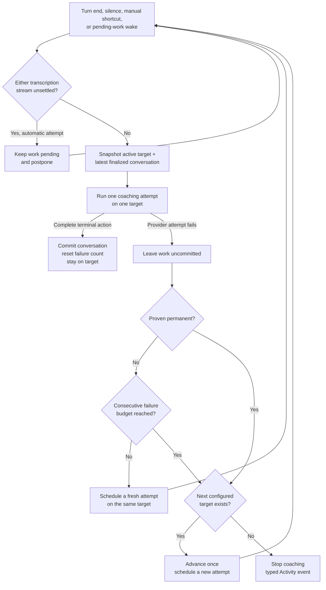

# Architecture

> A living document. Describes the vision, the harness loop, the components, and the principles
> that govern Jarvis. Exact schemas, prompts, and config are not duplicated here — they live in
> `Sources/JarvisCore/` (`Prompts/`, `Coach/ToolDefs.swift`, `Config/Config.swift`).

> **Scope:** This page describes the **native Swift app**, built directly rather than on a fork of
> an existing tool; why no existing product or open-source base fit is the record in
> [landscape-survey.md](./landscape-survey.md) and [fork-evaluation.md](./fork-evaluation.md).
> Exact schemas, the coach prompt, and config are **not duplicated here** — they live in code
> (`Sources/JarvisCore/`, especially `Prompts/`, `Coach/ToolDefs.swift`, and
> `Config/Config.swift`); this page is
> the *why*, the code is the *what*.

> The cross-cutting contract for isolating optional runtime work is
> [lean-coaching-core.md](./lean-coaching-core.md); every phase of its roadmap is built, and this
> page describes the resulting runtime.

## 1. Vision

Jarvis is a personal, always-on macOS assistant that **coaches you through technical interviews**:
behavioral, system-design, and coding questions. It listens to you think aloud, and — when it needs
visible context — looks at your screen to see the current question, code, diagram, or notes. When it
has something genuinely useful to add, it speaks up **unprompted** with a short tip rendered in an
on-screen overlay.

The guiding belief: **build the harness, not the intelligence.** The intelligence already exists
(the selected brain model and transcription provider). The macOS capabilities already exist
(SpeechAnalyzer, ScreenCaptureKit, AVFoundation, Vision, the built-in `screencapture` tool, NSPanel).
Jarvis is the thin layer of glue that wires them into a proactive coach. We write the least code
possible and reinvent nothing.

## 2. Core Loop

```
            ┌──────────────────────────────────────────────────────────────┐
            │                         JARVIS HARNESS                         │
            │                                                                │
  mic  ─────┤  AudioInput ──► selected Transcriber ──► transcript              │
  sys-audio ┤                       │ turn-end / silence events                │
            │                       ▼                                          │
            │                 CoachDriver ──(brain model + tools)─┐           │
            │                       ▲   │                         │           │
            │          capture_screen   │ speak(lines)            │           │
            │                       │   ▼                         │           │
  screen ◄──┤   ScreenTool ◄────────┘  Overlay (NSPanel) ◄────────┘           │
            │                                                                │
            └──────────────────────────────────────────────────────────────┘
```

Always-on and cheap: audio streams continuously to the selected transcription adapter, producing a
rolling, speaker-labeled transcript. OpenAI Realtime is the default; Apple Speech is an opt-in,
on-device adapter on macOS 26+. OpenAI defaults to automatic language recognition and lets the user
hint English, Mandarin, or both; Apple uses one user-selected locale per session. The transcript —
not the screen — is the constant input signal.

On demand and expensive: the screen is **only** captured when the model asks for it via the
`capture_screen` tool, and a coaching response is **only** produced when the model calls `speak`.
This is what keeps Jarvis cheap and fast — the costly vision and generation steps fire only at
moments the model judges worthwhile.

### The turn

1. The Transcriber emits a **turn-end** event after it finalizes an utterance (GPT-4o uses tuned
   server VAD, GPT Transcribe and GPT Live use a local Silero VAD plus an explicit acknowledged
   commit, and Apple Speech uses final `SpeechTranscriber` segments; all paths share the same client
   transcript-batching window, which groups rapid final fragments but does not establish
   cross-speaker chronology),
   or a **silence check** fires (you've gone quiet, maybe stuck). The silence check carries *how
   long* you've been quiet and backs off across a long silence (the interval
   doubles each step up to a cap — see `Config`), resetting on speech; past an idle cutoff it stops
   probing entirely (you've stepped away — a nudge into an empty room still bills a request) until
   speech re-arms it.
2. Before an automatic attempt, `TranscriptionSettlementGate` waits until both provider streams say
   that no active speech, finalization, or recovery can still produce an earlier transcript line.
   OpenAI reconnect-buffered audio remains unsettled even before replay creates a server item; Apple
   PCM silence requests `SpeechAnalyzer.finalize` and remains unsettled until matching final-result
   progress is consumed from the module stream.
   Natural triggers coalesce while waiting. Each finalized turn carries its transcript boundary, so
   a delayed transcript-batch callback arriving after another attempt committed that same line is
   consumed instead of buying a duplicate request. Any explicit coaching shortcut bypasses this wait.
   The CoachDriver then calls the brain on every trigger that carries **substance** — there is no
   cooldown, rate cap, or wake-word gate. Whether to speak (and whether the user just addressed
   Jarvis) is the model's call, governed by the system prompt; the only hard gates are the user's
   Start/Stop and the **substance gate** (`TurnSubstance`): a turn-end whose delta is pure
   clear hesitation sounds ("Hmm", "嗯", or a sequence such as "Uh. Hmm. Oh.") or empty is skipped
   without a request. Those sounds are also removed from a mixed brain-facing delta, while Activity
   keeps the complete finalized transcription. Context-dependent short replies such as "Yes", "No",
   "Okay", "对", and "可以" fail open for either speaker, as do unknown short fragments. Interviewer
   questions remain first-class and may draw a proactive tip. Consumed noise never rides into a
   later request; silence checks and both coaching shortcuts always go through. The gate is a small explicit
   class on purpose: a classifier model would add latency and cost for it, and asking the
   transcription model to drop filler is not a deterministic boundary and would silently alter the
   audit record.
3. It calls the **selected brain model** with the coach system prompt, the session memory
   (`CoachHistory`), the
   new transcript delta, the timing context (seconds silent, session elapsed), and the session's
   fixed tool set — `[capture_screen, speak, stay_silent]`, plus `search_prep_notes` when prep
   sources are configured, with `speak` carrying the System Design schema in that format. The timing
   is what lets the model tell "thinking" from "stuck."
4. Before speaking, the model calls `capture_screen` when a specific, correct reply depends on
   visible context missing from the conversation — including unresolved references such as “this”
   or “here” — and no fresh capture is already available for that request. It may also capture when
   a silence trigger leaves progress unclear. The harness returns a silent screenshot plus OCR; that
   fresh result satisfies the screen gate, so the next model response must speak or stay silent
   rather than capture the same request again. Fully stated questions do not require a reflexive
   capture.
5. The model calls `speak(lines)` — a tip of up to ~3 short lines, returned **already split**
   into an array (Structured Outputs / `strict:true`), so the client never splits prose on
   punctuation — or `stay_silent`. A tool call is **required** on every model response: silence is an
   explicit tool, never plain text. Under a "stay silent by calling no tool" contract the model still
   has to emit *something*, and at low reasoning effort that came out as leaked deliberation text
   ("final empty. no. final.") that polluted the conversation and was imitated on later turns;
   requiring a tool call prevents the emission rather than filtering it afterwards.
6. Activity records every brain action, through the session's one evidence handle: successful or failed `capture_screen`, `speak`, and
   `stay_silent`. Heard rows and model-facing transcript deltas share `ConversationChronology`:
   occurrence time is authoritative, and insertion order breaks timestamp ties. A late-finalizing
   earlier utterance is therefore inserted before a faster later reply. When Activity reaches its
   memory backstop, Core sends the discarded insertion identities so the live DOM trims in lockstep
   and keeps using those same indices. Reopened sessions retain the same newest insertion identities
   before sorting that retained set by occurrence time. The deliberate-silence entry is human-facing
   but stays out of model memory.
7. The scheduler reports the audit facts around the decision through the narrow
   `CoachingAttemptAuditing` port: the natural trigger or pending-work wake, the indexed finalized
   lines considered by the substance gate, whether a provider call is the initial request or a screen
   continuation, and the terminal outcome. Brain clients report matching traffic through
   `BrainTrafficAuditing`; a typed task-local request attribution carries the attempt identity.
   Runtime classification and actual request inclusion are recorded separately so the evaluator can
   observe a gate miss instead of recomputing the fact under audit. `FileSessionAudit` admits these
   typed events best-effort to the bounded process worker; callers outside a persisted live session
   omit the optional observer. This stays diagnostics-only; Activity remains the human-facing record
   and provider scheduling detail remains out of it. See [session-audit.md](./session-audit.md) for
   the component boundary and lifecycle.
8. `speak` renders to the **Overlay**, one line at a time (per-line display time set in `Config`).
   A newer tip never interrupts one still showing — tips queue and play in order, so no hint is lost.

**Why the overlay never interrupts and never drops (and why direct-reply latency is a non-issue).**
The queue is deliberately strict: a tip the user may still be reading is never cut off, and nothing
is discarded. The obvious objection — "a direct *'Jarvis, help'* reply could wait tens of seconds
behind a proactive tip" — does not apply in the real use case: **in a live interview the user never
addresses Jarvis out loud** (speaking to an AI would expose it), so overlay traffic is *entirely
proactive coaching* with no latency-critical direct reply to jump the queue. The accepted tradeoff is
that a queued proactive tip can surface some seconds after it was generated; that is bounded in
practice because `CoachDriver` runs a single turn in-flight (so tips are produced no faster than one
brain round-trip) and the prompt keeps the model restrained. So the policy is *not interrupt + not
drop*, not *show-freshest-only* — and adding direct-reply priority/preemption was considered and
rejected as solving a problem the interview workflow doesn't have. (The must-reply-on-direct-address
path still works for testing/practice; it is simply not latency-critical there.)

### Private architecture hints

An explicitly selected System Design session can attach a visual sketch to `speak` during the
high-level-architecture stage. The format addendum tells the model when a graph is helpful; the
harness does not classify interview stages. `CoachAttemptRunner` offers the nullable diagram field
only for that Start-time format and ignores unexpected diagram output in other formats. Keeping it
on `speak` also makes the manual-hint shortcut work in one response.

[`DiagramHint`](../Sources/JarvisCore/Overlay/DiagramHint.swift) accepts a bounded Mermaid subset:
rectangular labeled boxes and directed connections. The parser owns the precise grammar and limits;
the model-facing usage guidance lives in the system-design skill. Native
[`DiagramHintImage`](../Sources/JarvisOverlay/DiagramHintImage.swift) draws that inert graph into a
memory-only text attachment. This limited renderer needs no JavaScript, browser, remote assets, or
extra presentation surface. Graphs retain their layout and scale uniformly to the available width and a fraction of the
window height, reserving room for the text hint. They resize during a window drag. The Overlay Box
settings include a persisted **Show diagrams** switch, enabled by default, that hides or restores
attachments immediately without discarding text or graph history. Diagrams clear with the session.
The existing nonactivating panel, capture exclusion, visibility toggle, and Start/Stop rules apply.
Nothing is drawn on the interviewer's shared canvas.

Invalid or unsupported graph syntax degrades to the same text hint, with diagnostic detail only in
`jlog`. Activity records the text tip; graph source follows the existing brain-history and wire-audit
path, and rendered images are never archived. A graph is a suggested sketch accompanying one hint,
not a continuously synchronized model of the discussion.

### On-demand coaching shortcuts

Hints and explanations are proactive. The shared coach prompt distinguishes needing a next step
from not understanding the question, earlier guidance, or the overall approach using the available
session history, newest speech, and current screen. Clear confusion warrants an explanation; silence
or unchanged code alone does not. Repeated confusion calls for simpler framing or a smaller example,
while productive progress calls for silence. This policy applies across interview formats without a
separate classifier, timer, or model request.

Three configurable global shortcuts are fallbacks for a missed need: **Give me a hint** (default
**⌥⌘J**) requests the next useful hint; **Explain more** (default **⌥⌘E**) explicitly requests
clarification of the relevant gap, which may span several earlier hints; **Show code** (default
**⌥⌘K**) requests the next small coding component. All snapshot a fresh screen,
include the available conversation, and force `speak` in one brain round trip. If capture fails, the
request identifies the missing screen and uses available context without inventing visible details.
They share the ordinary single-flight coach loop and provider route. Natural wakes preserve pending
manual intent; the latest explicit shortcut chooses its kind. A fresh manual press may bypass unsettled
transcription, while an automatic retry waits for settlement. Stop cancels any request; while stopped,
an explicit shortcut only beeps. Activity records which shortcut was pressed.

The `speak` action keeps short `lines` for captions and an optional plain-text `explanation` for fuller
clarification in the persistent box. The prompt targets roughly 60–120 words in short paragraphs,
with a simple rationale, a concrete example when useful, and one starting action. The box scrolls to
the beginning of that entry and preserves its paragraphs. Hints use semibold text; fuller detail uses
regular text at the same configured size under an **Explanation** label, separated by whitespace.
Captions retain only the standalone summary.
[Enable explanations](./settings-window.md#shortcuts) controls both automatic detail and the manual
fallback. `SessionPlan.explanationsEnabled` is fixed at Start and preserved across screen-plan
revisions. Only enabled sessions receive explanation guidance in the system prompt; saved edits take
effect on the next Start, keeping CLI instructions stable. The nullable tool field remains until
[#273](https://github.com/JINGBANZ/jarvis/issues/273) establishes session-composed tools.
At delivery, the runner checks whether the persistent box can show detail. Hidden explanations are
omitted from both Activity and committed tool-call history. This live visibility check also covers a
box hidden while the request was running. Disabling the box turns off the saved explanation setting
and releases its shortcut; enabling the box does not implicitly enable explanations.

Explanation text follows the existing coaching history and Activity paths. It opens no extra window,
never activates Jarvis, and respects the box's enabled/session visibility. Disabling the box leaves
only the brief caption if that surface is enabled; it does not force a hidden surface on.

**Show code with hints** enables matching snippets only in explicit Coding mode, defaulting off.
None, General Technical, Behavioral, and System Design have no code dock or usable code shortcut;
changing modes preserves the saved code preference.
`SessionPlan.codeEnabled` is frozen at Start and preserved across screen revisions. The app resolves
the session format at Start, so non-coding sessions cannot reserve an empty code area. Only enabled
sessions receive the shortened code guidance in their fixed system prompt. The Show code shortcut
requests the next snippet; it never edits the preference or enables code during a disabled session.
Saved settings take effect on the next Start. Tool-field removal is deferred with explanations to #273.
The fixed `speak.codeSnippet` schema carries language, placement, code, and corrected-line indices;
[`CodeSnippet`](../Sources/JarvisCore/Overlay/CodeSnippet.swift) bounds and validates it without
truncating code. Highlight arrays are bounded before normalization, and trimming leading blank lines
rebases correction indices. Invalid attachments retain the useful text hint. The prompt requests one logical
component matching visible names, language, and structure. Local mistakes include a highlighted
correction and relevant next lines; an invalid overall approach receives a corrective hint instead.
Without visible code, known problem context supports a first component without inventing unseen names.

[`OverlayBoxPanel`](../Sources/JarvisOverlay/OverlayBoxPanel.swift) pins the snippet in a separate
bottom scroll area inside the existing capture-excluded panel. Its opaque dark background preserves
syntax contrast regardless of history opacity. Long code lines wrap within the dock without changing
source text or correction highlights. The dock measures wrapped content to use available space;
code uses a compact monospace size and shrinks only as needed to fit, down to a readable minimum
(see `CodeSnippetView`). Very small panels retain vertical scrolling rather than clipping code or
shrinking it indefinitely. Each new hint
replaces its snippet, or clears the previous code when none is appropriate, so guidance and code agree.
Dismiss and session clear remove the snippet. While enabled, an empty code area remains reserved;
a session started with code off has no dock. The dock collapses
with the header and restores its snippet on expansion. Settings preview
includes code only when enabled and restores the real snippet on close. The caption carries
only the short hint; Activity includes the accepted placement and code. Explanation preferences do
not govern code. Box visibility and code acceptance are checked together on the main actor at delivery;
a hidden snippet is also removed from committed tool history and Activity. Disabling the master box
releases the shortcut, disables the saved code setting, and clears/disables the current code dock.
Re-enabling the box alone does not restore the dock; code must be enabled before a new Start.

Shortcuts use **Carbon `RegisterEventHotKey`**, which needs no Accessibility/TCC permission.
[`CoachingShortcut`](../Sources/JarvisCore/Config/CoachingShortcut.swift) provides stable event identities;
`HotkeyController` dispatches only matching Jarvis events. Each binding persists independently through
`HotkeyPreferences`. Registering a replacement happens before releasing the old binding, so a
collision—including another Jarvis shortcut—keeps the prior working binding. See
[Settings → Shortcuts](./settings-window.md#shortcuts).

## 3. Components

| Component | Responsibility | Built on (borrowed) |
|---|---|---|
| **AggregateEchoCapture** | The whole capture path: one **private Core Audio aggregate device** = the built-in mic (`me`, clock master) + a system-output **process tap** (`them`, drift-compensated onto the mic's clock). A single IOProc delivers both sample-synced at the device's **native rate** — the one-clock case AEC3 needs; the capture **reads that rate and resamples mic+tap up to 48 kHz** for AEC3 (a no-op when the device is already 48 kHz). So **any input device works** — built-in, USB, 44.1 kHz gear, or AirPods (Bluetooth HFP at 16/24 kHz) — instead of the old hard 48 kHz pin that silently failed to start on Bluetooth mics. Inside the callback it runs AEC3 (tap = far reference, mic = near), removing the other side's speaker bleed from the mic *before* transcription — no headphones, and double-talk works (measured 30–50 dB cancellation). The untouched resampled tap remains the `them` source while a separate padded/truncated copy aligns AEC; wire delivery is serialized off the realtime IOProc. When a client-commit model is selected, separate Silero VAD instances score these post-AEC streams (resampled to 16 kHz) on the delivery queue rather than the IOProc, and emit content-free turn edges. Both sides then downsample to 24 kHz. Replaces the old separate `AVAudioEngine` mic + `SCStream`. | Core Audio (`AudioHardwareCreateProcessTap`, private aggregate device, drift compensation) + `AVAudioConverter` resampling + WebRTC **AEC3** + **Silero VAD** via Core ML. |
| **WebRTCEchoCanceller** | AEC3 echo canceller driven at 48 kHz on 10 ms frames inside the capture IOProc; far reference first, then the mic cleaned in place. | WebRTC **AEC3** (`webrtc-audio-processing`), vendored static + zero-dylib via `scripts/build-aec.sh`. |
| **ErrorReporter** | The single funnel for user-facing failures. Severity on a Foundation-only `UserFacingError` decides the lifecycle consequence; an explicit startup/runtime context decides presentation. Startup failures may alert, but runtime failures never activate Jarvis or present UI even when they stop the session. `ProviderFailure` feeds brain attempt outcomes into the finite provider route, and only exhaustion of that route reaches terminal reporting from it; a terminal transcription or capture failure reaches this funnel directly, carrying the same record. Typed Activity outcomes carry stable on-disk identities, and a failure quotes the provider's identity and redacted message inside a fixed frame while retry and transport detail stays in `JarvisLog`. | AppKit (`NSAlert`) for startup only. |
| **JarvisReadiness** | Compose the selected session's permission, credential, brain preparation, transcription preparation, endpoint, and capture-health snapshots into one typed status: checking, blocked, recovering, fully ready, microphone-only ready, or stopped. An opaque Start generation rejects stale callbacks. Focused subsystems keep owning their own mechanics; this Foundation-only component emits effects that the app renders in both the menu and Activity. | Foundation-only state reduction over `CaptureReadinessMonitor` and typed app observations. |
| **Transcriber** | Maintain a rolling, speaker-labeled, **spoken-time timestamped** transcript; emit transcription-work state, transcript-bound turn-end, and backing-off silence events (with quiet duration). Two instances run in parallel — one per side — tagging lines `me`/`them` into one shared transcript through the provider-neutral `TranscriptionSession` port. The default OpenAI adapter keeps its per-`item_id` reconciliation, delta salvage, acknowledged readiness, ping/pong health, and transactional reconnect path; PCM captured while its socket is unavailable is itself pending recovery until replacement replay reaches a terminal boundary. GPT-4o Transcribe remains its default model and uses tuned server VAD. GPT Transcribe and GPT Live Transcribe remain opt-in with a local Silero VAD: a bounded pre-roll opens at confirmed speech onset, active speech and trailing silence enter the ordered audio FIFO, and indefinite idle silence stays off the wire. Endpoints commit only after that FIFO reaches their boundary, and the server's commit acknowledgement binds each boundary to its `item_id`. GPT Transcribe also reports detected completion languages to debug diagnostics. Both new models receive fixed context for the captured speaker role, and GPT Live additionally requests low transcription delay. The opt-in macOS 26+ Apple adapter prepares one selected-locale asset before capture, converts the existing 24 kHz PCM to `SpeechAnalyzer`'s preferred format, and commits final results only. Its content-free local activity tracker requests analyzer finalization after speech; `TranscriptionFinalizationState` keeps work unsettled until the analyzer completes and matching module-result progress is consumed, including speech or setup races, without gating transcription or retaining PCM. Every path keeps unusable words diagnostic-only and records content-free boundary evidence. | OpenAI Realtime transcription (model-compatible server or local turn detection) or Apple `SpeechAnalyzer` / `SpeechTranscriber` (on-device). |
| **ConversationChronology** | Own the ordering rule for conversation-derived data in Foundation-only Core: both speaker streams use one session time origin, event occurrence time comes first, and stable insertion order breaks ties. It preserves append-index provenance while producing chronological views for the model, live Activity, and reopened sessions. | `TranscriptLine.at` and Activity event timestamps. |
| **CoachDriver** | Coordinate one single-flighted coaching attempt from a natural trigger or pending-work wake-up: admit every automatic attempt only after both transcription streams settle, consume a deferred turn whose transcript boundary is already committed, snapshot one route target plus the latest chronological conversation, route its tool calls, commit only a complete terminal action, and report one outcome to the scheduler. No speaking cooldown/rate cap — restraint is the model's; `TurnSubstance` removes only clear hesitation sounds from mixed deltas and skips a turn-end when no substantive text or saved observation remains. | The selected OpenAI Responses API, Claude Code, or Codex route target; See [§4 Local CLI brain providers](#local-cli-brain-providers). Provider-specific summary tiers are defined in `BrainModelCatalog`. |
| **[Session evidence](./session-audit.md)** | Carry every optional record a live session produces — the human Activity story, attempt provenance, provider traffic, and agent-facing diagnostics — through one bounded worker, per-session handle, and close lifecycle, without coupling any of it to coaching behavior or latency. One uniform best-effort loss contract, and a versioned health marker that keeps incomplete evidence honest to both the evaluator and the reader. | Foundation-only owner-only session artifacts. |
| **Local agent runtime** | Keep provider startup outside the coaching latency path while preserving the attempt boundary: a `BrainConversation` lease owns every model turn in one attempt, including a `capture_screen` continuation, then is explicitly finished. Claude leases one initialized safe-mode query; Codex prepares the first target-specific ephemeral thread at Session Start and opens a fresh thread for each later attempt on one session-scoped app-server. A runtime failure fails the attempt; it never switches to a one-shot transport. | Claude Code stream-json control protocol; Codex app-server JSON-RPC over stdio. |
| **ScreenTool** | Fulfill `capture_screen`: silently shoot the **active window** (default scope) — the window-server frontmost, on whichever display, clean even when partially covered — and attach an **on-device OCR** of the shot to the tool result so the model reads exact text instead of pixels. Falls back to a full-display capture (no OCR) — the Settings-chosen display in Entire-display scope, the main display when no window is eligible; the overlay window is excluded either way. See [settings-window.md](./settings-window.md#capture-scope). | macOS `screencapture` CLI + Apple Vision (`VNRecognizeTextRequest`). |
| **Overlay Caption** | Render `speak` output: up to ~3 short lines (model-split), shown one at a time and queued so a newer tip never cuts off the current one; non-activating, always-on-top, excluded from capture. Switchable from Settings — **off by default**; when off, tips are suppressed. | AppKit NSPanel; `OverlayCaptionPanel`. |
| **Overlay Box** | A persistent window logging every `speak` tip in full, timestamped — the scrollable history of what the caption flashed one line at a time. Movable, resizable, translucent, also excluded from capture; switched on/off from Settings (**on by default**). Its own header carries the box's controls: **collapse** on the left, which rolls the panel down to the header strip and back without losing the size the user dragged to, the name in the middle, and **clear** on the right, which appears only when there is something to erase. The header's proportions are derived from the box's height (`OverlayBoxChrome`) rather than fixed, so the strip stays aimable at the floor of `Defaults.Overlay.Box.heightRange` and stays chrome on a box dragged to fill a display. A borderless window advertises no resize affordance, and macOS refuses to let an inactive app set the cursor, so the box draws its own (`OverlayBoxResizeAffordanceView`): the edge or corner under the pointer lights up, on an `.activeAlways` tracking area, which is what reaches a background app. That view also owns the drag, so the region that lights is the region that resizes. Its thin edge grips are the only thing that refuses a window drag, because AppKit applies `mouseDownCanMoveWindow == false` to a view's whole frame: a full-size view refusing it freezes the box in place. It follows the session: shown on Start (cleared and rolled open, for the new conversation) and hidden on Stop. Its size persists across launches; its position does not, so it opens centered. Fed by the same `speak` call as the caption via **`BroadcastOverlay`**, which fans one `OverlayRendering.render` out to both sinks (so `CoachDriver` is unchanged). System-design visual hints are image attachments beside their text in this same box; the caption remains text-only. See [Private architecture hints](#private-architecture-hints). | AppKit NSPanel; `OverlayBoxPanel`. |
| **MenuBar** | Manual **Start/Stop** of the pipeline (no auto-start), the same authoritative readiness status shown by Activity, and one-time API-key entry when OpenAI is in use. Stopped and active use a boxless monochrome eye: closed on the Listening Lens's diagonal axis while stopped and open while active, with the active icon following the system menu-bar foreground instead of a brand color. The attention states retain the lit Listening Lens tile — amber while checking or recovering and red when a Start is blocked before any session begins — and the menu and tooltip name the requirement behind those attention states; stopped is simply labeled `Jarvis is stopped`. A failed system stream may degrade to microphone-only, while a failed microphone stream stops the session. The two overlay surfaces are switched from Settings, and the Overlay Box is cleared from its own header, not from the menu. A centered, disabled caption at the bottom of the menu names the running build, so a user can report it without opening Settings: a release shows a muted `v<version>` from `CFBundleShortVersionString`, and a local build shows a red `Dev`, keyed off the development marker `scripts/build-app.sh` stamps into the assembled bundle (see `MenuBarController.buildCaptionItem()`). | AppKit menu-bar item; owner-only file for the key. |
| **HotkeyController** | Register the independent hint, explanation, and code shortcuts and route each press to its manual coaching request while a session runs (beep otherwise). See [§2 On-demand coaching shortcuts](#on-demand-coaching-shortcuts). | Carbon HIToolbox (`RegisterEventHotKey`, no TCC). |
| **PermissionGate** | Gather every TCC grant at launch instead of mid-session, and keep Jarvis closed until it holds all three: one button walks Microphone, System Audio Recording, and Screen Recording one dialog at a time, and closing the window quits. `SystemAudioPermissionProbe` proves the silently-enforced system-audio grant by playing a muted tone into a tap of Jarvis's own process and listening for it. See [§3 Permissions](#permissions). | AVFoundation, `CGRequestScreenCaptureAccess`, Core Audio process taps. |

Each component has one job and a narrow interface. The CoachDriver is the only place the
"intelligence" lives, and even there the intelligence is the model — the driver just wires events
to tool calls and enforces safety.

### Capture: device-rate adaptation

`AggregateEchoCapture` reads the input device's native sample rate and resamples up to AEC3's
48 kHz, rather than forcing the aggregate to 48 kHz. The earlier hard **pin** existed for two
reasons — AEC3 is created at a fixed 48 kHz, and the downsampler to the selected transcription
provider's wire rate (see [Models and APIs](#models-and-apis)) assumes a true
48 kHz input — so an aggregate that inherited a 44.1 kHz mic would corrupt the echo model and
mislabel the wire rate. But the pin **silently failed to start** on any device that can't do
48 kHz, notably AirPods (Bluetooth HFP runs them at 16/24 kHz). Reading-and-resampling serves both
original concerns *better* (AEC3 always gets true 48 kHz; the wire label stays correct) and works on
every device. The **one-clock aggregate is untouched** — the pin was about *rate*, not the clock;
mic and tap still come off one drift-compensated IOProc, so they stay sample-synced and the far/near
lockstep (now applied post-resample) holds. If the rate can't be read we fail rather than assume.

Alternatives rejected: running AEC at the device's *native* rate doesn't generalize (24/44.1 kHz
aren't AEC3-legal, so you resample anyway, with a variable frame size in the most delicate
component); and **bypassing AEC on "headphone" routes** is unsafe because a Bluetooth *speaker* is
indistinguishable from a headset, so a wrong bypass re-admits the echo. AEC3 therefore stays on for
all routes — it's a near-passthrough on earbuds (no acoustic echo to cancel). Caveat: AirPods *as a
mic* are HFP narrowband and low-fidelity regardless of resampling; for input quality, use the
built-in mic.

### Permissions

Jarvis needs three macOS grants (Microphone, System Audio Recording, Screen Recording) and cannot
coach without any of them, so `PermissionGate` asks for all three at launch and keeps the app closed
until it holds them. One button walks the dialogs, strictly one at a time because macOS queues them.
The window's close button quits: grant or quit is the whole choice. Nothing records that the gate has
run, because it is shown exactly when the grants are incomplete, which is also the only way back in
after a refusal. There is no Permissions tab in Settings: the hard gate makes one unreachable.

The reason it happens at launch rather than at Start is the coaching context. A TCC dialog is system
UI that no capture-exclusion trick can hide, so one arriving mid-interview is visible to whoever the
user is sharing a screen with.

**Screen Recording is invisible to the process that asks.** `CGRequestScreenCaptureAccess` returns
false whether the user allowed or refused, and preflight keeps returning what the process started
with. A *later* launch sees the truth, so `PermissionPreferences.screenRecordingAsked` records that
Jarvis asked, and a launch that has asked before and still lacks the grant treats it as a proven
refusal. Without that, a refusal is indistinguishable from a grant awaiting relaunch and the gate
loops the user through Quit & Reopen forever.

**System Audio Recording is enforced silently.** There is no API to request it and none to read it,
and a refusal changes no observable except the audio itself: with the grant denied, tap creation, the
tap's 48 kHz format, the aggregate's channel count, `AudioDeviceStart`, and the IOProc callbacks all
behave exactly as when granted, and only the samples differ. Measured on macOS 26: 117 callbacks
peaking at 0.25 when allowed, 116 callbacks peaking at 0.0 when denied.

So `SystemAudioPermissionProbe` proves the grant by making a sound and listening for it. It taps
**only Jarvis's own process** rather than the system mix and mutes it, then plays half a second of a
quiet tone: hearing it back is proof, digital silence is proof of refusal. Scoping the tap to Jarvis
is what keeps the check invisible, since nothing the user is playing is tapped and nothing they are
listening to is muted. The private `TCCAccessPreflight` would read this grant exactly and silently,
but it can break on any macOS update, so the tone stays the check. **Grants are proved, never remembered.** Nothing records whether a grant was
held, because a stored answer reads exactly like a current one and the caller deciding whether a
session may run cannot tell which it holds. Being wrong there is the worst outcome in the design: a
denied tap still delivers frames, and `CaptureReadinessMonitor` reads frame arrival as healthy
without inspecting amplitude, so a session would report full readiness while hearing nothing from
the other side.

So proof is gathered twice, and lives only in the process that gathered it. At launch the two
readable grants are checked first, because they cost nothing and cannot prompt; system audio is
probed only when they are held, so anything missing opens the gate and lets the walk raise its
dialogs with a window on screen to explain them. Then every Start proves system audio again, ahead of the
preparation it already runs, since a menu-bar app can sit for days between launches and a grant
withdrawn in that time would otherwise reach a session. Every Start takes that path: there is no
longer a configuration with nothing to await, and nothing before the probe gates on its previous
answer, so a Start that failed on system audio is retried by pressing Start again. A probe that
cannot run proves nothing: it blocks the attempt at hand without counting as a refusal, so the
checklist keeps offering to ask rather than sending the user to a toggle that may already be on.

The one thing that persists is `screenRecordingAsked`, and it is not a grant: it records that Jarvis
asked, which no later grant or refusal makes untrue. It is cleared once the grant is observed held,
because holding it proves the asking was answered — which is what lets a later reset be treated as
undetermined and asked for again, rather than read as a refusal. Mid-session revocation is out of scope — every
way to catch it is either amplitude policing, which contradicts the rule above, or a timer. The next
Start refuses with the reason.

### Failure surfacing — startup loud, runtime ghost

Every user-facing failure flows through one `ErrorReporter`: severity on a Foundation-only
`UserFacingError` decides the lifecycle consequence while an explicit context captured at the
failure site decides presentation. Startup failures caused by an explicit Start may alert; every
runtime context suppresses alerts unconditionally, including after teardown, so a queued main-actor
report cannot reveal Jarvis during screen sharing. Permanent brain, microphone-transcription, and
audio-capture failures stop without presenting UI; a stream-local system-audio failure degrades to
microphone-only. A failed attempt leaves capture, transcription, pending triggers, unsent transcript,
and committed history intact; the provider-route state machine decides whether to try the active
target again, advance to the next user-authorized target, or stop after the finite route is
exhausted. Audio-route rebuilds separately retry under a bounded schedule before capture is declared
unavailable, and stale callbacks are identity-guarded across Stop → Start. Each Activity row persists
a stable event kind. The agentic session evaluator reads the complete Activity file, using those
kinds and the full user-visible sequence rather than a preselected excerpt; retry scheduling,
failure counts, and transport timing remain only in `JarvisLog`.

#### One failure record, one table per vendor

Every provider boundary (a brain request, a local CLI process, a transcription socket, the capture
device) classifies once, where the wire fact is observed, into one Foundation-only `ProviderFailure`
(`Sources/JarvisCore/Providers/`). It carries a `Source`, the `Stage` it surfaced at, a `Category`
that selects the human sentence, a `Disposition` the route and retry policy read, a structured
`Identity` (HTTP status, close code, error type and code, transport domain and code, exit status),
and the provider's message after `ProviderMessageRedaction`. Two kinds of consumer read two different
parts and nothing else: policy reads `disposition` and `endsEverySession`, people read `category`,
`identity`, and `message`.

The tables that turn wire facts into that record live one per vendor
(`Providers/OpenAI`, `Providers/Gemini`, `Providers/LocalAgent`, plus `TransportFailureClassifier`
for `URLError` and POSIX causes), shared by the brain, transcription, and Settings surfaces, so a
status code means the same thing wherever it arrives. Adapters choose a category; they never author
copy. `scripts/check-coaching-kernel.sh` keeps the folder Foundation-only: adapters hand in status
codes, JSON, close reasons, and `NSError` domain and code, never `URLSession` types.

Activity renders one fixed clause per category and quotes the identity and redacted message inside
it, the way a `heard` row quotes speech: `⏹ session ended by error — OpenAI denied access (HTTP 403,
unsupported_country_region_territory: Country, region, or territory not supported); check your
region, VPN, or API project`. The fixed frames stay verbatim because row styling and the legacy
human-facing filter key on them. A frame that also says what Jarvis is doing about the failure
(retrying, skipping the target, continuing on the microphone) takes the sentence without its advice
clause and appends the advice after its own tail, so the row never reads as two instructions on
either side of the frame. The identity renders each code with the numbering it belongs to (`network`
for URL loading, `errno`, `exit`, or a plain `code`), because a bare number labelled "network" sends a
person to check their Wi-Fi over a CLI that exited badly. Quoting the provider is deliberate: a user
reports a failure with a screenshot of Activity and nothing else, so a row naming only the category
leaves every unclassified cause undiagnosable. Redaction, not omission, is what keeps a
credential out of a row: the record redacts every provider-supplied string it holds, the message and
the identity's own error type and code alike, in its initializer, so no adapter can carry raw text
past it. The identity is also kept to what is grep-able at the source: a WebSocket close reason is
free text the server chose, so only a half that is shaped like an error code becomes one, and a
sentence stays in the message where it is quoted once rather than printed back beside itself.

An unclassified failure stays `.temporary`: losing one coaching turn, or spending a bounded retry
budget, is safer than exhausting a target because a new provider error was not yet in the table. A
classifier produces `.permanent` only from reviewed proof that the target cannot recover. Route
changes, target skips, and final exhaustion each use their own fixed Activity frame with the failure
quoted inside it.

Overall readiness is current UI state rather than an Activity event: `JarvisReadiness` drives the
menu and the live Activity badge from the same effect, while an opened past session shows **Ended**.
Readiness transitions never append rows to `jarvis-activity.jsonl`; the persisted record continues
to contain only user-facing coaching, fixed failures, and lifecycle outcomes.

Ghost mode applies from a live pipeline through terminal teardown: no autonomous activation, alert,
window, browser, notification, attention request, or sound is allowed outside the nonactivating,
capture-excluded caption and box overlays. The persistent menu-bar item and user-invoked
Settings/Activity surfaces are explicit exceptions, as is unavoidable macOS privacy UI. The Core
presentation matrix is unit-tested, and `scripts/check-ghost-mode.sh` rejects unreviewed presentation
API calls from the normal test gate. Realtime health remains visible through the menu and current
Activity badge; `ErrorReporter` owns failure lifecycle and permitted startup surfacing.

### Ordered provider route

Settings persists one primary target followed by an ordered list of explicitly authorized fallback
targets. A target is a provider/model pair; the shared reasoning-effort preference is snapshotted with
the route when an attempt begins. Exact duplicate targets are invalid, while two different models from
the same provider are allowed when the user deliberately places both in the list. The live route cursor
starts at the primary, only moves forward, and is session-local: automatic failover never rewrites
preferences. A successful fallback remains active for the rest of the session unless it later exhausts
its own failure budget. Stop → Start begins again at the persisted primary. Only a Settings edit that
changes route topology—the ordered provider/model target identities—installs a fresh route and resets
the live cursor between attempts. A reasoning-effort edit rebuilds clients at the existing cursor and
failure counts; the already-running attempt remains valid, so its success or failure updates route
health normally.

Saving the OpenAI API key refreshes only OpenAI clients and OpenAI transcription reconnect
credentials; it never probes or replaces CLI clients. It preserves the route cursor and counts. An
in-flight OpenAI failure belongs to the superseded credential and is ignored, while an in-flight
attempt on an unaffected CLI retains normal success/failure accounting.

A **coaching attempt** snapshots one target and the latest provider-neutral conversation, then keeps
that target for the complete tool loop. Every provider request in that loop is made once. A complete,
non-truncated terminal `speak` or `stay_silent` commits the attempt and clears that target's consecutive
failure count. A provider error, malformed/incomplete terminal response, or failure after an
intermediate `capture_screen` fails the attempt once; cancellation, filler suppression, and local
screen-capture failure do not count as provider failures. The most recent completed screen observation
remains provider-neutral input for the next attempt, but older captures, raw reasoning, tool-call
identifiers, and call/result pairing never cross an attempt or provider boundary.

Failed conversation work remains pending and schedules another coaching attempt under bounded
backoff. This internal wake-up does not depend on a new natural trigger. If a turn-end, silence, or
manual coaching trigger arrives first, it coalesces with the pending wake-up; the next attempt contains the
failed conversation plus every newer finalized transcript item. If nothing new arrives, the new
attempt uses the same pending conversation. Every automatic attempt waits while either transcription
stream owns unfinished work so it does not cross an earlier utterance that is about to finalize. An
explicit coaching shortcut interrupts that postponement even after the wait begins and upgrades the same
pending-work attempt to a forced hint; ordinary natural triggers remain parked until transcription
settles. `TriggerReason` remains the model-facing
reason that made coaching useful (`turnEnd`, `silence`, `manualHint`, `manualExplanation`, or `manualCode`); pending work is scheduler
state, not a fourth instruction to the model. An automatic attempt with no newer trigger reuses the
pending work's reason; when another natural trigger arrives, its newer reason describes the fresh
snapshot.

Temporary and unknown failures increment the active target's consecutive count; reaching the
code-owned threshold exhausts that target (see
[`BrainRouteSession.failuresPerTarget`](../Sources/JarvisCore/Coach/BrainRouteSession.swift)).
A failure classified as permanent at the provider boundary (for example, proven authentication,
billing, access, or model configuration failure) exhausts the target immediately. Either transition
only changes the route cursor after the failed attempt ends: the next target starts in a separate
fresh attempt with rebuilt conversation context. A terminal success resets the active target's count
but never moves the cursor backward. A fallback that is already proven impossible to construct at
activation time—for example, a missing executable, confirmed signed-out CLI, or invalid
configuration—is skipped as unavailable rather than consuming synthetic attempts merely to reach
that threshold. If no target remains, coaching stops and Activity records one typed route-exhausted
event naming the last target's failure (see
[One failure record](#one-failure-record-one-table-per-vendor)); retry scheduling and failure counts
stay in `jarvis-debug.log`.



The implementation keeps orchestration, route policy, and OS edges separate:

| Component | Responsibility | Must not do |
|---|---|---|
| Route value (`JarvisCore/Brain`) | Immutable ordered targets and validation. | Schedule work or create UI. |
| Route state machine (`JarvisCore/Coach`) | Count attempt outcomes, move forward, and emit pure transition commands. | Call providers, read preferences, or own timers. |
| Attempt scheduler (`JarvisCore/Coach`) | Own pending work, bounded backoff, trigger coalescing, single-flight, and transcription-settlement admission. | Classify provider payloads or mutate the route directly. |
| Attempt runner (`CoachAttemptRunner`) | Run one snapshotted target's tool loop, normalize completed provider-neutral effects, commit history, and report one outcome. | Retry a failed request, choose another target mid-attempt, or schedule anything. |
| Client factory (`JarvisCore/Brain`) | Build a `BrainClient` for an explicit target and surface preflight availability. | Select or reorder targets. |
| Preferences (`JarvisCore/Config`) | Persist primary, ordered fallbacks, per-provider models, and shared effort. | Store the live route cursor or failure counts. |
| App adapters (`JarvisApp`) | Render the list editor and feed provider transcription-work/timer events into Core. | Contain retry or failover policy. |

## 4. Data Flow & Cost Model

- **Continuous (cheap):** audio → the selected transcription adapter → transcript. This runs the
  whole session; Apple Speech removes continuous audio egress and OpenAI transcription billing.
- **Per-turn (cheap):** a selected-brain call on each substantive turn-end and each silence event,
  with a bounded, mostly-cached working set. Clear non-semantic hesitation sounds are removed before
  brain input, and turn-ends containing only those sounds (from either speaker) are skipped
  client-side — free. No image unless the model asks.
- **On-demand (expensive):** a screenshot + vision tokens, only when the model calls
  `capture_screen`. A coaching response, only when the model calls `speak`.

The model is the cost governor: it spends vision tokens and screen real estate only when it
judges them worthwhile. That is the whole point of making screen capture a model-invoked tool
rather than a per-turn screenshot.

### Models and APIs

- **OpenAI brain — the selected catalog model via the Responses API** (`POST /v1/responses`), not Chat Completions:
  for the gpt-5 family, function/tool calling is the recommended (and least restricted) path on
  Responses. The tool loop is threaded with `function_call` / `function_call_output` items, with the
  model's `reasoning` items replayed verbatim ahead of the call — OpenAI's requirement for the model
  to continue its chain of thought over a tool result instead of re-reasoning from scratch.
- **Per-session memory — client-managed (`CoachHistory`).** The coach needs to remember its *own*
  prior replies (the transcript only holds user speech), so `CoachDriver` keeps the session memory
  itself and rebuilds every request as `[system] + memory + new delta`. Owning the memory is what
  keeps it small and cheap: it grows **append-only** (a byte-identical prefix, so OpenAI's prompt
  cache keeps hitting at ~90% discount); `stay_silent` turns leave no trace; screenshots and reasoning
  items live only inside the turn that produced them — at commit, the pixels become a one-line stub
  and the capture's OCR text (in the tool result) is what persists, and reasoning items are dropped;
  and past a token threshold (see
  `Config.historyCompactionTokenThreshold`) the oldest span is **compacted** into a short,
  interview-format-neutral briefing written by a cheaper model (`gpt-5.4-mini`). Its size estimate
  treats non-ASCII scripts conservatively; the exact retention and topic-retirement policy lives in
  [`JarvisPrompts.HistorySummary.system`](../Sources/JarvisCore/Prompts/JarvisPrompts+HistorySummary.swift).
  Compaction uses one Core-owned workload deadline across providers and fails soft: a slow or failed
  summary leaves the full history intact for a later attempt. Server-side memory (a Conversations
  API conversation, or `previous_response_id` threading) is deliberately not used: it can only grow,
  so every screenshot and reply is re-billed as input on every later turn of a long session, and its
  single-writer lock turns one slow turn into minutes of `conversation_locked` silence. Requests are sent `store:true`
  so they stay inspectable in the OpenAI dashboard for debugging — the retention tradeoff is
  documented in [sandbox.md](./sandbox.md).
- **Interview format is an optional Start-time addendum (`InterviewFormat` in
  `Sources/JarvisCore/Config/`).** The picker defaults to **None**, which supplies the byte-for-byte
  base coach prompt. Coding, Behavioral, System Design, and General Technical are explicit choices.
  This keeps behavior unchanged for a user who never opens Settings. General Technical is one
  purpose-built routing skill, not a concatenation of specialist prompts: it selects relevant
  format-specific guidance from the newest conversation and available screen evidence. Screen
  capture remains on demand under the base action policy; no fresh capture is assumed on every turn.
  There is no runtime classifier or persisted question classification.

  The base prompt owns when to speak or stay silent, the hint length, and conditional comprehension
  before strategy. Coding adds representation/invariant guidance, local implementation and defect
  diagnosis, and boundary-test content for a post-completion hint already warranted by the base
  policy. Finishing code alone does not trigger a hint. Behavioral shapes candidate-owned answers
  with STAR and prepared criteria, labels constructed examples, and avoids refinement of a concrete,
  complete, aligned answer. General Technical follows the same behavioral completion standard.
  System Design supplies stage vocabulary from requirements through trade-offs.

  Each explicit format is a Markdown file under `Sources/JarvisCore/Resources/Skills/`; missing content
  resolves to an empty addendum, and Settings filters it out. `InterviewFormat.promptAddendum` loads
  the selected resource through `skillMarkdownURL(named:)`, including installed-app, SwiftPM, and test
  layouts. Packaging copies `Jarvis_JarvisCore.bundle` into `Contents/Resources`. New formats require an
  enum case and display name as well as a resource; user-supplied skill files are not supported.
  Nil resolves directly to an empty string, preserving the default rather than composing skills.

  The header and Settings mode pickers use one explicit replacement path: a different selection
  saves the preference and starts a fresh session, clearing conversation and overlay content once
  preflight succeeds. Failure leaves the current session intact; a newer selection invalidates
  older pending startup work. The in-panel dropdown stays inside the capture-excluded overlay.
  The selected text is frozen at Start (`BrainComposition.interviewFormatAddendum`) and reused during
  provider reapply. Both OpenAI and CLI construction use
  `JarvisPrompts.Coach.system(prepMaterial:formatAddendum:)`; passing resolved text keeps resource I/O
  outside coaching turns. CLI instructions remain fixed for the session, while General Technical can
  use new task evidence within those instructions. CLI construction reads `prepMaterial` from the
  session's fixed tool set, so the baked instructions describe exactly what the loop offers.
  [Private architecture hints](#private-architecture-hints) require explicit **System Design** in
  both the tool schema and runtime; General Technical's system-design guidance does not enable
  diagrams.
- **A session's tool set is fixed at Start, for the same reason its system prompt is
  (`sessionCoachTools` in `Sources/JarvisCore/Coach/ToolDefs.swift`).** `CLIBrainClient` renders each
  tool's `parametersJSON` verbatim into the instructions its process is warmed with, and rejects any
  later turn whose tools no longer compose to that string, so a set that grew or changed shape
  mid-session would fail every remaining attempt on that target until the route exhausted. Both the
  coach loop and the CLI-provider construction therefore resolve their tools through one function,
  from inputs known at Start: the interview format selects the plain or System Design speak schema,
  and configured prep-material *sources* decide whether `search_prep_notes` is offered at all. That
  last input is deliberately "sources are configured", not "an index exists": building the index
  reads files and shells out to `textutil`, so it runs off the Start path and the search port arrives
  after the first attempts. A search that lands before it, or after indexing found nothing usable,
  returns no matches — the honest answer, and one that costs nothing, where changing the offered set
  mid-session would cost the whole session.
- **Transcription has its own provider, model, and language settings.** OpenAI remains the provider
  default and `gpt-4o-transcribe` remains its model default; `gpt-transcribe` and
  `gpt-live-transcribe` are opt-in comparison choices. All use the GA Realtime API, but keep their
  model-compatible turn contracts: GPT-4o uses tuned `server_vad`, while GPT Transcribe and GPT Live
  disable automatic turn detection, keep only bounded local pre-roll while idle, and explicitly
  commit endpoints from a local Silero VAD scoring each post-AEC stream at 16 kHz. Silero, not the
  classic WebRTC VAD already inside the vendored AEC archive: that detector is biased toward recall
  and fires on impulsive broadband noise, so laptop typing near the mic held one turn open for
  86 seconds in production, and its one-bit output cannot express the hysteresis
  `SpeechEndpointDetector` runs on Silero's per-frame probabilities. The heavier alternatives were
  rejected on weight or terms: FluidAudio (ASR, TTS, diarization and a Rust XCFramework for 1 MB of
  VAD, with runtime model downloads), ONNX Runtime (tens of MB to run a 2 MB model), TEN VAD (an
  Agora non-compete that propagates to derivatives), Picovoice Cobra (closed, server-validated key),
  and Apple `SoundAnalysis` (windows of 0.5 s or more against 32 ms frames). GPT
  Transcribe and GPT Live receive fixed role-aware recording context; GPT Live also requests low
  transcription delay. Both also receive the user's free-text vocabulary glossary (Settings →
  Transcription) as literal `keywords`, biasing recognition toward jargon and names; GPT-4o
  Transcribe has no such field and ignores the setting. Automatic is the default language
  selection and sends no language hint. A single expected language guides recognition without
  translating. Multiple selections are supplied to GPT Transcribe and GPT Live and leave GPT-4o
  automatic because the older model accepts at most one language hint. GPT Transcribe's completion-language
  metadata is logged for diagnosis without entering Activity or model context. This is one
  session-level expectation shared by both speakers, not a language decision per turn; either
  speaker may switch within a sentence. The macOS 26+ opt-in is Apple `SpeechAnalyzer` with one
  `SpeechTranscriber` locale chosen
  from the framework's runtime-supported list; `SFSpeechRecognizer` is not offered on older macOS,
  because it would be a second Apple adapter with its own authorization, availability, and result
  lifecycle. `AssetInventory` installs that model before the new
  pipeline replaces a running one, and final results alone enter Activity/model context. Apple
  documents `SpeechDetector` as an optional power-saving gate that may trade away transcription
  accuracy, while its result stream does not expose usable VAD boundaries; Jarvis therefore sends
  all audio to the transcriber and uses its existing content-free PCM activity detector only to
  request finalization and postpone coaching until the matching final-result boundary is consumed.
  Both adapters apply the client-side transcript-batching window to group rapid final fragments;
  automatic model admission is controlled separately by provider work state, never by extending
  that fixed delay.
- **Gemini transcription is the third opt-in provider, over the Gemini Live WebSocket
  (`GeminiLiveSession`, `GeminiLiveTranscriber`).** The socket authenticates with the API key as a
  URL query parameter rather than a header — the only one of the three providers that does — so
  `GeminiLiveTranscriber` never logs, interpolates, or stringifies the connect URL or a `URLRequest`
  built from it (a `URLError` can embed the failing URL, key included, in its `description`); every
  diagnostic instead names the fixed, credential-free `GeminiLiveSession.redactedEndpoint`. A caught
  transport error is safe to carry because it reaches a message only through
  `TransportFailureClassifier`'s fixed table, keyed on the error code and never on the error's own
  description, and a server close reason reaches Activity only through `ProviderMessageRedaction`
  (see [One failure record](#one-failure-record-one-table-per-vendor)). Turn detection is **entirely
  server-owned**: Gemini finalizes each utterance itself and returns it as `inputTranscription`, so
  unlike the OpenAI models there is no client-side commit, no Silero endpoint scoring, and no
  ledger reconciling provisional against final items — one server final is one accepted line, mirrored
  in `RealtimeContinuityReporter`'s `expectsServerSpeechEvents: false` for this boundary. The opening
  `setup` frame carries the model, expected-language hints (`languageCodes`, `[]` selects automatic
  detection rather than an omission the server would have to guess at), the optional vocabulary
  glossary (`customVocabulary`), and the verbatim/smart mode; the socket is not usable until the
  server acknowledges it with `setupComplete` — an open socket alone does not prove the format was
  accepted. Reconnect, ping/pong liveness, and bounded offline audio buffering mirror
  `RealtimeTranscriber`'s lifecycle so the two providers fail and recover the same way from the rest
  of the pipeline's perspective, with one deliberate divergence — Gemini's `goAway`-driven
  drain-then-rotate — covered in [Resilience](#resilience). `GeminiLiveTranscriber` is a new,
  independent adapter rather than a generalization of `RealtimeTranscriber` into a shared base: Gemini
  needs neither `RealtimeTranscriber`'s per-item ledger nor its client-commit path (turn detection is
  entirely server-owned), so restructuring the OpenAI adapter — whose live socket cannot be
  unit-tested — to serve a provider that needs neither would risk the primary transcription path for
  speculative reuse. What the two genuinely share is the socket lifecycle (ready-timeout, ping/pong,
  timer invalidation, generation guards), and that part is one driver, because a lifecycle rule
  maintained twice by hand is a rule the two adapters can disagree about without either looking
  wrong: see [Resilience](#resilience). The per-item ledger, the commit path, and turn detection are
  what the adapters keep to themselves, which is what separates them.
- **The wire sample rate is a per-provider requirement, not a quality knob
  (`TranscriptionProvider.audioFormat`, `TranscriptionAudioFormat`).** OpenAI Realtime and Apple
  Speech take 24 kHz PCM16 mono; Gemini Live requires 16 kHz PCM16 mono
  (`audio/pcm;rate=16000`, sent in the chunk's `mimeType`, which must match the PCM actually sent).
  Speech carries nothing above 8 kHz that a recognizer uses, so 16 kHz is already sufficient for
  recognition — Gemini's lower rate is what its API accepts, not a deliberate quality tradeoff Jarvis
  is making. Capture resamples the shared 48 kHz AEC output down to whichever rate the selected
  provider declares, so the AEC3/downsample pipeline and `WebRTCEchoCanceller` stay provider-agnostic
  and only the final resample step varies — an exact 3:1 decimation for Gemini's 16 kHz, cheaper and
  cleaner than a Gemini-private resampler chained after a shared 24 kHz stage (a 24 → 16 kHz second
  hop at a 2:3 ratio), which was rejected for exactly that reason: it resamples twice for no benefit
  and keeps a "shared" constant that actually encodes one provider's requirement. Capturing at 16 kHz
  for every provider — the simplest option — is not available, since OpenAI Realtime requires 24 kHz.

### Local CLI brain providers

The brain can alternatively run through a locally installed **Claude Code** CLI (`BrainProvider`,
selected in [Settings → Brain](./settings-window.md#brain)), so coaching turns are billed to the
user's existing Claude **subscription** instead of the metered API key, or a locally installed
**Codex** CLI billed to the user's ChatGPT subscription. Both coach through a persistent runtime;
Codex additionally remains available to the explicit completed-session evaluator.

`BrainClient` is the provider port. The OpenAI Responses adapter lives in the
`JarvisBrainProviders` target, which depends inward on Core and is composed by `JarvisApp` at
Start ([lean-coaching-core.md → Phase 4
contract](./lean-coaching-core.md#phase-4-implementation-contract--openai-provider-extraction));
the local-agent adapter — shared CLI discovery and process infrastructure plus distinct Claude
Code and Codex sub-adapters — remains under Core's `Brain/Adapters` until its own slice
([#206](https://github.com/JINGBANZ/jarvis/issues/206)).
`CLIBrainClient` implements the same port, so `CoachDriver`, the client-managed memory,
provider-route policy, and traffic recording are unchanged — only the transport differs.
`LocalAgentRuntimeSet` owns provider-specific coach/summarizer runtime ownership.

- **One conversation lease per coaching attempt.** `BrainClient.makeConversation()` gives
  `CoachDriver` a provider-native continuation boundary. The first model turn receives the complete
  client-managed context; later `capture_screen` turns send only their new tool result and image over
  the same lease. A complete terminal action commits while the lease is still owned; the lease is
  then explicitly finished before memory compaction starts. A malformed reply, runtime crash,
  timeout, or cancellation ends the lease and fails that provider attempt.
  There is deliberately **no per-turn Claude process or `codex exec` coaching fallback**: the
  existing [ordered provider route](#ordered-provider-route) decides what a later fresh attempt may
  do.
- **Claude Code keeps one initialized query ready.** Session Start preinitializes the active Claude
  coach with the stream-json control handshake. Taking that single-use lease immediately starts its
  replacement, overlapping initialization with remote inference; the leased process stays alive for
  every turn in that attempt. Coach and summarizer use separate runtimes because Claude fixes model
  and system prompt at query startup. Input images remain inline base64 blocks. The query uses
  `--safe-mode` to exclude CLAUDE.md, skills, plugins, hooks, MCP, agents, and other customizations
  without disabling OAuth; it also uses no session persistence, no settings sources, an explicitly
  empty built-in tool set, and strict explicit empty MCP config. Stop synchronously terminates ready,
  leased, and preparing process trees.
- **The process edge is deliberately narrow and local.** `AgentRuntimeProcess` owns the long-lived
  newline channel, bounded buffering, process-group creation, and launch-proven PID/start-time
  membership. Its exit monitor observes the exact leader without reaping it, snapshots descendant
  identities while the original group is still provable, and only then reaps the leader. Teardown
  sends graceful termination to the whole group only while a launch-observed identity proves
  ownership. It retains an exited launch leader as the ownership proof until group-wide escalation,
  reaching helpers forked during teardown; without that proof, escalation stays limited to current
  launch-observed PID/start-time identities rather than trusting a potentially recycled group.
  `AgentRuntimeLifetime` is only the lock-guarded synchronous ownership seam needed
  because actor `deinit` cannot await. The stable Swift Subprocess API's execution handle is scoped
  to one async closure and its teardown stops tracking a group when the leader is gone, so adopting
  it would retain these wrappers while adding a dependency.
- **Codex keeps one app-server for the session.** Session Start launches a single `codex app-server`
  under a private owner-only `CODEX_HOME` containing nothing but an `auth.json` symlink, then prepares
  the first target-specific ephemeral thread while transcription connects. The first coaching
  attempt leases that verified thread; each later attempt opens a fresh one and closes it when the
  lease ends. Coach and summarizer can share one runtime because model, prompt, and effort travel per
  `thread/start`, not in the launch identity. A changed target configuration replaces any unused
  prepared thread before opening its own; a prewarm defers to an attempt that is opening and to
  any newer request, so two callers never trade evictions. Releasing the session or route runtime
  terminates the app-server and every prepared, active, or preparing thread.
  The isolation goal is to exclude user/project customization, constrain side effects, and reject
  provider-native actions outside Jarvis's coaching contract; the concrete launch and per-thread
  settings live in
  [`CodexAppServerRuntime.swift`](../Sources/JarvisBrainProviders/LocalAgent/Codex/CodexAppServerRuntime.swift).
  Codex publishes no control that removes built-in tools, so the runtime also verifies the thread
  boundary and aborts on server requests or item events outside the message/reasoning contract. The
  completed-session evaluator remains separate and intentionally agentic. If inference reaches its
  workload deadline, Jarvis interrupts that turn and waits for its matching terminal event before
  retiring the thread; the shared app-server stays available. Failure to confirm that scoped cleanup
  instead invalidates the server because its event stream is no longer known to be synchronized.
- **The JSON action contract remains provider-neutral.** The CLIs do not expose Jarvis's native
  function calls, so the same `ToolDef`s are rendered as a JSON output protocol and parsed back into
  `ToolInvocation`; wiring the CLIs' MCP interfaces instead would mean a protocol server and a
  handshake per turn for three tools. `BrainConversation` changes transport ownership, not `CoachHistory`: completed
  memory remains client-managed, provider-neutral, compact, and portable to the next attempt.
- **Installed CLIs are auto-detected.** `AgentCLIDetector` discovers binaries through file probes
  over stable $PATH entries + known install dirs. Inherited $PATH entries under the system temporary
  directory are ignored for both selection and the child environment: terminal launchers may put
  short-lived wrappers there, but a long-running app must resolve the durable user/system install
  instead. Claude's actual sign-in state comes from its non-billing `auth status --json` command under
  a short timeout, because stale account metadata can survive an expired OAuth session; Codex uses
  its auth-file marker and a bounded, non-model `features list` capability probe. Settings
  distinguishes signed in, signed out, and an unavailable auth probe, and Start refuses a confirmed
  logout. An empty, failed, or drifted feature catalog only narrows the disable set that is passed —
  it never widens what a Codex thread may do, which the sandbox and event allowlist bound. Settings availability
  discovery probes every supported CLI; Start probes only the CLI providers present in the
  configured route. Saving the OpenAI API key probes no CLI.
- **The OpenAI key is conditional**: it is required when OpenAI supplies transcription or appears
  anywhere in the configured brain route. Apple Speech plus a CLI-only route starts without it. The
  session evaluator independently runs through a separate, explicit one-shot agentic audit over the
  completed session directory.
  A controlled signed-in benchmark through each revision's production `CLIBrainClient` measured the
  complete model portion of a coaching attempt:

  | Provider | Attempt | `main` p50 | Persistent runtime p50 | Saved | Improvement |
  |---|---|---:|---:|---:|---:|
  | Claude Code | text-only, one turn (`n=5`) | 4,617 ms | 2,654 ms | 1,963 ms | 42.5% |
  | Claude Code | capture continuation, two turns (`n=3`) | 9,316 ms | 4,785 ms | 4,531 ms | 48.6% |
  | Codex | text-only, one turn (`n=5`) | 8,097 ms | 5,898 ms | 2,199 ms | 27.2% |
  | Codex | capture continuation, two turns (`n=3`) | 18,880 ms | 7,380 ms | 11,500 ms | 60.9% |

  These are real Claude Code 2.1.220 (`claude-opus-5`) and Codex 0.145.0
  (`gpt-5.6-sol`) invocations at low effort, with identical deterministic instructions and Jarvis's
  real coaching tool protocol. The capture case makes two real model calls but substitutes a
  successful capture result, so screen-capture I/O and image inference are outside the timing.
  Provider/model/network variance remains substantial—especially the overlapping Codex text-only
  samples—so the measurements demonstrate the end-to-end behavior on this machine, not a latency
  guarantee. The durable invariant is that provider startup is removed from the attempt path and a
  capture continuation does not replay the full client-managed history.

  A target-thread-prewarm A/B against the merged persistent-runtime implementation used the same
  production `CLIBrainClient`, real signed-in Codex model, deterministic instructions, low effort,
  and a 1.5-second Session Start prewarm window. All 16 attempts (22 model turns) completed with the
  expected action:

  | Codex attempt | App-server-only p50 (range) | Target-thread prewarm p50 (range) | p50 saved | Improvement |
  |---|---:|---:|---:|---:|
  | Text-only, one turn (`n=5`) | 7,970 ms (7,225–9,091) | 7,121 ms (5,527–10,275) | 849 ms | 10.7% |
  | Capture continuation, two turns (`n=3`) | 11,148 ms (9,946–13,190) | 7,382 ms (7,071–9,837) | 3,766 ms | 33.8% |

  Across all eight attempts per revision, median conversation-open latency fell from 2,269 ms to
  713 ms (68.6%). The first target-thread preparation itself varied from 1,950–5,070 ms, so a trigger
  after the controlled 1.5-second window sometimes still waited for completion; the overlapping
  text-only ranges remain the appropriate caution against treating the p50 as a guarantee.

### Latency

Target for the direct API path: **turn-end → first overlay line < 2s.** Transcription is continuous
(no STT latency at trigger time) and most turns are text-only. Local subscription latency depends on
the provider, model, and network. Claude keeps query startup off the attempt path; Codex begins both
app-server and first target-thread preparation at Session Start. Both make a capture follow-up
incremental, but neither promises the direct API target. The overlay reveals the already-returned
lines one at a time (paced by `Config`); the brain response itself is not streamed to the overlay.
Session auditing adds only best-effort typed-event admission to the live path. Parsing, redaction,
serialization, file I/O, bounded retention, and close behavior belong to the
[session-audit component](./session-audit.md); ordinary Stop never makes a replacement Start wait for
an older session's disk access, and Quit never waits for audit persistence.

### Resilience

The capture edge keeps two system-audio representations for different contracts: transcription
preserves every real tap sample and pads only a short/empty callback's missing silence so Realtime
VAD keeps advancing; AEC receives a separate exact mic-length padded/truncated reference. Neither
path disables AEC or changes the configured Realtime noise-reduction profile. A route switch may
briefly expose no usable input/output device, so a failed aggregate rebuild follows a bounded
exponential retry schedule before reporting terminal capture loss. Repeated notifications from the
same device transition may supersede the pending work, but share one `RetryIncident` budget; only a
successful rebuild resets it for a later incident.

The always-on legs are built to survive transient failure rather than die on it:

- **Transcription selection is explicit and session-scoped.** Start snapshots one complete
  provider-specific configuration for both speaker endpoints: provider plus OpenAI model and
  expected-language list, or provider plus Apple locale. Changing Settings affects the next Start, reconnects keep
  the same snapshot, and neither adapter silently sends audio to the other provider after failure. A
  microphone-side terminal failure ends the unusable session. A system-audio-side failure degrades to
  microphone-only and says why, unless the failure is one both sockets share (a permanent rejection,
  or a connection that never reached ready), in which case it ends the session instead
  (`ProviderFailure.endsEverySession`). Both sockets use one key and one network, so degrading on
  whichever side reports first would hide the real cause behind a system-audio notice seconds before
  the microphone side failed identically. A socket lost after it was ready is a blip local to that
  one stream and still degrades. Apple Speech and the capture device are `.local`: they share no
  account or network surface, so they never escalate.
- **An OpenAI Realtime transcription socket *will* drop** (network blips, server resets, the ~60-min
  session cap) and a Realtime session **cannot be resumed** — a dropped connection means a new
  session. A socket is not declared ready at the WebSocket handshake: the transcriber waits for the
  server's session-configuration acknowledgement under a startup deadline. Once ready, ping/pong
  probes expose an idle half-open connection before the user's next utterance; send, receive, close,
  startup-timeout, and liveness failures all classify at the edge and enter one idempotent reconnect
  path. A refused WebSocket upgrade whose status proves the request cannot succeed as sent
  (`HandshakeRefusal`, shared by both vendor tables), or a close the vendor table proves permanent,
  skips the reconnect path entirely and ends the session with its cause, because no retry fixes a
  rejected key, a denied region, or a wrong URL. A status that describes a moment rather than a
  contract, such as a proxy's upgrade timeout, keeps its retries like any other temporary failure.
  A socket that has never reached ready gets **three attempts** rather than seven (the two budgets
  `SocketLifecyclePolicy` is built with): it has nothing buffered to preserve, and every further
  attempt is silence the user cannot explain. When that budget runs out, the reported failure keeps the last observed identity and
  message and reads as unreachable rather than lost, which is what ends the session instead of
  degrading. A socket lost after it was ready keeps the longer budget, because there is a working
  session's audio to replay into a replacement. Each replacement
  socket has a generation so stale callbacks cannot damage the new one, and diagnostics label the
  `me`/`them` side, socket generation, server session, and current macOS network-path summary. While
  reconnecting, speech-eligible audio remains in one **transactional FIFO plus recovery tail**
  (`PCMBuffer`, capped at `maxBufferedAudioSeconds`); idle client-commit audio stays in the separate
  bounded `SpeechGatedAudioBuffer` pre-roll until onset. Exactly one oldest chunk is claimed at a time. A
  successful URLSession callback moves it into the in-memory tail rather than deleting it, because Realtime intentionally
  sends no confirmation for `input_audio_buffer.append`; only acknowledged item lifecycle progress
  retires a safe prefix. For GPT Transcribe and GPT Live, an explicit commit never crosses its
  sequence boundary, the returned `input_audio_buffer.committed` event binds that boundary to an
  `item_id`, and committed PCM remains replayable until the item is terminal. On failure, unresolved local boundaries are
  requeued with the unconfirmed tail ahead of audio captured
  during reconnect backoff. This closes the ready-transition, asynchronous-send, and idle half-open
  loss edges; deliberate cap eviction is logged as diagnostic metadata. Within a healthy socket,
  streamed transcript deltas survive a failed or missing terminal event. An utterance-local failure
  remains visible in diagnostics but cannot become pseudo-speech or trigger the brain; a permanent
  quota, authentication, access, or configuration rejection ends the session and records its cause in
  Activity, quoted from the provider.
  Sequence, sample, timestamp, and socket-generation checkpoints cover the capture, delivery,
  WebSocket attempt/completion, and server-event boundaries. Periodic content-free summaries and
  typed anomalies show which boundary stopped advancing. Bounded local activity intervals match
  overlapping provider turn intervals on the session audio clock, including delayed reconnect
  replay, so a quiet dip inside one provider utterance is not reported as a gap. This evidence stays in the
  owner-only session log: it diagnoses loss but cannot reconstruct words that never reached
  transcription, and none of it enters model context. VAD-only start/stop events do not
  restart silence checks without contributing context. Pending items are finalized by bounded
  stopped/active deadlines. On a recoverable socket failure, their old server IDs are cleared and
  their retained PCM is transcribed by the replacement session instead of first emitting a partial
  or gap that the replay would duplicate. Stale speech state therefore cannot suppress silence
  coaching after reconnect. Reconnect uses capped exponential backoff.
- **Both socket providers run that lifecycle from one driver
  (`SocketLifecyclePolicy`, `WebSocketConnection`).** The decisions are Foundation-only and
  unit-tested in Core: when to open, what counts as ready, which failures terminate now, and how much
  retry budget is left. The App-side driver owns the `URLSession`, the task, the generation counter,
  the three timers, and the receive and close paths, and asks the policy for each of those decisions.
  Each transcriber is that driver's adapter and supplies only what its vendor does differently: the
  request, the configuration frame, the frame reader, the two failure classifiers, and the stream
  bookkeeping a socket handoff needs.

  The split costs two locks, and the rule between them is load-bearing. The driver's lock guards
  socket state and is a leaf: the driver never calls an adapter while holding it. Each adapter guards
  its own audio and replay state, mirrors the driver's readiness under that lock, and has its
  producers read only the mirror. Every driver state change is immediately followed by an adapter
  callback that flips the mirror, so a producer sees either the whole pre-change picture or the whole
  post-change one, never a half-applied handoff. Having producers ask the driver directly would
  reopen the race the replay barrier exists to close: a producer that saw "not ready" before the
  handoff had begun would publish a barrier into the lifecycle ahead of the snapshot it belongs to.

  A rotation the server announced (OpenAI's `session_expired` or a 1001 close, Gemini's `goAway`)
  spends no retry budget and waits out no backoff delay, because it is expected churn rather than a
  fault. That freedom belongs only to a socket that reached ready. A warning on a socket that never
  worked describes a connection that is failing, and reading it as a rotation would reopen forever
  against a server that refuses every handshake, so those take the ordinary budgeted path.
- **A Gemini Live socket is capped at roughly 10 minutes, but Google gives advance warning:** a
  `goAway` frame (with a `timeLeft` countdown) arrives before the close, instead of the close simply
  happening as OpenAI's does. `GeminiLiveTranscriber` uses that warning to drain rather than just
  reconnect: `pumpIfPossible` stops sending NEW audio to the expiring socket (it keeps accumulating in
  the same bounded FIFO used for offline buffering — no second buffer), while the utterance already in
  flight gets a bounded grace period to produce its final transcript on the still-open socket. The
  bound is the smaller of a fixed cap and the server's own `timeLeft`, enforced by the same
  main-queue-confined timer discipline as `readyTimeout`/`pongTimeout`, so a lost final can never hang
  the rotation — it proceeds on the deadline regardless. Only then does it open the replacement, which
  sends its own `setup` like any new socket, and the buffered audio drains into it. Both sockets (mic
  and system audio) are opened together, so without this a session loses the transcript line in flight
  and replays audio from the middle roughly every 10 minutes — four times in a 45-minute interview.
  Because Google already warned it was coming, the rotation is not treated as a failure: it skips the
  reconnect backoff schedule entirely (no retry-budget consumption, no `.failed`), whether the
  replacement opens on the grace-period deadline, on the utterance's final arriving early, or on any
  transport failure that lands on the socket while it is draining. A very long utterance that is still
  being spoken exactly when the deadline is reached can still be split across the rotation — the
  residual limitation the drain narrows but does not close; the complete fix is Google's own session
  resumption (`sessionResumptionUpdate`), deliberately left as a follow-up (see
  [status.md → Not yet built](./status.md#not-yet-built)).
- **Apple Speech has no network reconnect loop.** Start validates macOS/device support, resolves the
  selected conversation locale to a supported equivalent, and downloads any missing asset before
  capture replaces an existing pipeline. Each endpoint then owns one analyzer and an ordered
  memory-only input stream. Apple uses one locale for the whole session; OpenAI is the intended path
  for English/Mandarin code-switching rather than parallel Apple analyzers.
  Setup uses the same bounded pre-ready audio budget as OpenAI; overflow is diagnostic. Final
  provider ranges supply spoken timestamps and continuity boundaries. The local activity tracker
  retains only adaptive level state, not PCM, and requests analyzer finalization rather than gating
  transcription input; model admission remains parked until finalization and matching consumed result
  progress agree. An analyzer, result-stream, conversion, or input-stream failure stays inside the Apple
  boundary and follows the terminal/degraded lifecycle above—never an implicit OpenAI fallback.
- **The brain call** is single-flighted (a turn can't double-speak) and runs under a Core-owned
  workload deadline shared by the API, Claude, and Codex transports. A one-shot local auxiliary
  response uses one absolute budget across provider setup and inference rather than restarting the
  full deadline for each phase.
  Stop terminates every ready, leased, and preparing local process. Termination and escalation
  target only process identities observed while the original group was proven alive, including
  descendants snapshotted before an immediately exited leader is reaped, and persistent stdout
  buffering is bounded while no turn is consuming it.
  A persistent-runtime failure has no one-shot fallback and is never replayed inside its coaching
  attempt. The attempt ends, sent-state and provider-neutral work remain uncommitted, and the
  scheduler makes a new attempt after bounded backoff or an earlier coalesced natural trigger. That
  new attempt rebuilds its input from the latest committed history, the failed conversation, and
  every newer finalized transcript item; with no new speech, it simply re-attempts the pending work.
  Reaching the [ordered route's](#ordered-provider-route) code-owned consecutive failure budget
  exhausts the active target; a provider-boundary failure proven permanent exhausts it after one
  attempt. In both cases, only the next fresh attempt runs the next target on the forward-only route.
  A terminal success resets the active target's count and keeps that target installed. No provider
  is probed concurrently, and no automatic recovery returns to the primary. Cancellation remains
  quiet. A timed-out Codex inference first interrupts and drains only that turn, preserving the
  session-scoped app-server when the matching terminal state confirms the stream is healthy;
  uncertain protocol cleanup still invalidates the server. Memory **compaction** fails soft outside
  this route: a failed summary simply leaves the full history for the next attempt.
- **The audit edge** is isolated, bounded, and completeness-aware. Regular Stop drains and closes its
  old audit in a background task while a replacement Start proceeds independently. Quit seals the
  audit and returns without waiting. Capacity or persistence failure loses only affected evidence,
  leaves a sticky partial signal, and does not disable later admission. The health state moves from
  `in_progress` to one immutable terminal `complete` or `partial` state; post-seal callbacks are
  rejected instead of reopening it. The complete observer, lifecycle, privacy, and evaluator contract
  lives in [session-audit.md](./session-audit.md).

## 5. Safety Model

Enforcement-first, not convention. See [sandbox.md](./sandbox.md) for the full model. In short:

- **The current app is unsandboxed.** It is signed with a stable identity and relies on macOS TCC
  prompts for microphone, system-audio, and screen capture. It therefore has the filesystem authority
  of the signed-in user. App Sandbox with a narrow set of capabilities remains a future distribution
  target, not a property of the current build. See [sandbox.md](./sandbox.md).
- **API key in an owner-only file** (`0600`), not the Keychain — see [sandbox.md §3](./sandbox.md) for why.
- **Development happens inside a git worktree** for recoverability. A worktree does not isolate the
  process from the developer's account; a separate Standard account is optional hardening for long
  unattended agent runs. See [sandbox.md](./sandbox.md).
- **Egress is narrow and explicit:** the selected transcription provider's model receives audio —
  OpenAI Realtime when OpenAI is selected, Gemini Live when Gemini is selected — while opt-in Apple
  Speech keeps raw audio on-device; a screenshot + transcript window goes to the selected brain
  provider/model *only when the model triggers a capture/response*. Gemini authenticates its socket
  with the API key as a URL query parameter rather than a header, so it needs its own logging
  discipline — see [Models and APIs](#models-and-apis).
  The audio witness persists only counters, sequence/sample metadata, timestamps, provider
  generations, provider audio-clock values, and a local activity bit in the owner-only session
  log — never PCM or recovered words. The only screen-/audio-derived data written to **local** disk
  is the owner-only, bounded per-session record: Activity (spoken tips, deliberate-silence outcomes,
  failed-action and stop/degrade notices carrying the provider's redacted message, transcribed
  lines, and the screenshots the model saw), the coaching-attempt provenance needed to attribute those finalized lines, and redacted wire
  traffic. Raw mic audio and a separate live-transcript archive are never persisted. Requests
  are sent `store:true`, so what the model saw does remain inspectable (and retained) server-side at
  OpenAI for debugging (see [sandbox.md](./sandbox.md)).
- **Behavioral restraint (model-governed):** there is **no cooldown or rate cap** in code. Every
  substantive utterance — from either speaker; only clear non-semantic hesitation sounds are removed
  as pure cost — reaches the brain, and the brain decides whether it has anything worth
  saying — that restraint lives in the system prompt (see
  [`JarvisPrompts.Coach.system`](../Sources/JarvisCore/Prompts/JarvisPrompts+Coach.swift)).
  This keeps
  conversation natural: a follow-up question is never stranded behind a timer. The hard control is
  the menu-bar **Start/Stop** — coaching never runs until explicitly started, and stopping tears the
  pipeline down entirely. Cost is accepted as tracking usage for now (a future improvement, not a
  v1 guardrail).

## 6. Non-Goals (v1)

- A tiered sensitivity dial, or code-level coaching modes with separate trigger gates or
  runtime state. One harness spans behavioral, system-design, and coding questions; an optional
  Start-time interview-format selection specializes the model's coaching policy and, for System
  Design, enables private architecture sketches inside that shared loop — see
  [§ Models and APIs](#models-and-apis) — while retaining the same scheduling.
- Continuous OCR or recording the screen/audio to disk ("recall").
- A dedicated wake-word engine. Direct address is just the word "Jarvis" (or a question) appearing
  in the transcript, which the brain reads and answers — there is no wake-word detector. (A global
  **⌥⌘J** hotkey for an on-demand screen hint *does* exist — see [§2](#on-demand-coaching-shortcuts) — but it
  complements the proactive default; it is not a trigger-to-listen wake key.)
- Productization: hosted auth, billing, onboarding, or arbitrary provider chains.
- Windows / cross-platform.

## 7. Design Principles

1. **Build the harness, not the intelligence.** If a model or an OS framework can do it, we don't write it.
2. **Least code wins.** Prefer a borrowed tool (`screencapture`, an Apple framework, an OpenAI API) over custom code, every time.
3. **The model is the cost governor.** Expensive actions (vision, speaking) happen only when the model opts in.
4. **Proactive, but disciplined.** Speaking up unprompted is the whole point; the model's own restraint (a tuned system prompt) keeps it from being annoying.
5. **Make sensitive capabilities explicit.** TCC, owner-only files, provider selection, and narrow
   egress are enforced today; do not claim filesystem isolation until App Sandbox is implemented.
6. **Self-verifying.** Every build ships with tests and a smoke checklist the agent can run to prove it works.
7. **One domain, done well.** Ship the technical-interview coach; expand later.

The same principle applies to runtime structure: the
[lean coaching core contract](./lean-coaching-core.md) keeps only outcome-affecting policy and ports
on the critical lane, while one shared best-effort evidence stack serves the Activity window and
detailed agent/evaluator investigation.

How Jarvis is built, signed, tested, and run — and the activity viewer — is its own
operational page: [build-and-run.md](./build-and-run.md).
