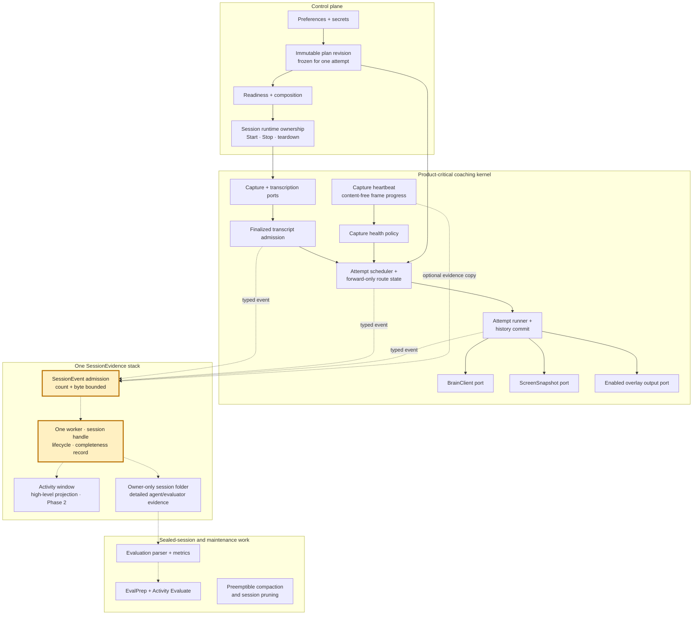

# Lean Coaching Core

> The approved target architecture and phased implementation contract for
> [issue #147](https://github.com/JINGBANZ/jarvis/issues/147). Phase 0, Phase 3's
> evaluation-extraction slice, and Phase 4's screen-capture adapter move are built. Phase 1 is the
> next implementation slice; the remaining phases describe the reviewed destination, not shipped
> behavior.

> **Owner review result:** This contract supersedes the issue body's proposed independent Activity,
> audit, diagnostic, and continuity-telemetry stacks and its earlier phase ordering. The issue remains
> the umbrella tracker; this wiki page and the matching [decision record](./decisions.md) are the
> implementation authority.

## Why This Exists

The live coach currently records optional evidence through three paths: the human-facing
`ActivityLog`, evaluator-focused session audit, and agent-facing `jlog`. Their content differs, but
their persistence has the same product contract: evidence is useful after an incident, yet it must
not decide whether Jarvis hears, reasons, captures, or delivers a tip.

The approved design therefore has one session-evidence stack instead of separate Activity, audit,
diagnostic, and continuity-telemetry stacks. Typed event categories preserve their different meaning;
one bounded transport, lifecycle, and completeness record avoid parallel queue machinery. The
Activity window remains the concise human view. The owner-only session folder remains the detailed
source an agent or evaluator inspects.

The current implementation remains described in [architecture.md](./architecture.md) and
[session-audit.md](./session-audit.md). This page is the durable target contract and handoff for the
phased migration.

## Approved Architecture Contract

| Concern | Contract |
|---|---|
| Coaching behavior | From finalized transcript admission through overlay delivery, coaching depends only on deterministic in-memory policy and explicitly injected critical ports. |
| Optional evidence | Producers submit one typed `SessionEvent` through nonthrowing, nonbackpressuring admission. Evidence has no callback or state-transition edge into coaching. |
| Failure behavior | Capacity pressure, serialization failure, file failure, or an unfinished close makes evidence visibly partial. Coaching continues. |
| Accepted data loss | All persisted session evidence, including Activity and evaluator/audit records, may be incomplete. Transcript state, coaching history, route state, and enabled overlay delivery may not be lost under this policy. |
| Human workflow | The Activity window shows the high-level session story. Detailed debugging is performed by pointing an agent at the owner-only session folder. |
| Queue policy | Session evidence uses one mailbox bounded by event count and retained bytes. It has no priority classes or reserved capacity. Critical queues declare their own policy and may intentionally be no-drop. |
| Lifecycle | One Start owns one session directory and one evidence handle. Stop seals that handle asynchronously. A new Start is independent of older optional work. Quit never waits for evidence. |
| Privacy | The stack does not archive raw microphone audio or a separate live transcript. Human presentation cannot expose raw diagnostic detail. Existing owner-only session storage rules remain. |

The single evidence queue is deliberate. Activity and audit records do not receive guaranteed
capacity ahead of diagnostics because the owner approved one uniform best-effort loss contract. If
that product contract changes, queue priority or separate failure domains require a new scope review;
they are not speculative safeguards in this design.

## Destination Architecture

Solid arrows belong to the control and product-critical lanes. Dashed arrows are optional evidence
or offline flow with no return edge into coaching. The highlighted nodes are the Phase 1
implementation focus.

The graph is a dependency rule, not a package diagram. A new SwiftPM target is justified only by a
compiler-enforced boundary, an isolated test boundary, or a second executable consumer. File count
and line count alone do not justify extraction.

## One Event, Two Projections

`SessionEvent` is the one versioned envelope for an occurrence. It carries a stable kind, session and
attempt attribution where applicable, occurrence/record timing, typed detail, and an optional
human-safe Activity presentation. The persisted layout may keep multiple files and attachments; file
partitioning is a projection detail, not a reason for another admission stack.

Producer code may retain narrow typed protocol views, such as the existing brain-traffic and
coaching-attempt observer ports. Those views converge on the same session handle; they are not
separate queues, workers, health records, or lifecycles. One shared stack also does not grant every
producer a generic path to author human-facing copy.

“Activity event” and “diagnostic event” describe projections, not transports:

| Event shape | Activity window | Session folder |
|---|---|---|
| Finalized utterance, manual hint, brain action, or fixed lifecycle/degradation notice | Friendly high-level row from the event's Activity presentation | Full typed event and attribution |
| Provider timing, transport error, retry scheduling, lifecycle detail, or raw error | Nothing; the event has no Activity presentation | Full typed diagnostic detail |
| Route advance or failed coaching attempt | Fixed, non-sensitive Activity summary | Same event's provider, attempt, timing, and failure detail |
| Capture heartbeat or continuity anomaly | No raw counter stream; readiness remains current UI state | Optional content-free evidence copy |

One occurrence produces one event. Producers do not mirror it through an `ActivityEventSink`, a
`DiagnosticSink`, a session-audit queue, and a continuity-telemetry queue. The closed set of Activity
presentations preserves the existing rule that transport, retry, timing, lifecycle, and raw-error
details never leak into the human view or model transcript.

After consolidation, “session audit” means the evaluator-relevant event categories and persisted
projection. It is not a second worker or lifecycle. “Continuity telemetry” likewise becomes typed
detail within `SessionEvidence`, except for the critical heartbeat decision described below.

## Capture Heartbeat

Capture heartbeat is content-free audio-frame progress from the existing authoritative
`AudioContinuityWitness`. It is not a timer ping, network liveness probe, audio recording, or second
counter.

The same source observation has two one-way consumers:

1. The critical in-memory branch feeds `CaptureReadinessMonitor`. Missing first frames or a sustained
   missing heartbeat can keep readiness pending, degrade system audio to microphone-only, or stop an
   unusable microphone session.
2. An optional copy may enter `SessionEvidence` so an agent can diagnose what happened later.

The critical branch never reads the evidence queue or persisted files. Losing the optional copy may
make evidence partial, but it cannot change the readiness, degrade, or stop decision. This is why
capture heartbeat remains outside `SessionEvidence` as policy input even though its diagnostic copy
shares the evidence stack.

## Fresh-Attempt Recovery and Routing

“Routing and retries” means the existing fresh-attempt recovery contract:

1. A coaching attempt snapshots exactly one user-authorized provider/model target.
2. That target owns the complete attempt, including any `capture_screen` continuation. Jarvis never
   replays a failed brain request or switches providers inside the attempt.
3. Failure ends the attempt without committing a partial outcome. The conversation remains pending,
   and a new attempt can include newer finalized speech.
4. A temporary or unknown failure exhausts the active target after three failed attempts. A proven
   permanent provider-boundary failure may exhaust it immediately.
5. Only a later fresh attempt advances to the next configured target. The route moves forward, never
   revisits an exhausted target, never races providers, and never rewrites saved preferences.

This roadmap does not add evidence-write retries, provider probes, cooldown recovery, or same-attempt
failover. Transcription transport reconnect remains its separate adapter-level recovery contract.

## A New Session After Stop → Start

The earlier phrase “replacement session” means a new Jarvis session after the user performs Stop and
then Start. It does not mean provider failover, a replacement brain inside an attempt, or a
replacement transcription socket.

Session A may still be completing its bounded evidence close after Stop. Session B starts with an
independent directory, evidence handle, runtime objects, and route cursor and does not wait for A.
Every persisted event carries its originating session handle so late work from A cannot be attributed
to B. Unaccepted or unfinished evidence from A may be lost and its completeness state remains honest.

## Phased Roadmap

Each phase leaves Jarvis working end to end. The destination is approved, but each later implementation
slice still freezes its own behavior, failure, degradation, non-goals, and verification contract before
editing.

| Phase | State | Outcome | Explicit boundary |
|---|---|---|---|
| 0 — Audit baseline | **Built** in [#146](https://github.com/JINGBANZ/jarvis/issues/146) / [PR #149](https://github.com/JINGBANZ/jarvis/pull/149) | One process-level count/byte-bounded audit worker, per-session handle, monotonic health, and independent Stop/Start lifecycle | Evaluator audit only; Activity and `jlog` remain separate today |
| 1 — Evidence foundation | **Next slice** | Generalize the settled audit transport into `SessionEvidence` and route diagnostics through it without another worker | Activity remains on its existing path until Phase 2 |
| 2 — Activity projection | Approved destination | Render and persist Activity through `SessionEvent`, show incomplete evidence in the Activity window, and remove Activity's independent persistence path | Human copy remains a closed safe projection; no debug detail enters Activity |
| 3 — Offline work | Evaluation extraction **built** in [#202](https://github.com/JINGBANZ/jarvis/issues/202); compaction and pruning remain the approved destination | Give evaluation a shared compiler boundary when justified by the app and `EvalPrep`; make history compaction preemptible and move pruning off Start | Failure keeps full history and surviving session evidence |
| 4 — Plans and adapters | Screen-capture adapter move **built** in [#204](https://github.com/JINGBANZ/jarvis/issues/204); plan revisions and the provider/file adapter moves remain the approved destination | Use immutable plan revisions at explicit between-attempt boundaries and move provider, process, screen, and file adapters outward | Live setting changes and fresh-attempt routing semantics remain intact |
| 5 — Decomposition | Approved destination | Split the `CoachDriver` facade and `AppDelegate` only after ports and state ownership settle | Structure changes; observable coaching and lifecycle behavior do not |

## Phase 1 Implementation Contract

Phase 1 is the diagnostics-only slice. It expands the proven Phase 0 mechanism; it does not create a
new `DiagnosticSink` service beside it.

### Expected behavior

- Existing coaching, routing, capture, overlay, Activity, session-folder, and evaluator behavior stays
  unchanged.
- The Phase 0 audit event schemas and provenance continue to be available to the evaluator.
- Agent-facing diagnostics use the shared bounded worker. Formatting, Console emission, file opening,
  seeking, serialization, and writing no longer run synchronously on the live coaching path.
- A persisted diagnostic is attributed through its immutable session handle. Unbound diagnostics may
  go to an asynchronous process log or be omitted, but they must never be guessed into the newest
  session.
- Existing artifact filenames may remain during the migration. Renaming or combining files is not a
  completion requirement.

### Failure and accepted degradation

- Enabled, disabled, full, blocked, and failing evidence paths produce the same provider calls, route
  transitions, coaching terminal outcomes, and overlay output events.
- Admission is nonthrowing and does not wait for the worker. The retained mailbox stays within both
  its count and byte limits.
- Capacity, oversize, formatting, Console, open, serialization, write, late-event, or unfinished-close
  loss marks the affected session evidence partial when possible. Later events still receive an
  independent admission attempt.
- No evidence kind receives priority in Phase 1. A blocked diagnostics-heavy session may lose audit
  records too; that is the approved degradation.
- Stop seals old evidence asynchronously. A new Start and Application Quit never wait for it.

### Non-goals

- Moving Activity onto `SessionEvidence`; that is Phase 2.
- Changing brain routing, failure budgets, attempt boundaries, transcription reconnects, capture
  readiness, heartbeat consequences, history semantics, or overlay queue policy.
- Extracting SwiftPM targets, moving provider adapters, preempting compaction, moving pruning, or
  decomposing `CoachDriver` / `AppDelegate`.
- Adding evidence priority, reserved capacity, writer retries, backpressure, raw-audio retention, a
  live-transcript archive, settings, or compatibility migrations.

### Completion criteria

- There is one shared evidence mailbox, worker, per-session handle, close lifecycle, and completeness
  contract for audit and diagnostics; there is no dedicated diagnostic worker.
- No diagnostic persistence or Console operation executes synchronously from the live coaching path.
- Tests use deterministic blocked, full, oversize, failing, and session-rotation fakes rather than
  wall-clock latency assertions.
- An architecture check prevents the critical kernel from importing or directly invoking concrete
  evidence persistence.
- The repository Gate passes: `swift build && ./scripts/run-tests.sh`.
- Live microphone or network-interruption validation is not required for this diagnostics-only slice;
  do not run it without explicit owner consent.

## Phase 3 Implementation Contract — Evaluation extraction

The first Phase 3 slice ([issue #202](https://github.com/JINGBANZ/jarvis/issues/202)) moves the
sealed-session evaluation stack out of `JarvisCore` into the `JarvisEvaluation` library target. It
clears the architecture contract's bar for a new target on two triggers at once: a second
executable consumer (`JarvisApp`'s Activity Evaluate flow and the `EvalPrep` CLI) and a
compiler-enforced boundary (sealed-session analysis can never read live coaching state). The slice
is a pure move — no parsing format, prompt, metric, report, or CLI-invocation behavior changes.
Preemptible history compaction and moving pruning off Start are the rest of Phase 3 and freeze
their own contract before implementation.

### Target shape

- `JarvisEvaluation` depends inward on `JarvisCore` only and stays Foundation-only.
  `JarvisCore` cannot depend back on it; the SwiftPM dependency graph is the enforcement, and no
  separate guard script exists for this rule.
- `Sources/JarvisEvaluation/` holds the sealed-session stack, moved unchanged apart from
  `import JarvisCore`: `SessionEvidenceIndex`, `SessionMetrics`, `EvaluationTranscript`,
  `SessionAuditEvidence`, `AgenticEvaluation`, `AgenticEvaluator`, `EvalReportPage`,
  `JSONLRecords`, and `JarvisPrompts+Evaluation` (still an extension of Core's public
  `JarvisPrompts` namespace, so predefined model-facing text remains auditable under that one
  name). `JSONLRecords` moves although the issue body does not list it: it is loss-aware parsing
  consumed only by the sealed-session readers; nothing on the live path parses JSONL.
- Core keeps the live recording side — `FileSessionAudit` with its worker/writer, the typed audit
  events and observer ports, `ActivityLog`, `SessionStore`, `jlog` — and the LocalAgent CLI
  plumbing (`AgentCLIDetector`, `AgentCLIProcessRunner`, `CodexRuntimeHome`), which the live brain
  path shares. The boundary reads: Core records evidence; `JarvisEvaluation` reads it after Stop.
- Two Core symbols become public for the boundary; everything else the stack reads already was:
  - `LocalAgentTransport` — its raw values are part of the persisted traffic-record schema
    (`request.runtime`), and `SessionMetrics` keys the `codex exec` usage shape on it. One source
    of truth beats duplicating the string in the parser.
  - `CodexRuntimeHome.removeLegacyHomes` — evaluation preflight fails closed by sweeping legacy
    in-session auth-bearing runtime homes before exposing a session to the agentic auditor; the
    adapter keeps ownership of the legacy prefix.

### Expected behavior

- Evaluation output is byte-identical for the same session directory: evidence index, telemetry
  tables, compact transcript, agent prompt, report stamp, HTML report page, artifact filenames,
  owner-only `0600` permissions, and atomic replace semantics.
- `JarvisApp` (Activity's Evaluate / Open report flow with its existing ghost-lifecycle gating)
  and `EvalPrep` consume `JarvisEvaluation`; `scripts/eval-session.sh` works unchanged.

### Failure and accepted degradation

- Nothing new. The typed `EvaluationError` surface, the fail-closed legacy-home sweep, the
  no-traffic and missing-Activity aborts, and older-report preservation on a failed run carry over
  unchanged.
- With evaluation symbols gone from `JarvisCore`, a future live-path reference to sealed-session
  analysis is a compile error rather than a review catch.

### Non-goals

- The compaction/pruning half of Phase 3, and all Phase 1/2 `SessionEvidence` work.
- Any behavior, schema, filename, prompt, or persisted-format change.
- Widening Core's public API beyond the two named symbols; compatibility shims or re-exports.
- Adding `JarvisEvaluation` to the ghost-mode scan: the target is Foundation-only and
  presentation-free like Core, and the scan set still covers exactly the OS-bound targets.
- Deleting the legacy-home sweep. Git history shows in-session runtime homes came only from
  pre-#115 review builds, never a released tag; dropping the sweep for good is a separate owner
  decision about data still on disk.

### Completion criteria

- `swift build` proves the boundary: `JarvisEvaluation` depends on `JarvisCore` only, `JarvisApp`
  and `EvalPrep` link the new target, and no sealed-session evaluation code remains under
  `Sources/JarvisCore`.
- The six evaluation test suites move to `JarvisEvaluationTests` with assertions unchanged —
  imports and local test support only. `JarvisCoreTests` neither keeps evaluation tests nor gains
  a dependency on `JarvisEvaluation`; its one `JSONLRecords` test helper is replaced with a local
  parse.
- `EvalPrep` renders byte-identical `eval-transcript.txt`, agent prompt, and `eval-report.html`
  for the same session directory before and after the move, verified offline without an agent run.
- The Gate passes: `swift build && ./scripts/run-tests.sh`. The live Evaluate-click check stays in
  the standard app smoke, not in this slice's gate.

## Phase 4 Implementation Contract — Screen-capture adapter move

The first Phase 4 slice ([issue #204](https://github.com/JINGBANZ/jarvis/issues/204)) moves the
`screencapture` helper process, the transient session-local JPEG, and the cleanup-verification
latch out of `JarvisCore` to the macOS edge, behind the existing `ScreenCapturing` port. Core keeps
the model-facing screen tool contract, the `ScreenSnapshot` model, and the pure window-selection
and recognized-text-layout logic — Foundation-only and unit-testable without spawning a process —
which lets the kernel dependency guard cover `Sources/JarvisCore/Screen/` and reject `Process` and
`FileManager` there outright. Immutable plan revisions and the provider/file adapter moves are the
rest of Phase 4 and freeze their own contracts before implementation.

### Target shape

- `JarvisScreenCapture` is the OS-bound adapter library: `ScreenCaptureRunner` (the cancellable
  helper process, the transient owner-only JPEG, TERM→KILL escalation gated on the helper's
  PID/start-time identity, verified deletion, and the cleanup-failure latch) and
  `ScreenCaptureCLI` (entire-display targeting with the main-display reshoot). It depends inward
  on `JarvisCore` only. It clears the architecture contract's bar for a new target through an
  isolated test boundary: `JarvisApp` is verified only by live smoke, so leaving the runner in the
  executable would orphan the headless cancellation/cleanup/latch regression tests that prove the
  privacy contract; they run in `JarvisScreenCaptureTests` instead.
- `Sources/JarvisCore/Screen/` keeps `ScreenCapturing`, `ScreenSnapshot`, `FrontWindowSelector`,
  `WindowCandidate`, `TextFragment`, and `RecognizedTextLayout`.
- `WindowScopedScreenCapture` in `JarvisApp` still composes the window-scoped shot, Vision OCR,
  and display fallback from the adapter pieces; `AppDelegate` wiring is unchanged.
- The ghost-mode scan covers `Sources/JarvisScreenCapture`, keeping its scan set equal to the
  OS-bound targets.

### Expected behavior

- A pure move: capture arguments, scope and display selection read at capture time, the
  window→display fallback order, OCR attachment, outcome classification, and Activity/debug
  emissions are unchanged.
- Cancellation still owns both helper teardown and file cleanup: a cancelled `capture()` returns
  only after the helper has exited and the transient JPEG's absence has been verified, so a
  coaching attempt can never outlive an unaccounted-for screen-derived file. A cancellation that
  loses the race with the helper's exit is still reported by the capture it was issued against and
  never survives to a later capture.
- Screen-derived files still land only in the owner-only live session directory, never `/tmp`, and
  the transient JPEG is owner-only (`0600`) from its first write.

### Failure and accepted degradation

- A capture whose cleanup cannot be proven still returns `cleanupFailed` and latches the
  session-local runner: no later capture — and no display fallback — starts while a screen-derived
  file is unaccounted for. The latch never self-clears; a fresh session builds a fresh runner.
- Local capture failure, cancellation, and the cleanup latch still end the screen tool call
  without a screenshot and still do not count as provider failures; no retry, recovery, or new
  failure mode is added.

### Non-goals

- The rest of Phase 4: immutable plan revisions and moving the Brain provider adapters
  (`Brain/Adapters/`) or remaining file adapters outward.
- Changing the screen tool contract, capture scopes, Settings behavior, OCR behavior, or any
  cancellation, cleanup, or latch semantics.
- New Core-visible capture abstractions beyond the existing `ScreenCapturing` port, and any
  Phase 1/2 `SessionEvidence` work.

### Completion criteria

- `JarvisCore` contains no `Process` and no file I/O for screen capture;
  `scripts/check-coaching-kernel.sh` covers `Sources/JarvisCore/Screen/`, so a reintroduced
  `Process`/`FileManager` fails the Gate.
- The runner's cancellation, cleanup-verification, latch, and owner-only-permission tests run
  unchanged (imports aside) in `JarvisScreenCaptureTests`; Core's screen tests are pure
  Foundation-only unit tests.
- The Gate passes: `swift build && ./scripts/run-tests.sh`.
- Live smoke verification of a screen-tool coaching turn and a cancelled capture in the signed
  app — App-bound behavior stays on the live smoke checklist, not in the offline gate.

## Source Handoff

The implementation agent should begin with these current boundaries:

- Phase 0 transport:
  [`FileSessionAudit.swift`](../Sources/JarvisCore/Diagnostics/FileSessionAudit.swift),
  [`SessionAuditWorker.swift`](../Sources/JarvisCore/Diagnostics/SessionAuditWorker.swift), and
  [`SessionAuditFileWriter.swift`](../Sources/JarvisCore/Diagnostics/SessionAuditFileWriter.swift).
- Current synchronous diagnostics:
  [`Log.swift`](../Sources/JarvisCore/Diagnostics/Log.swift).
- Current Activity stack:
  [`ActivityLog.swift`](../Sources/JarvisCore/Diagnostics/ActivityLog.swift) and
  [`ActivityViewer.swift`](../Sources/JarvisApp/Viewer/ActivityViewer.swift).
- Current sealed-session analysis:
  [`SessionEvidenceIndex.swift`](../Sources/JarvisEvaluation/SessionEvidenceIndex.swift) is the
  evaluator's descriptive index over persisted files. It is an offline consumer in the extracted
  `JarvisEvaluation` target, not the future live `SessionEvidence` admission stack.
- Capture-heartbeat source and critical policy:
  [`AudioContinuityWitness.swift`](../Sources/JarvisCore/Diagnostics/AudioContinuityWitness.swift),
  [`RealtimeContinuityReporter.swift`](../Sources/JarvisApp/Capture/RealtimeContinuityReporter.swift),
  and [`CaptureReadinessMonitor.swift`](../Sources/JarvisCore/Diagnostics/CaptureReadinessMonitor.swift).
- Composition and attempt boundaries:
  [`AppDelegate.swift`](../Sources/JarvisApp/App/AppDelegate.swift) and
  [`CoachDriver.swift`](../Sources/JarvisCore/Coach/CoachDriver.swift).

The first question during review remains: **Can this dependency change or delay a coaching outcome?**
If not, the critical kernel may emit a typed observation, but it may neither await nor depend on the
concrete evidence implementation.
