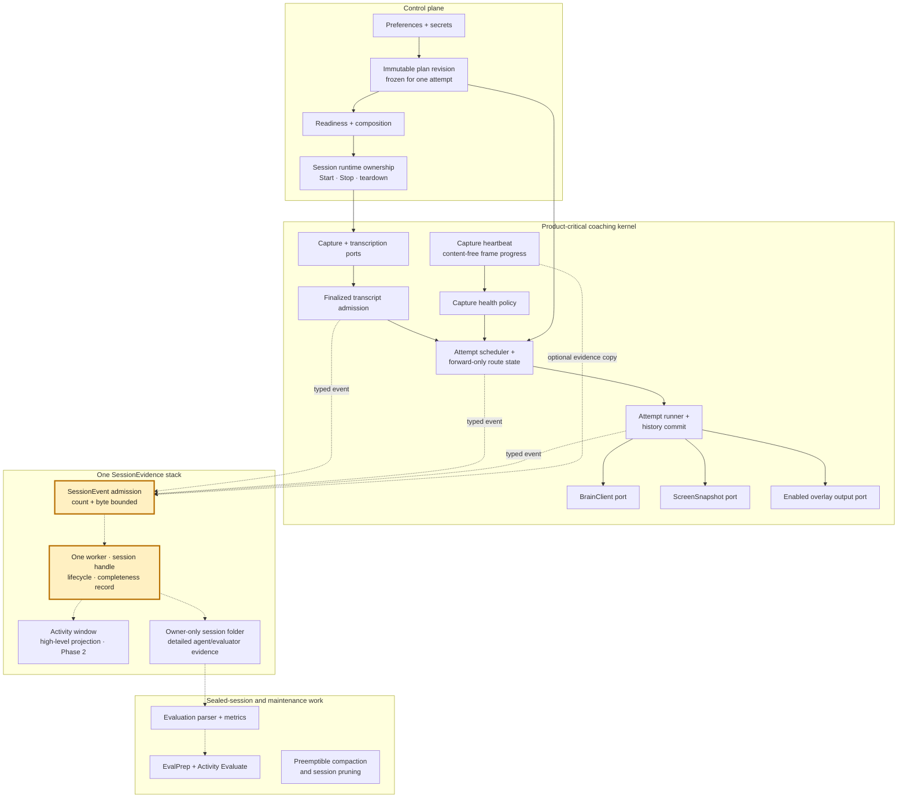

# Lean Coaching Core

> The approved target architecture and phased implementation contract for
> [issue #147](https://github.com/JINGBANZ/jarvis/issues/147). Phases 0, 1 and 2, Phase 3's
> evaluation-extraction slice, and Phase 4's OpenAI provider and screen-capture adapter slices are
> built. Phase 3's remaining work is the next implementation slice; the later phases describe the reviewed
> destination, not shipped behavior.

> **Owner review result:** This contract supersedes the issue body's proposed independent Activity,
> audit, diagnostic, and continuity-telemetry stacks and its earlier phase ordering. The issue remains
> the umbrella tracker; this wiki page and the matching [decision record](./decisions.md) are the
> implementation authority.

## Why This Exists

The live coach currently records optional evidence through three paths: the human-facing
`ActivityLog`, evaluator-focused session audit, and agent-facing `jlog`. Their content differs, but
their persistence has the same product contract: evidence is useful after an incident, yet it must
not decide whether Jarvis hears, reasons, captures, or delivers a tip.

The approved design therefore has one session-evidence stack instead of separate Activity, audit,
diagnostic, and continuity-telemetry stacks. Typed event categories preserve their different meaning;
one bounded transport, lifecycle, and completeness record avoid parallel queue machinery. The
Activity window remains the concise human view. The owner-only session folder remains the detailed
source an agent or evaluator inspects.

The current implementation remains described in [architecture.md](./architecture.md) and
[session-audit.md](./session-audit.md). This page is the durable target contract and handoff for the
phased migration.

## Approved Architecture Contract

| Concern | Contract |
|---|---|
| Coaching behavior | From finalized transcript admission through overlay delivery, coaching depends only on deterministic in-memory policy and explicitly injected critical ports. |
| Optional evidence | Producers submit one typed `SessionEvent` through nonthrowing, nonbackpressuring admission. Evidence has no callback or state-transition edge into coaching. |
| Failure behavior | Capacity pressure, serialization failure, file failure, or an unfinished close makes evidence visibly partial. Coaching continues. |
| Accepted data loss | All persisted session evidence, including Activity and evaluator/audit records, may be incomplete. Transcript state, coaching history, route state, and enabled overlay delivery may not be lost under this policy. |
| Human workflow | The Activity window shows the high-level session story. Detailed debugging is performed by pointing an agent at the owner-only session folder. |
| Queue policy | Session evidence uses one mailbox bounded by event count and retained bytes. It has no priority classes or reserved capacity. Critical queues declare their own policy and may intentionally be no-drop. |
| Lifecycle | One Start owns one session directory and one evidence handle. Stop seals that handle asynchronously. A new Start is independent of older optional work. Quit never waits for evidence. |
| Privacy | The stack does not archive raw microphone audio or a separate live transcript. Human presentation cannot expose raw diagnostic detail. Existing owner-only session storage rules remain. |

The single evidence queue is deliberate. Activity and audit records do not receive guaranteed
capacity ahead of diagnostics because the owner approved one uniform best-effort loss contract. If
that product contract changes, queue priority or separate failure domains require a new scope review;
they are not speculative safeguards in this design.

## Destination Architecture

Solid arrows belong to the control and product-critical lanes. Dashed arrows are optional evidence
or offline flow with no return edge into coaching. The highlighted nodes are the Phase 1
implementation focus.

The graph is a dependency rule, not a package diagram. A new SwiftPM target is justified only by a
compiler-enforced boundary, an isolated test boundary, or a second executable consumer. File count
and line count alone do not justify extraction.

## One Event, Two Projections

`SessionEvent` is the one versioned envelope for an occurrence. It carries a stable kind, session and
attempt attribution where applicable, occurrence/record timing, typed detail, and an optional
human-safe Activity presentation. The persisted layout may keep multiple files and attachments; file
partitioning is a projection detail, not a reason for another admission stack.

Producer code may retain narrow typed protocol views, such as the existing brain-traffic and
coaching-attempt observer ports. Those views converge on the same session handle; they are not
separate queues, workers, health records, or lifecycles. One shared stack also does not grant every
producer a generic path to author human-facing copy.

“Activity event” and “diagnostic event” describe projections, not transports:

| Event shape | Activity window | Session folder |
|---|---|---|
| Finalized utterance, manual hint, brain action, or fixed lifecycle/degradation notice | Friendly high-level row from the event's Activity presentation | Full typed event and attribution |
| Provider timing, transport error, retry scheduling, lifecycle detail, or raw error | Nothing; the event has no Activity presentation | Full typed diagnostic detail |
| Route advance or failed coaching attempt | Fixed, non-sensitive Activity summary | Same event's provider, attempt, timing, and failure detail |
| Capture heartbeat or continuity anomaly | No raw counter stream; readiness remains current UI state | Optional content-free evidence copy |

One occurrence produces one event. Producers do not mirror it through an `ActivityEventSink`, a
`DiagnosticSink`, a session-audit queue, and a continuity-telemetry queue. The closed set of Activity
presentations preserves the existing rule that transport, retry, timing, lifecycle, and raw-error
details never leak into the human view or model transcript.

After consolidation, “session audit” means the evaluator-relevant event categories and persisted
projection. It is not a second worker or lifecycle. “Continuity telemetry” likewise becomes typed
detail within `SessionEvidence`, except for the critical heartbeat decision described below.

## Capture Heartbeat

Capture heartbeat is content-free audio-frame progress from the existing authoritative
`AudioContinuityWitness`. It is not a timer ping, network liveness probe, audio recording, or second
counter.

The same source observation has two one-way consumers:

1. The critical in-memory branch feeds `CaptureReadinessMonitor`. Missing first frames or a sustained
   missing heartbeat can keep readiness pending, degrade system audio to microphone-only, or stop an
   unusable microphone session.
2. An optional copy may enter `SessionEvidence` so an agent can diagnose what happened later.

The critical branch never reads the evidence queue or persisted files. Losing the optional copy may
make evidence partial, but it cannot change the readiness, degrade, or stop decision. This is why
capture heartbeat remains outside `SessionEvidence` as policy input even though its diagnostic copy
shares the evidence stack.

## Fresh-Attempt Recovery and Routing

“Routing and retries” means the existing fresh-attempt recovery contract:

1. A coaching attempt snapshots exactly one user-authorized provider/model target.
2. That target owns the complete attempt, including any `capture_screen` continuation. Jarvis never
   replays a failed brain request or switches providers inside the attempt.
3. Failure ends the attempt without committing a partial outcome. The conversation remains pending,
   and a new attempt can include newer finalized speech.
4. A temporary or unknown failure exhausts the active target after three failed attempts. A proven
   permanent provider-boundary failure may exhaust it immediately.
5. Only a later fresh attempt advances to the next configured target. The route moves forward, never
   revisits an exhausted target, never races providers, and never rewrites saved preferences.

This roadmap does not add evidence-write retries, provider probes, cooldown recovery, or same-attempt
failover. Transcription transport reconnect remains its separate adapter-level recovery contract.

## A New Session After Stop → Start

The earlier phrase “replacement session” means a new Jarvis session after the user performs Stop and
then Start. It does not mean provider failover, a replacement brain inside an attempt, or a
replacement transcription socket.

Session A may still be completing its bounded evidence close after Stop. Session B starts with an
independent directory, evidence handle, runtime objects, and route cursor and does not wait for A.
Every persisted event carries its originating session handle so late work from A cannot be attributed
to B. Unaccepted or unfinished evidence from A may be lost and its completeness state remains honest.

## Phased Roadmap

Each phase leaves Jarvis working end to end. The destination is approved, but each later implementation
slice still freezes its own behavior, failure, degradation, non-goals, and verification contract before
editing.

| Phase | State | Outcome | Explicit boundary |
|---|---|---|---|
| 0 — Audit baseline | **Built** in [#146](https://github.com/JINGBANZ/jarvis/issues/146) / [PR #149](https://github.com/JINGBANZ/jarvis/pull/149) | One process-level count/byte-bounded audit worker, per-session handle, monotonic health, and independent Stop/Start lifecycle | Evaluator audit only; Activity and `jlog` remain separate today |
| 1 — Evidence foundation | **Built** in [#197](https://github.com/JINGBANZ/jarvis/issues/197) | Generalize the settled audit transport into `SessionEvidence` and route diagnostics through it without another worker | Activity remains on its existing path until Phase 2 |
| 2 — Activity projection | **Built** in [#198](https://github.com/JINGBANZ/jarvis/issues/198), [#199](https://github.com/JINGBANZ/jarvis/issues/199), [#200](https://github.com/JINGBANZ/jarvis/issues/200) | Render and persist Activity through `SessionEvent`, show incomplete evidence in the Activity window, and remove Activity's independent persistence path | Human copy remains a closed safe projection; no debug detail enters Activity |
| 3 — Offline work | **Built**: evaluation extraction in [#202](https://github.com/JINGBANZ/jarvis/issues/202), pruning off Start in [#201](https://github.com/JINGBANZ/jarvis/issues/201); preemptible compaction shipped earlier in [#187](https://github.com/JINGBANZ/jarvis/pull/187) | Give evaluation a shared compiler boundary when justified by the app and `EvalPrep`; make history compaction preemptible and move pruning off Start | Failure keeps full history and surviving session evidence |
| 4 — Plans and adapters | **Built**: screen-capture adapter move ([#204](https://github.com/JINGBANZ/jarvis/issues/204)), OpenAI extraction ([#205](https://github.com/JINGBANZ/jarvis/issues/205)), local-agent move ([#206](https://github.com/JINGBANZ/jarvis/issues/206)), capture-heartbeat split ([#203](https://github.com/JINGBANZ/jarvis/issues/203)), immutable plan revisions ([#207](https://github.com/JINGBANZ/jarvis/issues/207)) | Use immutable plan revisions at explicit between-attempt boundaries and move provider, process, screen, and file adapters outward | Live setting changes and fresh-attempt routing semantics remain intact |
| 5 — Decomposition | Approved destination | Split the `CoachDriver` facade and `AppDelegate` only after ports and state ownership settle | Structure changes; observable coaching and lifecycle behavior do not |

## Phase 1 Implementation Contract

Phase 1 is the diagnostics-only slice. It expands the proven Phase 0 mechanism; it does not create a
new `DiagnosticSink` service beside it.

### Expected behavior

- Existing coaching, routing, capture, overlay, Activity, session-folder, and evaluator behavior stays
  unchanged.
- The Phase 0 audit event schemas and provenance continue to be available to the evaluator.
- Agent-facing diagnostics use the shared bounded worker. Formatting, Console emission, file opening,
  seeking, serialization, and writing no longer run synchronously on the live coaching path.
- A persisted diagnostic is attributed through its immutable session handle. Unbound diagnostics may
  go to an asynchronous process log or be omitted, but they must never be guessed into the newest
  session.
- Existing artifact filenames may remain during the migration. Renaming or combining files is not a
  completion requirement.

### Failure and accepted degradation

- Enabled, disabled, full, blocked, and failing evidence paths produce the same provider calls, route
  transitions, coaching terminal outcomes, and overlay output events.
- Admission is nonthrowing and does not wait for the worker. The retained mailbox stays within both
  its count and byte limits.
- Capacity, oversize, formatting, Console, open, serialization, write, late-event, or unfinished-close
  loss marks the affected session evidence partial when possible. Later events still receive an
  independent admission attempt.
- No evidence kind receives priority in Phase 1. A blocked diagnostics-heavy session may lose audit
  records too; that is the approved degradation.
- Stop seals old evidence asynchronously. A new Start and Application Quit never wait for it.

### Non-goals

- Moving Activity onto `SessionEvidence`; that is Phase 2.
- Changing brain routing, failure budgets, attempt boundaries, transcription reconnects, capture
  readiness, heartbeat consequences, history semantics, or overlay queue policy.
- Extracting SwiftPM targets, moving provider adapters, preempting compaction, moving pruning, or
  decomposing `CoachDriver` / `AppDelegate`.
- Adding evidence priority, reserved capacity, writer retries, backpressure, raw-audio retention, a
  live-transcript archive, settings, or compatibility migrations.

### Completion criteria

- There is one shared evidence mailbox, worker, per-session handle, close lifecycle, and completeness
  contract for audit and diagnostics; there is no dedicated diagnostic worker.
- No diagnostic persistence or Console operation executes synchronously from the live coaching path.
- Tests use deterministic blocked, full, oversize, failing, and session-rotation fakes rather than
  wall-clock latency assertions.
- An architecture check prevents the critical kernel from importing or directly invoking concrete
  evidence persistence.
- The repository Gate passes: `swift build && ./scripts/run-tests.sh`.
- Live microphone or network-interruption validation is not required for this diagnostics-only slice;
  do not run it without explicit owner consent.

### What shipped

- `SessionEvent` gained a third typed detail, `.diagnostic(DiagnosticAuditEvent)`. `jlog` builds one
  and admits it; nothing else runs on the caller. Timestamp rendering, `NSLog`, file opening,
  seeking, and writing all moved behind the one shared worker.
- `JarvisLog.attach(to:)` binds `jlog` to the live session's evidence handle, replacing
  `enableFileLogging(directory:)`. Attribution is by immutable handle: while a handle is attached its
  diagnostics are that session's, and once it is sealed — or when none is attached — they reach the
  asynchronous process log (Console) through `recordProcessDiagnostic` and stop there. A diagnostic
  is never guessed into the newest session.
- `jarvis-debug.log` keeps its filename, `0600` mode, per-session freshness, `HH:mm:ss.SSS` stamp,
  and content. Only the thread that writes it changed. The worker creates it alongside the audit
  files at session open, so an open retry never truncates lines already written.
- Console emission became part of the writer edge (`SessionAuditWriting.emitToConsole`) rather than
  a call at the `jlog` site, so it is both off the caller and deterministically observable in tests.
  Console runs before the file write, so a file failure still leaves the line visible.
- The mailbox count bound rose from 256 to 4,096 envelopes. Diagnostics arrive from ~180 call sites
  and burst during reconnects and teardown; a bound sized for audit records alone would have turned
  ordinary bursts into routine `queue_overflow` and made every busy session read as partial. The
  32 MB retained-byte bound — what actually caps memory — is unchanged.
- The undocumented `JARVIS_LOG` environment fallback was deleted rather than carried onto the new
  transport. Nothing in the repository set it, and it was a synchronous file write on the caller.
- `scripts/check-coaching-kernel.sh` gained an `admission_paths` set covering
  `Diagnostics/Log.swift`, checked for OS reach-through only. `jlog` is not kernel code, but the
  kernel calls it from inside the attempt path, so reintroducing `NSLog` or a file handle there now
  fails the Gate. It stays exempt from the persistence-reach-through check because naming the shared
  transport is exactly its job.
- The transport types keep their Phase 0 names (`FileSessionAudit`, `SessionAuditWorker`,
  `SessionAuditFileWriter`). The rule that renaming persisted artifacts is not a completion
  requirement applies to them too: a rename would touch every evaluator and test call site without
  changing behavior.
- The transcription benchmark's run directory is now an ordinary session directory with its own
  evidence handle, sealed on both exits, so `scripts/transcription-benchmark.sh` still finds
  `jarvis-debug.log` where it expects it.

## Phase 2 Implementation Contract — Activity producer edge

The first Phase 2 slice ([issue #198](https://github.com/JINGBANZ/jarvis/issues/198)) moves the
producer edge only. Coaching producers stop naming a concrete Activity log and emit one typed
`SessionEvent` whose detail *is* its human-safe presentation; `ActivityLog` becomes the projection
the worker renders into. Activity keeps its own persistence until the next slice.

### Target shape

- `ActivityEvent` is the closed human-safe presentation set, lifted out of `ActivityLog` into its
  own type. The kernel can now name the vocabulary without holding the persistence behind it, which
  is what lets the kernel guard reject `ActivityLog` and any `.shared` singleton outright.
- `SessionEvent.Detail` gains `.activity(ActivityAuditEvent)` — a presentation plus its occurrence
  time. `activityPresentation` became **derived** from the detail rather than a field stored beside
  it. Deriving it is what makes "one occurrence produces one event" structural: an occurrence cannot
  carry human copy that duplicates, or disagrees with, what its detail says happened.
- `ActivityEventRecording` is the narrow producer port, with two implementations on purpose.
  `FileSessionAudit` wraps the occurrence into one envelope on the shared transport — the production
  path. `ActivityLog` is the terminal projection the worker renders into.
- `CoachDriver` and `TranscriptionCoachingCoordinator` hold `any ActivityEventRecording`, injected,
  with no default. The `ActivityLog.shared` default is gone from the kernel.
- `JarvisApp` composes `FileSessionAudit(directory:activity: ActivityLog.shared)` at Start and hands
  that one handle to the driver and both transcribers.

### Expected behavior

- The Activity window shows the same rows, with the same copy, kinds, and occurrence times, for
  every existing event kind — live and in history. Finalized speech still carries its speech-time so
  Activity and the model share one chronology.
- Rendering now happens on the evidence worker rather than on the producer's thread. A producer
  states an occurrence and returns.
- The closed presentation set is unchanged. Sharing one stack grants no producer a path to author
  free-form human-facing copy, and transport, retry, timing, lifecycle, and raw-error detail still
  cannot reach the human view or the model transcript.

### Failure and accepted degradation

- Absent, blocked, full, oversize, and failing Activity evidence produce identical provider calls,
  route transitions, terminal outcomes, and overlay output. The parity harness proves it with an
  `activity` variant beside the existing ones.
- A screen-view row retains a base64 JPEG, which is the largest thing the human projection carries;
  it is counted against the same retained-byte bound as everything else, with no reserved capacity.
- Between this slice and the next, `JarvisApp` still records its own notices — settings-not-applied,
  route advanced/skipped, brain change applied, system audio stopped, session ended — straight to
  `ActivityLog`. Those bypass the worker, so their order relative to kernel rows is no longer a
  single queue's FIFO. `ActivityLog` already orders the window by occurrence time and already
  treats the session-end marker as final for the session, so the visible record is unaffected; the
  next slice removes the split entirely.

### Non-goals

- Moving Activity's persistence onto the worker, or removing its serial queue and file writer.
- Moving `JarvisApp`'s own Activity notices, or the incomplete-evidence notice.
- Merging an Activity occurrence with the coaching-attempt record that follows it. A delivered tip
  and an attempt terminal are two occurrences recorded at two points, with different content; the
  rule is that neither is written twice, not that they must become one record.
- Any change to Activity copy, event kinds, persisted `jarvis-activity.jsonl` format, or the viewer.

### Completion criteria

- No coaching-kernel file names `ActivityLog` or a `.shared` singleton; `scripts/check-coaching-kernel.sh`
  fails the Gate if one returns.
- Activity occurrences reach the window through the shared handle, proven end to end in
  `ActivityProjectionTests`, and every existing Activity assertion in `CoachDriverPipelineTests`
  passes unchanged.
- The parity harness passes with absent, enabled, blocked, full, and failing Activity destinations.
- The Gate passes: `swift build && ./scripts/run-tests.sh`.

## Phase 2 Implementation Contract — Activity persistence

The second Phase 2 slice ([issue #199](https://github.com/JINGBANZ/jarvis/issues/199)) moves the
writes. Activity rows and their screenshot attachments persist through the one bounded worker and
per-session handle; `ActivityLog`'s own serial queue and `FileHandle` writing are deleted, not
wrapped. This is the point where Activity stops being a privileged failure domain.

### Target shape

- `ActivityLog` is the terminal **projection**, not a recorder. It owns the in-memory chronology,
  the retained-entry cap, the screenshot sequence, the session-end latch, the `attach`/`detach`
  viewer wiring, and the pure rendering. Its serial queue is replaced by a lock held only across
  in-memory bookkeeping; no disk access happens behind it.
- The worker calls three narrow projection entry points on its own queue — `isRecording`,
  `nextShotFilename()`, `admit(_:at:shotFilename:)`, `publish(_:)` — and performs both writes
  itself through `SessionAuditWriting`, which gains a whole-file `write` for attachments.
- `ActivityEventRecording` now has exactly one implementation, `FileSessionAudit`. A producer
  cannot record into a projection that does not persist.
- `jarvis-activity.jsonl` is created empty and owner-only when the worker opens the session,
  alongside every other evidence file, so `SessionStore.listSessions()` still discovers a session
  before its first row.
- `JarvisApp`'s own notices — settings-not-applied, route advanced/skipped, brain change applied,
  system audio stopped, session ended — go through the same handle. Nothing records Activity
  directly any more, so the split introduced by the previous slice is gone.

### Expected behavior

- The Activity window and history are unchanged: same rows, copy, kinds, occurrence-time ordering,
  screenshot lightbox, and `jarvis-activity.jsonl` format. Past sessions open and render as before,
  through `SessionStore` and the same projection rendering.
- A screenshot is still written **before** the row that references it, still `0600`, and still only
  inside the owner-only live session directory — never `/tmp`.
- The session-end marker is still final for the session; a late row admitted after it is refused.
- `ActivityLog.flush()` is deleted. Closing the session handle is the barrier that replaced it, and
  it covers every accepted row rather than only Activity's queue.

### Failure and accepted degradation

- Activity evidence is best-effort under the one uniform loss contract: no reserved capacity, no
  priority, no writer retries. A row that does not fit the count or byte bound is lost, a failed
  write loses that row's place in history, and the session's health record reads `partial`.
- A failed row is still pushed to the live window. Losing history is not the same as losing the
  screen the user is looking at.
- **Quit changed.** The session-end row now rides the evidence stack, and Quit seals without
  waiting, so a session ended by quitting the app may lose its terminal Activity row. That is the
  approved contract — Quit never waits for evidence — and the health marker records the session as
  partial when it happens. The next slice makes that visible in the window.
- The parity harness proves absent, enabled, blocked, full, and failing Activity destinations
  produce identical provider calls, route transitions, terminal outcomes, and overlay output.

### Non-goals

- Renaming `jarvis-activity.jsonl`, `shot-N.jpg`, or the persisted row schema.
- Any change to Activity copy, event kinds, the viewer, or history browsing.
- Evidence priority, reserved capacity for Activity, writer retries, or a synchronous drain on Quit.
- The incomplete-evidence notice; that is the next slice.

### Completion criteria

- No Activity row or attachment is written outside the shared worker, and `ActivityLog` contains no
  `DispatchQueue` and no `FileHandle`.
- Past sessions still open and render; `SessionStoreTests` and `JarvisViewerTests` pass unchanged.
- The kernel guard rejects persistence singletons — landed with the producer-edge slice and still
  green.
- The Gate passes: `swift build && ./scripts/run-tests.sh`, plus live smoke of Start, a coaching
  turn with a screen view, Stop, and browsing the finished session in the Activity window.

## Phase 2 Implementation Contract — Incomplete-evidence notice

The final Phase 2 slice ([issue #200](https://github.com/JINGBANZ/jarvis/issues/200)) makes the
uniform best-effort loss contract honest to the person reading the window. A session that hit
capacity, dropped an oversize record, failed a write, or never finished its close reads as visibly
incomplete instead of presenting an apparently complete story.

### Target shape

- One fixed pair of strings, `ActivityLog.incompleteEvidenceNotice` ("incomplete record") and
  `incompleteEvidenceDetail` ("Some of this session's activity could not be saved."), rendered as a
  header badge with a tooltip. Empty text collapses the badge out of the header entirely.
- It is **not** an `ActivityEvent`. Nothing happened in the coaching exchange; incompleteness is a
  property of the session's record, so it does not become a row, does not join the closed
  presentation set, and cannot be authored by a producer.
- The signal is the existing monotonic health record, read two ways and nowhere else:
  - **Live** — the worker reports `session.health.snapshot.isComplete` after it persists a row and
    again when it seals the session. The projection announces the transition once, through the same
    observer channel that carries rows.
  - **History** — `SessionStore` reads `audit-health.json`. `complete` → true, `partial` and
    `in_progress` → false, anything else → nil.
- `nil` is unknown, not incomplete: a session written before the health record existed, or with an
  unreadable marker, shows no notice. Claiming holes in a record we cannot read would be its own
  dishonesty.

### Expected behavior

- A session with dropped, failed, or unfinished evidence shows the notice — live while it runs and
  when browsed later in history.
- A session whose evidence is complete shows nothing.
- Switching from an incomplete session to a complete one clears the badge, so a stale notice cannot
  follow the reader into another session's history.
- The wording carries no transport, retry, timing, lifecycle, or raw-error detail. The rule that
  debug detail never reaches the Activity window is not relaxed to build this; the detail stays in
  the owner-only session folder where an agent reads it.

### Failure and accepted degradation

- No new counter and no new state: the notice reads the health record that already existed. Health
  counters are monotonic, so the notice is announced once and never retracts within a session.
- If the loss happens after the final row and the window is closed before the seal, that session
  still reads incomplete the next time it is browsed — the persisted marker is the durable copy.
- A missing or malformed marker leaves the session silent rather than accused.

### Non-goals

- A per-category breakdown, a count of lost records, or any way to see *what* was lost from the
  window. That is what the session folder is for.
- Turning the notice into an Activity row, a menu-bar indicator, or a notification.
- Retrying, reserving capacity, or otherwise reducing the loss this notice reports.

### Completion criteria

- `JarvisViewerTests` cover the incomplete rendering, the complete rendering, and the switch back.
- `ActivityProjectionTests` cover the live announcement, its once-only nature, the clean session,
  and a loss recorded at seal.
- `SessionStoreTests` cover complete, partial, unfinished, and unknown history markers.
- The Gate passes: `swift build && ./scripts/run-tests.sh`.

## Phase 3 Implementation Contract — Evaluation extraction

The first Phase 3 slice ([issue #202](https://github.com/JINGBANZ/jarvis/issues/202)) moves the
sealed-session evaluation stack out of `JarvisCore` into the `JarvisEvaluation` library target. It
clears the architecture contract's bar for a new target on two triggers at once: a second
executable consumer (`JarvisApp`'s Activity Evaluate flow and the `EvalPrep` CLI) and a
compiler-enforced boundary (sealed-session analysis can never read live coaching state). The slice
is a pure move — no parsing format, prompt, metric, report, or CLI-invocation behavior changes.
Preemptible history compaction and moving pruning off Start are the rest of Phase 3 and freeze
their own contract before implementation.

### Target shape

- `JarvisEvaluation` depends inward on `JarvisCore` only and stays Foundation-only.
  `JarvisCore` cannot depend back on it; the SwiftPM dependency graph is the enforcement, and no
  separate guard script exists for this rule.
- `Sources/JarvisEvaluation/` holds the sealed-session stack, moved unchanged apart from
  `import JarvisCore`: `SessionEvidenceIndex`, `SessionMetrics`, `EvaluationTranscript`,
  `SessionAuditEvidence`, `AgenticEvaluation`, `AgenticEvaluator`, `EvalReportPage`,
  `JSONLRecords`, and `JarvisPrompts+Evaluation` (still an extension of Core's public
  `JarvisPrompts` namespace, so predefined model-facing text remains auditable under that one
  name). `JSONLRecords` moves although the issue body does not list it: it is loss-aware parsing
  consumed only by the sealed-session readers; nothing on the live path parses JSONL.
- Core keeps the live recording side — `FileSessionAudit` with its worker/writer, the typed audit
  events and observer ports, `ActivityLog`, `SessionStore`, `jlog` — and the LocalAgent CLI
  plumbing (`AgentCLIDetector`, `AgentCLIProcessRunner`, `CodexRuntimeHome`), which the live brain
  path shares. The boundary reads: Core records evidence; `JarvisEvaluation` reads it after Stop.
- Two Core symbols become public for the boundary; everything else the stack reads already was:
  - `LocalAgentTransport` — its raw values are part of the persisted traffic-record schema
    (`request.runtime`), and `SessionMetrics` keys the `codex exec` usage shape on it. One source
    of truth beats duplicating the string in the parser.
  - `CodexRuntimeHome.removeLegacyHomes` — evaluation preflight fails closed by sweeping legacy
    in-session auth-bearing runtime homes before exposing a session to the agentic auditor; the
    adapter keeps ownership of the legacy prefix.

### Expected behavior

- Evaluation output is byte-identical for the same session directory: evidence index, telemetry
  tables, compact transcript, agent prompt, report stamp, HTML report page, artifact filenames,
  owner-only `0600` permissions, and atomic replace semantics.
- `JarvisApp` (Activity's Evaluate / Open report flow with its existing ghost-lifecycle gating)
  and `EvalPrep` consume `JarvisEvaluation`; `scripts/eval-session.sh` works unchanged.

### Failure and accepted degradation

- Nothing new. The typed `EvaluationError` surface, the fail-closed legacy-home sweep, the
  no-traffic and missing-Activity aborts, and older-report preservation on a failed run carry over
  unchanged.
- With evaluation symbols gone from `JarvisCore`, a future live-path reference to sealed-session
  analysis is a compile error rather than a review catch.

### Non-goals

- The compaction/pruning half of Phase 3, and all Phase 1/2 `SessionEvidence` work.
- Any behavior, schema, filename, prompt, or persisted-format change.
- Widening Core's public API beyond the two named symbols; compatibility shims or re-exports.
- Adding `JarvisEvaluation` to the ghost-mode scan: the target is Foundation-only and
  presentation-free like Core, and the scan set still covers exactly the OS-bound targets.
- Deleting the legacy-home sweep. Git history shows in-session runtime homes came only from
  pre-#115 review builds, never a released tag; dropping the sweep for good is a separate owner
  decision about data still on disk.

### Completion criteria

- `swift build` proves the boundary: `JarvisEvaluation` depends on `JarvisCore` only, `JarvisApp`
  and `EvalPrep` link the new target, and no sealed-session evaluation code remains under
  `Sources/JarvisCore`.
- The six evaluation test suites move to `JarvisEvaluationTests` with assertions unchanged —
  imports and local test support only. `JarvisCoreTests` neither keeps evaluation tests nor gains
  a dependency on `JarvisEvaluation`; its one `JSONLRecords` test helper is replaced with a local
  parse.
- `EvalPrep` renders byte-identical `eval-transcript.txt`, agent prompt, and `eval-report.html`
  for the same session directory before and after the move, verified offline without an agent run.
- The Gate passes: `swift build && ./scripts/run-tests.sh`. The live Evaluate-click check stays in
  the standard app smoke, not in this slice's gate.

## Phase 3 Implementation Contract — Retention pruning off Start

The second Phase 3 slice ([issue #201](https://github.com/JINGBANZ/jarvis/issues/201)) takes the
retention scan and delete off the Start path. Start creates the owner-only session directory and
installs the session's evidence handle; it no longer lists and deletes old sessions inline.

### Target shape

- `beginNewSession` still creates the `0700` directory (and tightens a pre-existing base), enables
  the Activity projection, opens the evidence handle, attaches diagnostics to it, and points the
  viewer at the new session. That is admission, and it stays.
- `pruneRetainedSessions(base:current:)` runs afterwards on its own task: it reads the protected
  set on the main actor, then performs the listing and deletion on a detached utility task. Nothing
  awaits it.
- The protected set is read **at prune time**, not captured at Start, so a session still sealing its
  evidence is spared by its state when the delete actually happens.
- `ActivityViewer.historyDidChange()` refreshes the session picker after a prune, since the picker
  was built from the pre-prune listing. It refreshes the list only — the rows on screen are
  unaffected, so nothing reloads.

### Expected behavior

- Start performs no retention scan and no delete. Secure owner-only session-directory creation is
  unchanged: `0700` for the directory, `0600` for everything the worker writes inside it.
- The retained-session count is what it was, the current session is always spared, non-session
  subdirectories and symlinks are still skipped, and a session whose evidence is still closing is
  still never deleted. All of that is `SessionStore.pruneToMostRecent` behavior, unchanged.
- An immediate Stop → Start is independent of any pruning still in flight.

### Failure and accepted degradation

- Pruning failure is silent by construction: nothing awaits the task, nothing reports it, and it can
  neither block Start nor consume provider-route failure budget. A failed prune means old sessions
  survive one more run — the same outcome the existing per-item `try?` already produced.
- Between Start and the prune completing, the picker can briefly list a session that is about to be
  deleted. Selecting one in that window renders an empty session rather than failing.

### Non-goals

- Moving secure session-directory creation off Start. It is the privacy boundary and a session must
  not begin without it.
- Changing the retained count, the protection rule, or any `SessionStore` deletion semantics.
- A pruning schedule, timer, or retry. It runs once per Start, after Start.

### Completion criteria

- No retention scan or delete remains on the Start path.
- `SessionStoreTests` continue to pin the retained count, the spared current session, the
  non-positive-`keep` floor, and the protected still-closing session — the behaviors the move had to
  preserve. The move itself is `JarvisApp` composition, which this repository verifies through live
  smoke rather than unit tests.
- The Gate passes: `swift build && ./scripts/run-tests.sh`, plus live smoke of Start, Stop, and an
  immediate restart, confirming the session directory rotates and old sessions still age out.

## Phase 4 Implementation Contract — Screen-capture adapter move

The first Phase 4 slice ([issue #204](https://github.com/JINGBANZ/jarvis/issues/204)) moves the
`screencapture` helper process, the transient session-local JPEG, and the cleanup-verification
latch out of `JarvisCore` to the macOS edge, behind the existing `ScreenCapturing` port. Core keeps
the model-facing screen tool contract, the `ScreenSnapshot` model, and the pure window-selection
and recognized-text-layout logic — Foundation-only and unit-testable without spawning a process —
which lets the kernel dependency guard cover `Sources/JarvisCore/Screen/` and reject `Process` and
`FileManager` there outright. Immutable plan revisions and the provider/file adapter moves are the
rest of Phase 4 and freeze their own contracts before implementation.

### Target shape

- `JarvisScreenCapture` is the OS-bound adapter library: `ScreenCaptureRunner` (the cancellable
  helper process, the transient owner-only JPEG, TERM→KILL escalation gated on the helper's
  PID/start-time identity, verified deletion, and the cleanup-failure latch) and
  `ScreenCaptureCLI` (entire-display targeting with the main-display reshoot). It depends inward
  on `JarvisCore` only. It clears the architecture contract's bar for a new target through an
  isolated test boundary: `JarvisApp` is verified only by live smoke, so leaving the runner in the
  executable would orphan the headless cancellation/cleanup/latch regression tests that prove the
  privacy contract; they run in `JarvisScreenCaptureTests` instead.
- `Sources/JarvisCore/Screen/` keeps `ScreenCapturing`, `ScreenSnapshot`, `FrontWindowSelector`,
  `WindowCandidate`, `TextFragment`, and `RecognizedTextLayout`.
- `WindowScopedScreenCapture` in `JarvisApp` still composes the window-scoped shot, Vision OCR,
  and display fallback from the adapter pieces; `AppDelegate` wiring is unchanged.
- The ghost-mode scan covers `Sources/JarvisScreenCapture`, keeping its scan set equal to the
  OS-bound targets.

### Expected behavior

- A pure move: capture arguments, scope and display selection read at capture time, the
  window→display fallback order, OCR attachment, outcome classification, and Activity/debug
  emissions are unchanged.
- Cancellation still owns both helper teardown and file cleanup: a cancelled `capture()` returns
  only after the helper has exited and the transient JPEG's absence has been verified, so a
  coaching attempt can never outlive an unaccounted-for screen-derived file. A cancellation that
  loses the race with the helper's exit is still reported by the capture it was issued against and
  never survives to a later capture.
- Screen-derived files still land only in the owner-only live session directory, never `/tmp`, and
  the transient JPEG is owner-only (`0600`) from its first write.

### Failure and accepted degradation

- A capture whose cleanup cannot be proven still returns `cleanupFailed` and latches the
  session-local runner: no later capture — and no display fallback — starts while a screen-derived
  file is unaccounted for. The latch never self-clears; a fresh session builds a fresh runner.
- Local capture failure, cancellation, and the cleanup latch still end the screen tool call
  without a screenshot and still do not count as provider failures; no retry, recovery, or new
  failure mode is added.

### Non-goals

- The rest of Phase 4: immutable plan revisions and moving the Brain provider adapters
  (`Brain/Adapters/`) or remaining file adapters outward.
- Changing the screen tool contract, capture scopes, Settings behavior, OCR behavior, or any
  cancellation, cleanup, or latch semantics.
- New Core-visible capture abstractions beyond the existing `ScreenCapturing` port, and any
  Phase 1/2 `SessionEvidence` work.

### Completion criteria

- `JarvisCore` contains no `Process` and no file I/O for screen capture;
  `scripts/check-coaching-kernel.sh` covers `Sources/JarvisCore/Screen/`, so a reintroduced
  `Process`/`FileManager` fails the Gate.
- The runner's cancellation, cleanup-verification, latch, and owner-only-permission tests run
  unchanged (imports aside) in `JarvisScreenCaptureTests`; Core's screen tests are pure
  Foundation-only unit tests.
- The Gate passes: `swift build && ./scripts/run-tests.sh`.
- Live smoke verification of a screen-tool coaching turn and a cancelled capture in the signed
  app — App-bound behavior stays on the live smoke checklist, not in the offline gate.

## Phase 4 Implementation Contract — OpenAI provider extraction

The first Phase 4 slice ([issue #205](https://github.com/JINGBANZ/jarvis/issues/205)) moves the
concrete OpenAI adapter out of `JarvisCore` into the `JarvisBrainProviders` library target. It
clears the architecture contract's bar for a new target on a compiler-enforced boundary: Core
describes the brain domain but no longer contains a provider transport, so a future live-path
reference to a concrete provider is a compile error rather than a review catch. The slice is a
pure move — no request-shape, classification, traffic-recording, timeout, or route/attempt
behavior changes. The local-agent CLI subtree
([issue #206](https://github.com/JINGBANZ/jarvis/issues/206)), immutable plan revisions, and the
remaining process and file adapters are the rest of Phase 4 and freeze their own
contracts before implementation.

### Target shape

- `JarvisBrainProviders` depends inward on `JarvisCore` only and stays Foundation-only
  (`FoundationNetworking` on non-Darwin). The SwiftPM dependency graph is the enforcement, as
  with `JarvisEvaluation`; the coaching-kernel guard separately keeps `URLSession` out of Core's
  kernel paths.
- `Sources/JarvisBrainProviders/OpenAI/` holds the OpenAI Responses adapter, moved unchanged
  apart from `import JarvisCore`: `OpenAIBrainClient`, plus `BrainFailure+OpenAI` — the OpenAI
  HTTP permanence proof, which moves although the issue body does not list it: the statuses and
  error codes proving an unrecoverable OpenAI target are that adapter's reviewed boundary
  knowledge, not provider-neutral domain, and nothing outside the adapter calls it.
- Core keeps the provider-neutral brain domain: `BrainClient`/`BrainConversation`, `BrainTarget`,
  `BrainRoute`, `BrainProvider`, `BrainFailure` with its unknown-error → temporary entry point,
  `BrainModelCatalog`, `ReasoningEffort`, `BrainWorkloadTimeout`, tool-invocation parsing, and
  the attempt/observer contracts. (The local-agent CLI subtree followed in
  [#206](https://github.com/JINGBANZ/jarvis/issues/206).)
- `JarvisApp` composes providers at Start and hands the kernel injected `BrainClient` ports; the
  kernel's route and scheduling policy never name a concrete adapter.
- One Core symbol becomes public for the boundary; everything else the adapter reads already was:
  - `BrainFailure.init(_:)` — every provider adapter's classification entry point for errors it
    has not proven anything about (unknown → temporary). The local-agent slice needs the same
    entry point when it moves.
- The coaching parity harness keeps composing the kernel with the real OpenAI adapter over
  scripted transports — the same composition `JarvisApp` performs at Start — so
  `Tests/JarvisCoreTests` links `JarvisBrainProviders` for exactly that harness; Core's own units
  keep testing against fakes.

### Expected behavior

- Byte-identical provider behavior: request wire shape, `store`/`prompt_cache_key` hardening
  flags, per-effort token budgets, workload deadlines, HTTP failure classification, and tagged
  brain-traffic recording.
- [Fresh-attempt recovery and routing](#fresh-attempt-recovery-and-routing) is untouched: one
  snapshotted target owns each attempt, no in-attempt replay or provider switch, a temporary or
  unknown failure exhausts a target only after three failed attempts, only a proven permanent
  provider-boundary failure exhausts immediately, and the route advances forward-only without
  rewriting saved preferences. The parity harness's route-transition snapshot is the proof.

### Failure and accepted degradation

- Nothing new, and no accepted data loss. The typed `BrainFailure` dispositions and the
  unknown-defaults-to-temporary policy carry over unchanged; raw provider detail still stays out
  of Activity.

### Non-goals

- Moving the local-agent CLI subtree, or restructuring it to fit this slice; that is
  [#206](https://github.com/JINGBANZ/jarvis/issues/206).
- A third, lower-level contracts target beneath `JarvisCore`. Reviewed and declined during the
  evaluation extraction: provider and evaluation targets depend inward on Core's contracts.
- Any behavior, wire-format, classification, or persisted-schema change; compatibility shims or
  re-exports.
- Widening Core's public API beyond the one named symbol.
- Adding `JarvisBrainProviders` to the ghost-mode scan: the target is Foundation-only and
  presentation-free like Core, and the scan set still covers exactly the OS-bound targets.

### Completion criteria

- `swift build` proves the boundary: `JarvisBrainProviders` depends on `JarvisCore` only,
  `JarvisApp` composes it, and no `URLSession` brain transport remains under
  `Sources/JarvisCore`.
- The OpenAI adapter tests and the OpenAI classification tests move to
  `JarvisBrainProvidersTests` with assertions unchanged — imports and local test support only.
  The provider-neutral `BrainFailure` tests stay in `JarvisCoreTests`.
- The coaching parity harness passes with its scenario, fakes, and snapshot comparison untouched.
- The Gate passes: `swift build && ./scripts/run-tests.sh`. Live smoke verification of one OpenAI
  coaching turn stays in the standard app smoke, performed by a human.

## Phase 4 Implementation Contract — Local-agent adapter move

The second Phase 4 slice ([issue #206](https://github.com/JINGBANZ/jarvis/issues/206)) moves the
local-agent CLI subtree out of `JarvisCore` into `JarvisBrainProviders` — roughly 3,000 lines, and
the last brain-related process plumbing in Core. After it, **Core describes brains and never runs
one**, which is what lets the kernel guard cover `Sources/JarvisCore/Brain/` with no exclusions at
all. It is a pure move: no behavior, invocation, parsing, timing, or classification change.

### Target shape

- `Sources/JarvisBrainProviders/LocalAgent/` holds the CLI brain client and its reply parsing,
  conversation rendering and invocation shaping, the CLI detector and its unavailability reporting,
  the process runner and phase timings, the runtime lifetime, and the Claude Code, Codex exec, and
  Codex app-server runtimes — moved unchanged apart from `import JarvisCore`.
- `JarvisPrompts+LocalAgent` moves with the adapters. It stays an extension of Core's public
  `JarvisPrompts` namespace, so every predefined model-facing string Jarvis ships is still auditable
  under that one name — the same rule the evaluation prompts follow.
- `JarvisEvaluation` gains a dependency on `JarvisBrainProviders`, because the agentic evaluator
  genuinely runs a local agent CLI: it reuses the same detector, invocation shape, and process
  runner rather than keeping a second copy of that plumbing. The dependency graph stays acyclic and
  inward-only (`JarvisEvaluation` → `JarvisBrainProviders` → `JarvisCore`), and the boundary that
  matters — evaluation never reads live coaching state — is untouched.
- One symbol becomes public for the boundary: `AgentCLIProcessRunner.errorDomain`. It is the
  adapter's identity on every error that leaves it, and Core's provider-neutral `BrainFailure`
  classification is tested against the real domain rather than a duplicated literal.
- `JarvisCoreTests` links `JarvisBrainProviders` for two narrow reasons now: the coaching parity
  harness, and the `BrainFailure` classification tests naming that real domain.

### Expected behavior

- CLI detection and its unavailability reporting, runtime lifetime and teardown, app-server versus
  exec runtime selection, reply parsing, and phase timings behave exactly as today.
- Failure classification and its consequences are unchanged: a proven permanent provider-boundary
  failure (a missing CLI, for instance) still exhausts its target immediately, and a temporary or
  unknown failure still takes three failed attempts. See
  [Fresh-attempt recovery and routing](#fresh-attempt-recovery-and-routing).

### Failure and accepted degradation

- Nothing new, and no accepted data loss. With the CLI plumbing gone from `JarvisCore`, a future
  live-path reference to a concrete brain runtime is a compile error rather than a review catch.

### Non-goals

- Restructuring the local-agent code to fit the move, changing any CLI invocation or parse, or
  touching the app-server protocol.
- Widening Core's public API beyond the one named symbol; compatibility shims or re-exports.
- Adding `JarvisBrainProviders` to the ghost-mode scan: the target is Foundation-only and
  presentation-free like Core, and the scan set still covers exactly the OS-bound targets.

### Completion criteria

- `swift build` proves the boundary: no `Process`, `FileManager`, `FileHandle`, or `URLSession`
  remains under `Sources/JarvisCore/Brain`, and `scripts/check-coaching-kernel.sh` now scans that
  directory — and `Sources/JarvisCore/Prompts` — with the `Adapters` exclusion deleted outright.
- The six local-agent test suites move to `JarvisBrainProvidersTests` with assertions unchanged —
  imports only.
- The coaching parity harness passes.
- The Gate passes: `swift build && ./scripts/run-tests.sh`, plus live smoke verification of one
  Claude Code and one Codex coaching turn.

## Phase 4 Implementation Contract — Capture heartbeat split

The third Phase 4 slice ([issue #203](https://github.com/JINGBANZ/jarvis/issues/203)) names the
content-free audio-frame-progress observation **capture heartbeat** and gives it exactly two one-way
consumers. The rename is the smaller half; the deliverable is the test that proves the asymmetry.

### Target shape

- `CaptureHeartbeat` is the Core value: `.frames(sampleCount:)` or `.stalled`, and nothing else. No
  amplitude, no PCM, no transcript crosses the boundary, and `evidenceDescription` is the only text
  the evidence copy ever carries.
- `CaptureHeartbeatGate` holds the promotion latch — the first frame, and the first frame after a
  stall — moved out of `RealtimeContinuityReporter` into Core. It is not a second counter: it
  decides *when* the witness's existing frame evidence carries new information, and it holds no
  totals of its own. Moving it inward gave both capture adapters one implementation and made the
  latch drivable by Foundation-only tests.
- `CaptureReadinessMonitor.note(_:for:at:)` takes the heartbeat directly. This is the critical
  branch: in-memory policy over the value, with no read of the evidence queue or a persisted file —
  a rule the kernel guard already enforces over `CaptureReadinessMonitor.swift` and the witness.
- `RealtimeContinuityReporter.emit(_:)` is the one fan-out point. The critical consumer runs first
  and unconditionally; the evidence copy — one `jlog` line, which since Phase 1 *is* nonblocking
  admission to `SessionEvidence` — follows. That ordering is what makes the asymmetry structural
  rather than a convention.

### Expected behavior

- Capture readiness, microphone-only degradation, and the terminal microphone stop behave exactly as
  before. A zero-length callback is still not health; positive sample progress is still health
  regardless of amplitude, so valid digital silence still counts.
- Each promoted heartbeat now also appears in `jarvis-debug.log` as
  `Jarvis capture heartbeat [<stream>, <boundary>]: frames=N | stalled`, so an agent can reconstruct
  frame health after the fact.
- Raw microphone audio is still never archived, and the heartbeat carries no audio content.

### Failure and accepted degradation

- Losing, blocking, or failing the evidence copy makes the session's record partial and nothing
  else. `CaptureHeartbeatTests.evidencePressureCannotChangeReadinessDegradationOrStop` drives one
  fixed script — both streams reach ready, the system stream degrades, the microphone stops — under
  a healthy, a blocked-and-overflowing, and a write-failing evidence destination, and compares the
  complete readiness/effect/unavailability sequence against a run with no evidence at all.
- Admission is nonblocking, so emitting the copy is safe on the realtime audio callback it is
  emitted from.

### Non-goals

- Renaming `AudioContinuityWitness`. The heartbeat is one projection of it; the witness also covers
  delivery lag, socket generations, replay-buffer eviction, and local-activity matching, none of
  which is a heartbeat.
- A typed persisted heartbeat record, a counter stream in the Activity window, or any new capture
  telemetry. The copy is a projection of the value the critical branch already reads.
- Changing readiness thresholds, stall thresholds, degradation rules, or the recovery suspension.

### Completion criteria

- Naming is aligned to *capture heartbeat* in code, tests, and this page; no `CapturePulse`,
  `Signal`, or `onCaptureContinuity` spelling survives.
- The gate's promotion rule and the content-free evidence text are unit-tested.
- The asymmetry test passes with a healthy, blocked/full, and failing evidence destination.
- The Gate passes: `swift build && ./scripts/run-tests.sh`, plus live smoke of capture readiness and
  system-audio degradation to microphone-only.

## Phase 4 Implementation Contract — Immutable plan revisions

The last Phase 4 slice ([issue #207](https://github.com/JINGBANZ/jarvis/issues/207)) is the control
plane half of the Lean Coaching Path Rule: preferences are read at Start or at an explicit
between-attempt boundary, frozen into an immutable revision, and a coaching turn never reads
storage.

### Target shape

- `SessionPlan` is the immutable revision: a monotonic `revision` identity plus the frozen
  `ScreenCaptureSelection` a turn needs. `ScreenCapturePreferences.selection` is the one place the
  persisted store is read.
- `ScreenCapturing.capture(_ selection:)` takes the frozen selection. The adapters — `ScreenCaptureCLI`
  and `WindowScopedScreenCapture` — no longer hold a preference store at all, so "no attempt reads
  storage" is structural rather than a convention. Before this, both read scope and display index
  from `UserDefaults` at capture time, inside the attempt.
- `CoachDriver` holds the plan under `stateLock` and snapshots it into `AttemptBrain` alongside the
  target. One attempt, one revision — including every `capture_screen` continuation.
- `CoachDriver.updatePlan(_:)` is the declared boundary. `AppDelegate.freshSessionPlan()` builds a
  revision at Start; `reapplySessionPlan()` installs one when the Screen settings change.
- `OverlayAppearance` moved from `Overlay/` to `Config/` where the other preference stores live. It
  is control plane, not delivery, and misfiling it was what previously put a `UserDefaults` reader
  inside a kernel-guarded directory.

### Expected behavior

- The route half of the control plane was already frozen this way through `ConfiguredBrainRoute`,
  built from preferences, secrets, and provider discovery at Start or at a Settings reapply. That is
  unchanged: a live Settings edit still installs a fresh route for the next attempt, a failed
  preflight still surfaces the fixed *settings change not applied* notice while the existing session
  continues, and a credential refresh still gates stale attempts without superseding committed route
  health.
- [Fresh-attempt recovery and routing](#fresh-attempt-recovery-and-routing) is untouched: one
  snapshotted target per attempt, no in-attempt replay or provider switch, three failed attempts to
  exhaust a temporary or unknown failure, immediate exhaustion only for a proven permanent
  provider-boundary failure, forward-only advance, and no rewriting of saved preferences.
- Runtime health never installs a plan revision. Only an explicit user edit does.
- **Timing changed, deliberately.** A screen-capture setting used to apply to the very next
  screenshot, which could be the second capture inside a turn already in progress. It now applies to
  the next attempt. The Settings card says so ("Applied to the next coaching turn").

### Failure and accepted degradation

- Nothing new and no data loss. A plan is a value: installing one cannot fail, cannot block, and has
  no failure mode to report.
- A session with no configured control plane runs against `SessionPlan.default`, which is what the
  persisted defaults produce — active-window capture on the main display.

### Non-goals

- Folding the route, secrets, or provider discovery into `SessionPlan`. They are already frozen at
  the same boundaries by `ConfiguredBrainRoute`; restructuring them into one value would be churn
  with no behavior change, and the rule they have to satisfy is already satisfied.
- Any new revision lifecycle, rollback, or scheduling. The boundary is "the next attempt", and an
  attempt already running keeps what it snapshotted.
- Changing what any preference means, its default, or its clamping.

### Completion criteria

- `scripts/check-coaching-kernel.sh` rejects `UserDefaults`, every preference store, and
  `SecretStore` inside the kernel, so a reintroduced storage read fails the Gate.
- `SessionPlanTests` prove a revision installed mid-attempt does not reach that attempt's second
  capture, that the next attempt does run against it, and that the selection is resolved from the
  persisted store exactly at the boundary.
- The Gate passes: `swift build && ./scripts/run-tests.sh`, plus live smoke of a Settings change
  applied to a running session and a failed preflight.

## Phase 5 Implementation Contract — CoachDriver split

The first Phase 5 slice ([issue #208](https://github.com/JINGBANZ/jarvis/issues/208)) splits the
1,333-line `CoachDriver` facade into two owners with a stated state-ownership boundary. It is
deliberately late: splitting a coordinator before its ports and state ownership settle just
relocates the coupling, which is why the roadmap put decomposition after the plan and adapter work.

### Target shape

- **`CoachDriver` is the scheduler**, and stays the session's public face. It owns trigger
  coalescing and pending-trigger generations, transcription settlement, the single-flight handling
  slot, and forward-only route state — selection, advance, skip, exhaustion, and the delivery tokens
  that make a terminal transition land exactly once. All of it stays under its one `stateLock`.
- **`CoachAttemptRunner` executes one attempt** against one snapshotted target: filler
  classification, the bounded tool loop, the `capture_screen` continuation, overlay delivery,
  history commit, off-path history compaction with its own cancellation lifecycle, and attempt
  identity. Its `runnerLock` guards state that never touches scheduling state, which is why it is a
  separate lock rather than a second user of the scheduler's.
- **`CoachTranscriptLedger` is the one datum both halves share**: the committed transcript boundary.
  The scheduler reads it to decide whether a late turn-end is already covered by speech an earlier
  attempt committed; the runner reports into it when a complete, non-truncated terminal action
  commits. It only ever grows, so it is a leaf lock and neither half ever holds the other's.

The interface is one call per attempt — an immutable `AttemptBrain` plus the pending work in, an
`AttemptExecution` out. Nothing new coordinates between the halves; the ledger and that one call are
the same three private touchpoints the combined type already had, made explicit.

### Expected behavior

- Structure changed; observable coaching did not. The conversational attempt boundary, terminal
  outcomes, transcript commit semantics, route transitions, and audit attempt numbering are
  identical before and after.
- `cancelBackgroundWork()` keeps its public shape and semantics; the runner owns the lifecycle
  behind it.

### Failure and accepted degradation

- Nothing new. No lifecycle state, retry, timer, or cross-component coordination was introduced —
  if the two halves had needed something new to talk to each other, that would have meant the
  boundary was wrong, not that the coordination was needed.

### Non-goals

- Renaming `CoachDriver` or changing any public signature. It is the App's and the tests' handle on
  a session.
- Moving transcription settlement, the route policy, or the trigger machinery outside the scheduler.
- Changing attempt semantics, the tool-loop bound, compaction policy, or history commit rules.

### Completion criteria

- **Every existing `CoachDriver` test passes unmodified** — not a single test file changed in this
  slice, which is the strongest available proof that the split is behavior-preserving.
- The coaching parity harness passes.
- The Gate passes: `swift build && ./scripts/run-tests.sh`.

## Source Handoff

The implementation agent should begin with these current boundaries:

- Phase 0 transport:
  [`FileSessionAudit.swift`](../Sources/JarvisCore/Diagnostics/FileSessionAudit.swift),
  [`SessionAuditWorker.swift`](../Sources/JarvisCore/Diagnostics/SessionAuditWorker.swift), and
  [`SessionAuditFileWriter.swift`](../Sources/JarvisCore/Diagnostics/SessionAuditFileWriter.swift).
- Current synchronous diagnostics:
  [`Log.swift`](../Sources/JarvisCore/Diagnostics/Log.swift).
- Current Activity stack:
  [`ActivityLog.swift`](../Sources/JarvisCore/Diagnostics/ActivityLog.swift) and
  [`ActivityViewer.swift`](../Sources/JarvisApp/Viewer/ActivityViewer.swift).
- Current sealed-session analysis:
  [`SessionEvidenceIndex.swift`](../Sources/JarvisEvaluation/SessionEvidenceIndex.swift) is the
  evaluator's descriptive index over persisted files. It is an offline consumer in the extracted
  `JarvisEvaluation` target, not the future live `SessionEvidence` admission stack.
- Capture-heartbeat value, promotion latch, source, and critical policy:
  [`CaptureHeartbeat.swift`](../Sources/JarvisCore/Diagnostics/CaptureHeartbeat.swift),
  [`AudioContinuityWitness.swift`](../Sources/JarvisCore/Diagnostics/AudioContinuityWitness.swift),
  [`RealtimeContinuityReporter.swift`](../Sources/JarvisApp/Capture/RealtimeContinuityReporter.swift),
  and [`CaptureReadinessMonitor.swift`](../Sources/JarvisCore/Diagnostics/CaptureReadinessMonitor.swift).
- Composition and attempt boundaries:
  [`AppDelegate.swift`](../Sources/JarvisApp/App/AppDelegate.swift) and
  [`CoachDriver.swift`](../Sources/JarvisCore/Coach/CoachDriver.swift).

The first question during review remains: **Can this dependency change or delay a coaching outcome?**
If not, the critical kernel may emit a typed observation, but it may neither await nor depend on the
concrete evidence implementation.
